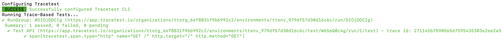

:::note
[Check out the source code on GitHub here.](https://github.com/kubeshop/tracetest/tree/main/examples/quick-start-jaeger-nodejs)
:::

[Tracetest](https://tracetest.io/) is a testing tool based on [OpenTelemetry](https://opentelemetry.io/) that allows you to test your distributed application. It allows you to use data from distributed traces generated by OpenTelemetry to validate and assert if your application has the desired behavior defined by your test definitions.

[Jaeger](https://www.jaegertracing.io/) is an open-source, end-to-end distributed tracing solution. It allows you to monitor and troubleshoot transactions in complex distributed systems. It was developed and then open sourced by Uber Technologies. Jaeger provides a distributed tracing solution to enable transactions across multiple heterogeneous systems or microservices to be tracked and displayed as a cascading series of spans.

## Node.js App with Jaeger, OpenTelemetry and Tracetest

This is a simple quick start on how to configure a Node.js app to use OpenTelemetry instrumentation with traces and Tracetest for enhancing your E2E and integration tests with trace-based testing. The infrastructure will use Jaeger as the trace data store, and OpenTelemetry Collector to receive traces from the Node.js app and send them to Jaeger.

## Prerequisites

**Tracetest Account**:

- Sign up to [`app.tracetest.io`](https://app.tracetest.io) or follow the [get started](/getting-started/installation) docs.
- Have access to the environment's [agent API key](https://app.tracetest.io/retrieve-token).

**Docker**: Have [Docker](https://docs.docker.com/get-docker/) and [Docker Compose](https://docs.docker.com/compose/install/) installed on your machine.

## Run This Quckstart Example

The example below is provided as part of the Tracetest project. You can download and run the example by following these steps:

Clone the Tracetest project and go to the Jaeger Node.js Quickstart:

```bash
git clone https://github.com/kubeshop/tracetest
cd tracetest/examples/quick-start-jaeger-nodejs
```

Follow these instructions to run the quick start:

1. Copy the `.env.template` file to `.env`.
2. Fill out the [TRACETEST_TOKEN and ENVIRONMENT_ID](https://app.tracetest.io/retrieve-token) details by editing your `.env` file.
3. Run `docker compose run tracetest-run`.
4. Follow the links in the output to view the test results.

Follow along with the sections below for an in detail breakdown of what the example you just ran did and how it works.

## Project Structure

The project contains [Tracetest Agent](/getting-started/installation#install-the-tracetest-agent), [OpenTelemetry Collector](https://github.com/open-telemetry/opentelemetry-collector-contrib/tree/main), and a Node.js app.

The `docker-compose.yaml` file in the root directory of the quick start runs the Node.js app and the [Tracetest Agent](/concepts/agent) setup.

## Configuring the Node.js App

The Node.js app is a simple Express app, contained in [the `app.js` file](https://github.com/kubeshop/tracetest/blob/main/examples/quick-start-jaeger-nodejs/app.js).

Configure the `.env` like shown below.

```bash
# Get the required information here: https://app.tracetest.io/retrieve-token

TRACETEST_TOKEN="<YOUR_TRACETEST_TOKEN>"
TRACETEST_ENVIRONMENT_ID="<YOUR_ENV_ID>"
```

The OpenTelemetry tracing is contained in the `tracing.otel.grpc.js` or `tracing.otel.http.js` files.

Choosing the [`tracing.otel.grpc.js` file](https://github.com/kubeshop/tracetest/blob/main/examples/quick-start-jaeger-nodejs/tracing.otel.grpc.js) will send traces to OpenTelemetry Collector's `GRPC` endpoint.

Enabling the tracer is done by preloading the trace file. As seen in the `package.json`.

```json
"scripts": {
  "app-with-grpc-tracer": "node -r ./tracing.otel.grpc.js app.js",
},
```

## Run the Node.js App, Jaeger and OpenTelemetry Collector with Docker Compose

The [`docker-compose.yaml` file](https://github.com/kubeshop/tracetest/blob/main/examples/quick-start-jaeger-nodejs/docker-compose.yaml) and [`Dockerfile`](https://github.com/kubeshop/tracetest/blob/main/examples/quick-start-jaeger-nodejs/Dockerfile) in the root directory are for the Node.js app. The `docker-compose.yaml` contains one service for the Node.js app, as well as the Tracetest Agent, Jaeger, and OpenTelemetry Collector.

[The `collector.config.yaml` configures the OpenTelemetry Collector](https://github.com/kubeshop/tracetest/blob/main/examples/quick-start-jaeger-nodejs/collector.config.yaml). It receives traces via either `grpc` or `http`. Then, exports them to Jaeger via the OTLP `exporter`.

To start it, run this command:

```bash
docker compose run tracetest-run
```

This will:
1. Start the Node.js app, the OpenTelemetry Collector, and send the traces to Jaeger.
2. Start the Tracetest Agent.
3. Configure the tracing backend and create tests in your environment.
4. Run the tests.

The output of the test will look similar to this:


You can follow the links in the output to view the run group and the test result on Tracetest.

Jaeger is started as a part of this recipe, and you can access Jaeger's UI at `http://localhost:16686/` and see any traces generated.

The docker file exposes the underlying Node.js app at `http://localhost:8080/`.

Open Tracetest and start creating tests using this environment! Make sure to use the `http://app:8080/` URL in your test creation, because your Node.js app and the Tracetest agent are in the same network. This simple Node.js application only supports a GET operation against `http://app:8080/` and should return the string 'Hello World'.

## Learn More

Feel free to check out our [examples in GitHub](https://github.com/kubeshop/tracetest/tree/main/examples) and join our [Slack Community](https://dub.sh/tracetest-community) for more info!
