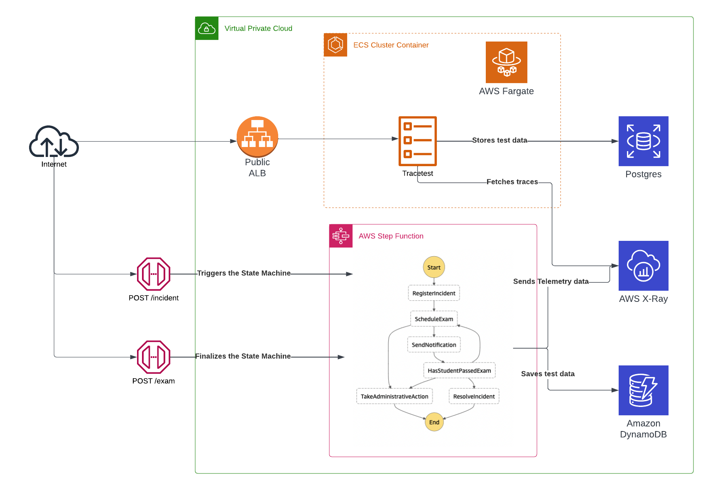
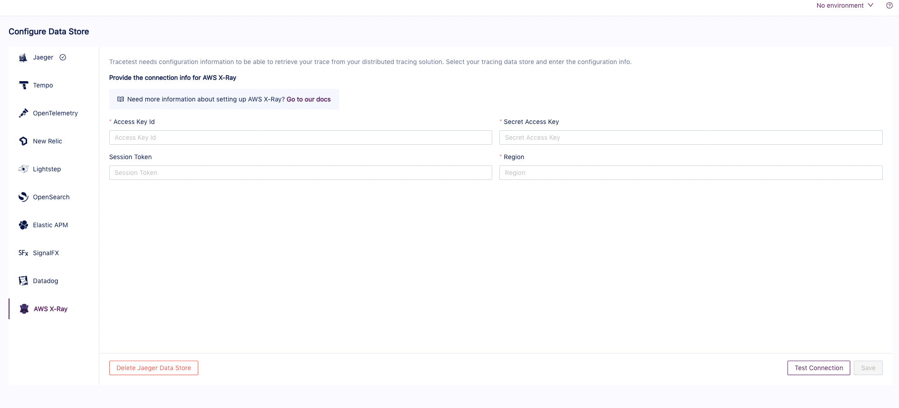
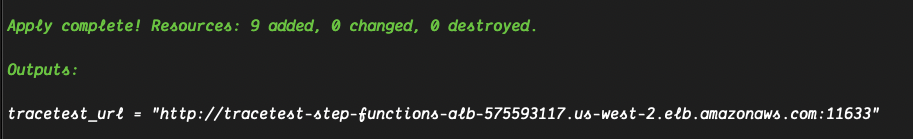
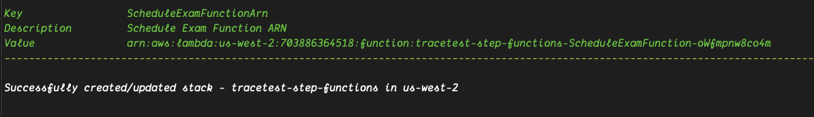

# Running Tracetest with AWS Step Functions, AWS X-Ray and Terraform

:::note
[Check out the source code on GitHub here.](https://github.com/kubeshop/tracetest/tree/main/examples/tracetest-aws-step-functions)
:::

[Tracetest](https://tracetest.io/) is a testing tool based on [OpenTelemetry](https://opentelemetry.io/) that allows you to test your distributed application. It allows you to use your telemetry data generated by the OpenTelemetry tools to check and assert if your application has the desired behavior defined by your test definitions.

[Terraform](https://www.terraform.io/) is an infrastructure as code tool that lets you define both cloud and on-prem resources in human-readable configuration files that you can version, reuse and share. You can then use a consistent workflow to provision and manage all of your infrastructure throughout its lifecycle.

[AWS Fargate](https://aws.amazon.com/fargate/) is a serverless, pay-as-you-go compute engine that lets you focus on building applications without managing servers. AWS Fargate is compatible with both Amazon Elastic Container Service (ECS) and Amazon Elastic Kubernetes Service (EKS).

[AWS Step Functions](https://aws.amazon.com/step-functions) is a visual workflow service that helps developers use AWS services to build distributed applications, automate processes, orchestrate microservices and create data and machine learning (ML) pipelines.

[AWS X-Ray](https://aws.amazon.com/xray/) provides a complete view of requests as they travel through your application and filters visual data across payloads, functions, traces, services, APIs and more with no-code and low-code motions.

## .NET Step Functions Serverless API with AWS X-Ray, AWS Fargate and Tracetest

The use case you'll see in this recipe is based on [this .NET demo repository](https://github.com/aws-samples/aws-step-functions-plagiarism-demo-dotnetcore) that illustrates how to create a Basic State Machine using Step Functions, Lambda and DynamoDB.

The infrastructure will use X-Ray as the trace data store to receive traces from the NET core lambda functions, SAM as deployment framework for the Step Functions and Terraform to provision the required AWS services to run Tracetest in the cloud.

## Services Architecture



## Prerequisites

You will need [Terraform](https://www.terraform.io/), a configured instance of the [AWS CLI](https://aws.amazon.com/cli/) and the [SAM CLI](https://docs.aws.amazon.com/serverless-application-model/latest/developerguide/install-sam-cli.html) installed on your machine to run this quick start Step Functions app!

## Project Structure

The project is divided into two main sections. The `infra` folder includes the basic services and resources that are required to run Tracetest in your AWS account using Terraform as the deployment framework. Meanwhile, the `src` folder includes the code and configuration to create and provision the Step Functions using the SAM framework.

### 1. NET Core Lambda Functions

The `src` directory includes a separate sub-folder for each of the Lambda functions that are a part of the Step Functions definition, there you can find what steps are taken for each of the checkpoints.

The State Machine definition can be found in the `scr/state-machine.asl.json` file which is written using the [AWS States Language](https://docs.aws.amazon.com/step-functions/latest/dg/concepts-amazon-states-language.html).

### 2. Tracetest

Under the `infra` folder you'll find the `tracetest.tf` file, which includes the required services and configuration to run Tracetest on AWS Fargate.

### AWS Network

To connect all of the services, the example generates a VPC network which includes private and public subnets. Internal services like the Postgres RDS instance are protected behind the VPC and only accessible through a node within the internal network.

There is one [Public Application Load Balancer](https://aws.amazon.com/elasticloadbalancing/application-load-balancer/) which provides access to the Tracetest task instance through port `11633`.

## Tracetest

The `infra/tracetest.tf` file contains the required services for the Tracetest server which include.

- **Postgres RDS** - Postgres is a prerequisite for Tracetest to work. It stores trace data when running the trace-based tests.
- [**Tracetest Task Definition**](https://docs.aws.amazon.com/AmazonECS/latest/developerguide/task_definitions.html) - The information on how to configure and provision Tracetest using ECS.
- [**ECS Service**](https://docs.aws.amazon.com/AmazonECS/latest/developerguide/ecs_services.html) - The server provisioning metadata to run the Tracetest Task Definition.
- **Networking** - Security groups, target groups and load balancer listeners required to have Tracetest connected to the rest of the AWS infrastructure.

### Configuring the Tracetest Container

The Tracetest docker image supports environment variables as the entry point for the bootstrap configuration. In this case the task definition includes the following:

```json
{
  "environment" : [
    // POSTGRES CONNECTION
    {
      "name" : "TRACETEST_POSTGRES_HOST",
      "value" : "${module.db.db_instance_address}"
    },
    {
      "name" : "TRACETEST_POSTGRES_PORT",
      "value" : "${tostring(module.db.db_instance_port)}"
    },
    {
      "name" : "TRACETEST_POSTGRES_DBNAME",
      "value" : "${module.db.db_instance_name}"
    },
    {
      "name" : "TRACETEST_POSTGRES_USER",
      "value" : "${module.db.db_instance_username}"
    },
    {
      "name" : "TRACETEST_POSTGRES_PASSWORD",
      "value" : "${module.db.db_instance_password}"
    },
  ]
}
```

## AWS X-Ray

This recipe uses AWS X-Ray as the Data Source for the telemetry data. It doesn't require any predefined configuration to start using this service, only needing the correct access for applications to be able to send and fetch information from it.

## How does Tracetest reach AWS X-Ray?

Tracetest supports the native AWS SDK library to connect to X-Ray to find traces. Currently, the only authentication method supported is manually adding a set of AWS credentials that have access to the X-Ray service from your account.
This can be done by either providing them from the initial bootstrap using:

```yaml
---
type: DataStore
spec:
  name: awsxray
  type: awsxray
  awsxray:
    accessKeyId: <your-accessKeyId>
    secretAccessKey: <your-secretAccessKey>
    sessionToken: <your-session-token>
    region: "us-west-2"
```

Or from the Tracetest settings page:


## How do traces reach AWS X-Ray?

This recipe uses the auto-instrumentation [library for .NET](https://docs.aws.amazon.com/xray-sdk-for-dotnet/latest/reference/html/N_Amazon_XRay_Recorder_Handlers_AwsSdk.htm) which automatically listens to any AWS SDK request and sends the telemetry data to X-Ray.

To provide the Lambda functions access to X-Ray, the `arn:aws:iam::aws:policy/AWSXrayWriteOnlyAccess` AWS managed policy is also added.

## Running the Example

The first thing you need to do is to provision the Tracetest infrastructure by running the following commands from the `infra` folder:

```bash
terraform init \
terraform apply
```

After accepting the changes after running the `terraform apply` command and finalizing the infra creation, you can find the output with the required endpoints to continue with tests.
The final output from the Terraform command should be a list of endpoints that are similar to the following:



You can follow the `tracetest_url` to find the Tracetest UI.

The second step is adding the AWS credentials for Tracetest to reach X-Ray by following this url `tracetest_url/settings`. Select X-Ray as the data store and update the settings.

**Tip.** After you add the credentials, you can test the connection by clicking the **Test Connection** button.

The third step is to create the Lambda functions and the rest of the services to run the Step Functions by running the following command from the `src` folder:

```bash
sam build \
sam deploy --guided
```

You'll be asked to fill in some details like the app name, email settings and a Sendgrid API key.
The output from the previous command should look similar to this:



## Running Trace-based Tests

Now that all of the required services and infra have been created, you can start running trace-based testing by doing the following:

1. Run this `sam list stack-outputs --stack-name <your_app_name>` command where you can copy the `StepFunctionsAPIUrl` value and add the `<your_api_endpoint>` placeholder from the `tests/incident.yaml` and `tests/exam.yaml` files.
2. From the Terraform output, configure the [Tracetest CLI](https://docs.tracetest.io/cli/configuring-your-cli) to point to the public load balancer endpoint with `tracetest configure --endpoint <tracetest_url>`.
3. Run the tests YAML file using the CLI.

```bash
  tracetest test run -d tests/incident.yaml \
  tracetest test run -d tests/exam.yaml \
  tracetest test run -d tests/transaction.yaml
```

4. Follow the link to find the results.

## Learn More

Please visit our [examples in GitHub](https://github.com/kubeshop/tracetest/tree/main/examples) and join our [Discord Community](https://discord.gg/8MtcMrQNbX) for more info!
