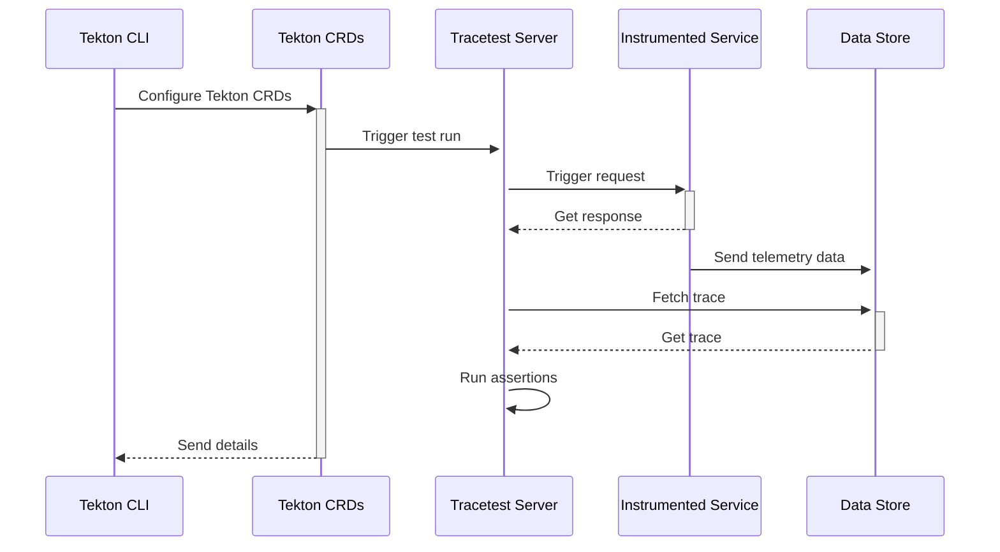

# Tracetest and Tekton - Cloud-Native CI/CD Pipelines

:::note
[Check out the source code on GitHub here.](https://github.com/kubeshop/tracetest/tree/main/examples/quick-start-tekton)
:::

[Tekton](https://tekton.dev/) is a powerful and flexible open-source framework for creating CI/CD systems, allowing developers to build, test, and deploy across cloud providers and on-premise systems.

[Tracetest](https://tracetest.io/) is a testing tool based on [OpenTelemetry](https://opentelemetry.io/) that allows you to test your distributed application. It allows you to use data from distributed traces generated by OpenTelemetry to validate and assert if your application has the desired behavior defined by your test definitions.

## Why do we want to run Tracetest with Tekton?

Tracetest leverages existing OpenTelemetry instrumentation to run assertions against every part of an HTTP transaction.

By running Tracetest with Tekton you can now add trace-based testing to the native CI/CD pipeline in your Kubernetes cluster. It allows you to run scheduled test runs and synthetic tests. All while following the trace-based testing principle and enabling full in-depth assertions against trace data, not just the response.

## Infrastructure Overview

The following is high level sequence diagram on how Tekton and Tracetest interact with the different pieces of the system:



## Prerequisites

Make sure you have these three things installed before starting.

1. A running Kubernetes cluster (either locally or in the cloud).
2. [Kubectl](https://kubernetes.io/docs/tasks/tools/)
3. [Helm](https://helm.sh/docs/intro/install/)
4. [Tekton CLI](https://tekton.dev/docs/cli/)

## Quickstart

Follow these steps to get started.

## 1. Install Tekton Pipelines and Triggers

Install Tekton Pipelines by following [these instructions for Pipelines](https://tekton.dev/docs/getting-started/tasks/#install-tekton-pipelines), and [there instructions for Triggers](https://tekton.dev/docs/getting-started/triggers/#install-tekton-triggers). Or, run the command below.

```bash
kubectl apply --filename \
https://storage.googleapis.com/tekton-releases/pipeline/latest/release.yaml

kubectl apply --filename \
https://storage.googleapis.com/tekton-releases/triggers/latest/release.yaml

kubectl apply --filename \
https://storage.googleapis.com/tekton-releases/triggers/latest/interceptors.yaml
```

## 2. Install Tracetest CLI

Install Tracetest CLI by following [these instructions](https://docs.tracetest.io/getting-started/installation) for your OS.

```bash
# MacOS example
brew install kubeshop/tracetest/tracetest
```

## 3. Install Tracetest in Your Kubernetes Cluster

```bash
tracetest server install
```

```text title="Expected output"
How do you want to run TraceTest? [type to search]:
  Using Docker Compose
> Using Kubernetes
```

Select `Using Kubernetes`.

```text title="Expected output"
Do you have OpenTelemetry based tracing already set up, or would you like us to install a demo tracing environment and app? [type to search]:
  I have a tracing environment already. Just install Tracetest
> Just learning tracing! Install Tracetest, OpenTelemetry Collector and the sample app.
```

Select `Just learning tracing! Install Tracetest, OpenTelemetry Collector and the sample app.`.

Confirm that Tracetest is running:

```bash
kubectl get all -n tracetest
```

```text title="Expected output"
NAME                                  READY   STATUS    RESTARTS        AGE
pod/otel-collector-7f4d87489f-vp6zn   1/1     Running   0               5m41s
pod/tracetest-78b9c84c57-t4prx        1/1     Running   3 (4m15s ago)   5m29s
pod/tracetest-postgresql-0            1/1     Running   0               5m42s

NAME                              TYPE        CLUSTER-IP      EXTERNAL-IP   PORT(S)               AGE
service/otel-collector            ClusterIP   10.96.173.226   <none>        4317/TCP              5m46s
service/tracetest                 ClusterIP   10.96.248.146   <none>        11633/TCP,4317/TCP   5m42s
service/tracetest-postgresql      ClusterIP   10.96.155.147   <none>        5432/TCP              5m42s
service/tracetest-postgresql-hl   ClusterIP   None            <none>        5432/TCP              5m42s

NAME                             READY   UP-TO-DATE   AVAILABLE   AGE
deployment.apps/otel-collector   1/1     1            1           5m46s
deployment.apps/tracetest        1/1     1            1           5m42s

NAME                                        DESIRED   CURRENT   READY   AGE
replicaset.apps/otel-collector-7f4d87489f   1         1         1       5m46s
replicaset.apps/tracetest-78b9c84c57        1         1         1       5m42s

NAME                                    READY   AGE
statefulset.apps/tracetest-postgresql   1/1     5m42s
```

By default, Tracetest is installed in the `tracetest` namespace.

To explore the Tracetest Web UI, run the command:

```bash
kubectl --kubeconfig <path-to-your-home>/.kube/config --context <your-cluster-context> --namespace tracetest port-forward svc/tracetest 11633
```


## 4. Create a Test in Tracetest

Start by clicking `Create` > `Create New Test` > `HTTP Request` > `Next` > `Choose Example` (dropdown) > `Pokeshop - List` (generates a sample test from the Tracetest demo) > `Next` > `URL` is prefilled with `http://demo-pokemon-api.demo/pokemon?take=20&skip=0` > `Create & Run`.

This will trigger the test and display a distributed trace in the `Trace` tab to run assertions against.


Proceed to add a test spec to assert all database queries return within 500 ms. Click the `Test` tab and proceed to click the `Add Test Spec` button.

In the span selector make sure to add this selector:

```css
span[tracetest.span.type="database"]
```

In the assertion field add:

```css
attr:tracetest.span.duration < 500ms
```

Save the test spec and publish the test.


The database spans that are returning in more than 500ms are labeled in red.


This is an example of a trace-based test that asserts against every single part of an HTTP transaction, including all interactions with the database.

However, Tracetest cannot run this test as part of your CI/CD without integrating with another tool.

Let's introduce how Tekton makes it possible.

## 5. Create a Task in Tekton

Click the ⚙️ button in the top right. Then click `Test Definition`.


This will open a YAML definition for the test run.


Save this into a file called `test-api.yaml`:

```yaml
type: Test
spec:
  id: RUkKQ_aVR
  name: Pokeshop - List
  description: Get a Pokemon
  trigger:
    type: http
    httpRequest:
      url: http://demo-pokemon-api.demo/pokemon?take=20&skip=0
      method: GET
      headers:
      - key: Content-Type
        value: application/json
  specs:
  - name: Database queries less than 500 ms
    selector: span[tracetest.span.type="database"]
    assertions:
    - attr:tracetest.span.duration  <  500ms
```

Create another YAML file, name it `install-and-run-tracetest.yaml`.
This contains the Tekton `Task` definition.

```yaml
apiVersion: tekton.dev/v1beta1
kind: Task
metadata:
  name: install-and-run-tracetest
spec:
  steps:
    - name: create-test-files
      image: ubuntu
      script: |
        #!/usr/bin/env bash
        cat <<EOF >/workspace/test-api.yaml
        type: Test
        spec:
          id: RUkKQ_aVR
          name: Pokeshop - List
          description: Get a Pokemon
          trigger:
            type: http
            httpRequest:
              url: http://demo-pokemon-api.demo/pokemon?take=20&skip=0
              method: GET
              headers:
              - key: Content-Type
                value: application/json
          specs:
          - name: Database queries less than 500 ms
            selector: span[tracetest.span.type="database"]
            assertions:
            - attr:tracetest.span.duration  <  500ms
        EOF
      volumeMounts:
      - name: custom
        mountPath: /workspace
    - name: install-and-run-tracetest
      image: kubeshop/tracetest:v0.11.9 # The official Tracetest image comes with the Tracetest CLI installed
      script: |
        # Configure and Run Tracetest CLI
        tracetest configure -g --endpoint http://tracetest.tracetest.svc.cluster.local:11633/
        tracetest run test -f /workspace/test-api.yaml
      volumeMounts:
      - name: custom
        mountPath: /workspace
  volumes:
  - name: custom
    emptyDir: {}
```

```bash
kubectl apply -f ./install-and-run-tracetest.yaml
```

Make sure to use the Tracetest service as the endpoint for your `tracetest configure` command. This may vary depending on your installation.

```bash
http://tracetest.tracetest.svc.cluster.local:11633/
```

## 6. Run the Tracetest Trace-based Test in Tekton with a TaskRun

Finally, to run the test, create a `TaskRun`.

Create a file called `install-and-run-tracetest-run.yaml`.

```yaml
apiVersion: tekton.dev/v1beta1
kind: TaskRun
metadata:
  name: install-and-run-tracetest-run
spec:
  taskRef:
    name: install-and-run-tracetest
```

```bash
kubectl apply -f ./install-and-run-tracetest-run.yaml
```

Here's how to check the logs:

```bash
kubectl logs --selector=tekton.dev/taskRun=install-and-run-tracetest-run
```

You can also trigger a Task with the Tekton CLI.

```bash
tkn task start install-and-run-tracetest
```

```text title="Expected output"
TaskRun started: install-and-run-tracetest-run-xmhfg
```

In order to track the TaskRun progress run:

```bash
tkn taskrun logs install-and-run-tracetest-run-gccjk -f -n default

[install-and-run-tracetest] ✔ Pokeshop - List (http://tracetest.tracetest.svc.cluster.local:11633/test/RUkKQ_aVR/run/3/test) - trace id: 0549641531d3221ded696f2fd3b20ce6
[install-and-run-tracetest] 	✔ Database queries less than 500 ms
[install-and-run-tracetest]
```

To preview which tasks failed or succeeded, use this command:

```bash
tkn taskrun list
```

```text title="Expected output"
NAME                                  STARTED          DURATION   STATUS
install-and-run-tracetest-run         3 minutes ago    23s        Succeeded
install-and-run-tracetest-run-nmptn   7 minutes ago    33s        Failed
install-and-run-tracetest-run-bhf7v   20 minutes ago   23s        Succeeded
install-and-run-tracetest-run-wm8bj   21 minutes ago   22s        Succeeded
install-and-run-tracetest-run-dbrbt   23 minutes ago   24s        Failed
```

## 7. Trigger Trace-based Tests with an EventListener

By using Tektons's [triggers](https://tekton.dev/docs/getting-started/triggers/), you can trigger tests via an [eventlistener](https://tekton.dev/docs/getting-started/triggers/#create-an-eventlistener).

### Create a TriggerTemplate and TriggerBinding

```yaml title="install-and-run-tracetest-trigger-binding.yaml"
apiVersion: triggers.tekton.dev/v1beta1
kind: TriggerTemplate
metadata:
  name: install-and-run-tracetest-template
spec:
  resourcetemplates:
  - apiVersion: tekton.dev/v1beta1
    kind: TaskRun
    metadata:
      generateName: install-and-run-tracetest-run-
    spec:
      taskRef:
        name: install-and-run-tracetest
```

```yaml title="install-and-run-tracetest-trigger-template.yaml"
apiVersion: triggers.tekton.dev/v1beta1
kind: TriggerBinding
metadata:
  name: install-and-run-tracetest-binding
spec:
  params:
  - name: run
    value: $(body.run)
```

```bash
kubectl apply -f install-and-run-tracetest-trigger-binding.yaml
kubectl apply -f install-and-run-tracetest-trigger-template.yaml
```

### Create an EventListener

```yaml title="install-and-run-tracetest-event-listener.yaml"
apiVersion: triggers.tekton.dev/v1beta1
kind: EventListener
metadata:
  name: install-and-run-tracetest-event-listener
spec:
  serviceAccountName: tekton-robot
  triggers:
    - name: install-and-run-tracetest-trigger 
      bindings:
      - ref: install-and-run-tracetest-binding
      template:
        ref: install-and-run-tracetest-template
```

The EventListener requires a service account to run. To create the service account for this example create a file named `tekton-robot-rbac.yaml` and add the following:

```yaml title="tekton-robot-rbac.yaml"
apiVersion: v1
kind: ServiceAccount
metadata:
  name: tekton-robot
---
apiVersion: rbac.authorization.k8s.io/v1
kind: RoleBinding
metadata:
  name: triggers-example-eventlistener-binding
subjects:
- kind: ServiceAccount
  name: tekton-robot
roleRef:
  apiGroup: rbac.authorization.k8s.io
  kind: ClusterRole
  name: tekton-triggers-eventlistener-roles
---
apiVersion: rbac.authorization.k8s.io/v1
kind: ClusterRoleBinding
metadata:
  name: triggers-example-eventlistener-clusterbinding
subjects:
- kind: ServiceAccount
  name: tekton-robot
  namespace: default
roleRef:
  apiGroup: rbac.authorization.k8s.io
  kind: ClusterRole
  name: tekton-triggers-eventlistener-clusterroles
```

```bash
kubectl apply -f tekton-robot-rbac.yaml
kubectl apply -f install-and-run-tracetest-event-listener.yaml
```

Enable port forwarding.

```bash
kubectl port-forward service/el-install-and-run-tracetest-event-listener 8080
```

Hitting the port forwarded endpoint will trigger the task.

```text
curl -v \
   -H 'content-Type: application/json' \
   -d '{"run":true}' \
   http://localhost:8080
```

Checking the `taskruns` will confirm this.

```bash
tkn taskrun list
```

```text title="Expected output"
NAME                                  STARTED          DURATION   STATUS
install-and-run-tracetest-run-69zrz   4 seconds ago    ---        Running(Pending)
```

Finally, check the logs:

```bash
tkn taskrun logs -f install-and-run-tracetest-run-69zrz
```

```text title="Expected output"
[install-and-run-tracetest] ✔ Pokeshop - List (http://tracetest.tracetest.svc.cluster.local:11633/test/RUkKQ_aVR/run/5/test)
[install-and-run-tracetest] 	✔ Database queries less than 500 ms
```

## Next Steps

To explore more options that Tekton gives you, check out [the docs](https://tekton.dev/docs/getting-started/) to learn more!
