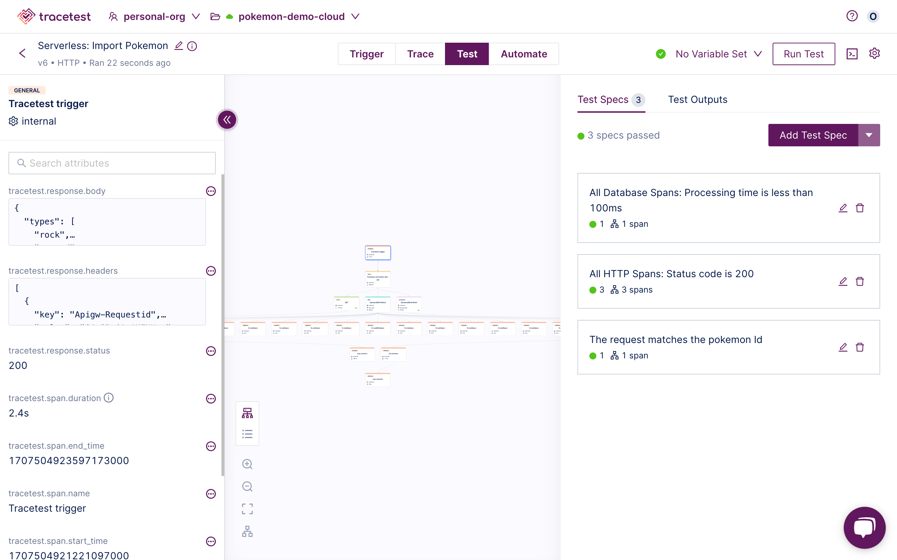

:::note
[Check out the source code on GitHub here.](https://github.com/kubeshop/tracetest/tree/main/examples/quick-start-serverless)
:::

[Tracetest](https://tracetest.io/) is a testing tool based on [OpenTelemetry](https://opentelemetry.io/) that allows you to test your distributed application. It allows you to use data from distributed traces generated by OpenTelemetry to validate and assert if your application has the desired behavior defined by your test definitions.

[AWS Lambda](https://aws.amazon.com/lambda/) is a serverless, event-driven compute service that lets you run code for virtually any type of application or backend service without provisioning or managing servers. You can trigger Lambda from over 200 AWS services and software as a service (SaaS) applications, and only pay for what you use.

[The Serverless Framework](https://www.serverless.com/) is an open-source framework designed to help developers build and deploy serverless applications more efficiently. It abstracts away the underlying infrastructure management tasks, allowing developers to focus solely on writing code and defining the functions that comprise their applications.

## Why is this important?

Testing Serverless Functions has been a pain point for years. Not having visibility into the infrastructure and not knowing where a test fails causes the MTTR to be higher than for other tools. Including OpenTelemetry in AWS Lambda functions exposes telemetry that you can use for both production visibility and trace-based testing.

This sample shows how to run integration tests against AWS Lambda Functions with the help of the Serverless Framework to manage resources, and using [OpenTelemetry](https://opentelemetry.io/) and Tracetest.

The AWS Lambda function will fetch data from an external API, transform the data, and insert it into an AWS DynamoDB table. This particular flow has two failure points that are difficult to test.

1. Validating that an external API request from an AWS Lambda function is successful.
2. Validating that the DynamoDB put request is successful.

## Prerequisites

**Tracetest Account**:

- Copy the `.env.template` file to `.env`.
- Log into **the** [Tracetest app](https://app.tracetest.io/).
- This example is configured to use the OpenTelemetry Collector. Ensure the environment you will be utilizing to run this example is also configured to use the OpenTelemetry Tracing Backend by clicking on Settings, Tracing Backend, OpenTelemetry, and Save.
- Configure your environment to use [the cloud agent](https://docs.tracetest.io/concepts/cloud-agent), click the Click the Settings link and from the Agent tab select the "Run Agent in tracetest cloud" option.
- Fill out the [token](https://docs.tracetest.io/concepts/environment-tokens) and [agent url](https://docs.tracetest.io/concepts/cloud-agent) details by editing your .env file. You can find these values in the Settings area for your environment.
- Have your [AWS Account](https://aws.amazon.com/) with the [AWS CLI](https://aws.amazon.com/cli/) installed and configured.

**AWS Lambda Functions Example:**

Clone the [Tracetest GitHub Repo](https://github.com/kubeshop/tracetest) to your local machine, and open the Serverless quick start example app.

```bash title=Terminal
git clone https://github.com/kubeshop/tracetest.git
cd tracetest/examples/quick-start-serverless
```

Before moving forward, run `npm i` in the root folder to install the dependencies.

```bash title=Terminal
npm i
```

## Project Structure

This is a [Serverless Framework](https://www.serverless.com/) project bootstrapped with [`serverless`](https://www.npmjs.com/package/serverless#quick-start).

### 1. AWS Lambda Function

The AWS Lambda Function code can be found in `src/` alongside the [OpenTelemetry wrapper configured as explained in the OpenTelemetry docs](https://opentelemetry.io/docs/languages/js/serverless/).

### 2. Tracetest

The `tracetest.ts` file contains the script that will execute the trace-based tests based on the serverless deployment.

## AWS Lambda Function

The AWS Lambda is a simple API, [contained in the `src/handler.ts` file](https://github.com/kubeshop/tracetest/blob/main/examples/quick-start-serverless/src/handler.ts).

```typescript title=src/handler.ts
import { APIGatewayEvent, Handler } from "aws-lambda";
import fetch from "node-fetch";
import { Pokemon, RawPokemon } from "./types";
import DynamoDb from "./dynamodb";

const Pokemon = (raw: RawPokemon): Pokemon => ({
  id: raw.id,
  name: raw.name,
  types: raw.types.map((type) => type.type.name),
  imageUrl: raw.sprites.front_default,
});

const getPokemon = async (id: string): Promise<Pokemon> => {
  const url = `https://pokeapi.co/api/v2/pokemon/${id}`;
  const res = await fetch(url);

  const raw = await res.json();

  return Pokemon(raw);
};

const insertPokemon = async (pokemon: Pokemon) => {
  await DynamoDb.put(pokemon);

  return DynamoDb.get<Pokemon>(pokemon.id);
};

type TBody = { id: string };

export const importPokemon: Handler<APIGatewayEvent> = async (event) => {
  console.log(event);

  const { id = "" } = JSON.parse(event.body || "") as TBody;

  try {
    const pokemon = await getPokemon(id);
    const result = await insertPokemon(pokemon);

    return {
      statusCode: 200,
      body: JSON.stringify(result),
    };
  } catch (error) {
    return {
      statusCode: 400,
      body: error.message,
    };
  }
};
```

The OpenTelemetry tracing is [contained in the `src/lambda-wrapper.ts` file](https://github.com/kubeshop/tracetest/blob/main/examples/quick-start-serverless/src/lambda-wrapper.ts). Traces will be sent to the Tracetest Cloud Agent.

```typescript title=src/lambda-wrapper.ts
const api = require("@opentelemetry/api");
const { BatchSpanProcessor } = require("@opentelemetry/sdk-trace-base");
const { OTLPTraceExporter } = require("@opentelemetry/exporter-trace-otlp-grpc");
const { NodeTracerProvider } = require("@opentelemetry/sdk-trace-node");
const { registerInstrumentations } = require("@opentelemetry/instrumentation");
const { getNodeAutoInstrumentations } = require("@opentelemetry/auto-instrumentations-node");

api.diag.setLogger(new api.DiagConsoleLogger(), api.DiagLogLevel.ALL);

const { COLLECTOR_ENDPOINT = "" } = process.env;

const provider = new NodeTracerProvider();

const spanProcessor = new BatchSpanProcessor(
  new OTLPTraceExporter({
    url: COLLECTOR_ENDPOINT,
  })
);

provider.addSpanProcessor(spanProcessor);
provider.register();

registerInstrumentations({
  instrumentations: [
    getNodeAutoInstrumentations({
      "@opentelemetry/instrumentation-aws-lambda": {
        disableAwsContextPropagation: true,
      },
    }),
  ],
});
```

## Set up Environment Variables

Copy the `.env.template` and create a `.env` file in the same directory. Add token and Cloud Agent endpoint.

```txt title=.env
TRACETEST_AGENT_ENDPOINT=<my_agent_endpoint>
TRACETEST_API_KEY=<my_token_with_engineer_access>
```

## The Tracetest Script

The `tracetest.ts` file contains the script that will execute the trace-based tests based on the serverless deployment.

```typescript title=tracetest.ts
import Tracetest from "@tracetest/client";
import { TestResource } from "@tracetest/client/dist/modules/openapi-client";
import { config } from "dotenv";

config();

const { TRACETEST_API_TOKEN = "", ENDPOINT = "" } = process.env;

const definition: TestResource = {
  type: "Test",
  spec: {
    id: "ZV1G3v2IR",
    name: "Serverless: Import Pokemon",
    trigger: {
      type: "http",
      httpRequest: {
        method: "POST",
        url: "${var:ENDPOINT}/import",
        body: '{"id": "${var:POKEMON_ID}"}\n',
        headers: [
          {
            key: "Content-Type",
            value: "application/json",
          },
        ],
      },
    },
    specs: [
      {
        selector: 'span[tracetest.span.type="database"]',
        name: "All Database Spans: Processing time is less than 100ms",
        assertions: ["attr:tracetest.span.duration < 100ms"],
      },
      {
        selector: 'span[tracetest.span.type="http"]',
        name: "All HTTP Spans: Status  code is 200",
        assertions: ["attr:http.status_code = 200"],
      },
      {
        selector:
          'span[name="tracetest-serverless-dev-api"] span[tracetest.span.type="http" name="GET" http.method="GET"]',
        name: "The request matches the pokemon Id",
        assertions: ['attr:http.url  =  "https://pokeapi.co/api/v2/pokemon/${var:POKEMON_ID}"'],
      },
    ],
  },
};

const main = async () => {
  const tracetest = await Tracetest(TRACETEST_API_TOKEN);

  const test = await tracetest.newTest(definition);
  await tracetest.runTest(test, {
    variables: [
      {
        key: "ENDPOINT",
        value: ENDPOINT.trim(),
      },
      {
        key: "POKEMON_ID",
        value: `${Math.floor(Math.random() * 100) + 1}`,
      },
    ],
  });
  console.log(await tracetest.getSummary());
};

main();
```

The output from the `tracetest.ts` script will show the test results with links to the Tracetest App.

```bash title=Terminal
> tracetest-serverless@1.0.0 test
> ENDPOINT="$(serverless info --verbose | grep HttpApiUrl | sed s/HttpApiUrl\:\ //g)" ts-node tracetest.ts


Successful: 1
Failed: 0

[✔️ Serverless: Import Pokemon] #21 - https://app.tracetest.io/organizations/ttorg_ced62e34638d965e/environments/ttenv_a613d93805243f83/test/ZV1G3v2IR/run/21
```

### Tracetest App Results



To run the tests without deploying the serverless stack, you can use the `npm test` command.

### Running the example

Spin up the deployment and test execution.

```bash title=Terminal
npm start
```

This will trigger the serverless deploy command and immediately run the [trace-based tests using the Tracetest Typescript integration](../../tools-and-integrations/typescript.mdx) after completion.

## Learn More

Feel free to check out our [examples in GitHub](https://github.com/kubeshop/tracetest/tree/main/examples) and join our [Slack Community](https://dub.sh/tracetest-community) for more info!
