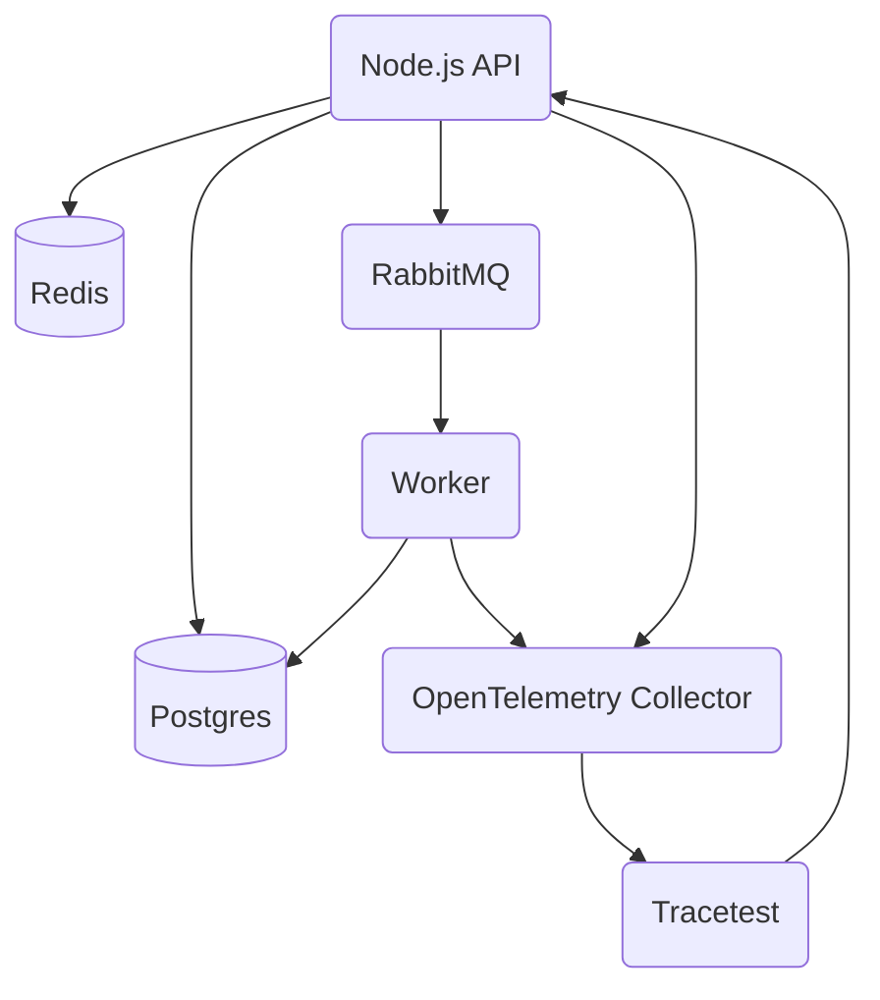

import Tabs from '@theme/Tabs';
import TabItem from '@theme/TabItem';
import CodeBlock from '@theme/CodeBlock';
import GtagInstallCliTabs from '@site/src/components/GtagInstallCliTabs';

So far, you've learned:

- How to define a trigger to executes tests against your apps.
- How to configure trace ingestion.
- How to configure your application to export traces.

This will enable trace-based testing in your apps that have OpenTelemetry distributed tracing configured.

We've provided a sample application with OpenTelemetry already enabled for you to try.

## Start the Sample Pokeshop API

To create tests quickly, start the official sample called [Pokeshop API](/live-examples/pokeshop/overview).

<Tabs groupId="installation">
<TabItem value="cli" label="Tracetest CLI" default>

```bash title="Terminal"
git clone --depth 1 https://github.com/kubeshop/tracetest.git
cd tracetest/examples/tracetest-agent/pokeshop/

docker compose up -d --build
```

- [`https://app.tracetest.io/`](https://app.tracetest.io) - Access the Tracetest Web UI. Sign up and create an organization.
- [`http://localhost:8081`](http://localhost:8081) - The Pokeshop API demo is exposed from Docker to `localhost` on this port. 
- `http://localhost:8081` - To run tests you will use `localhost` since it is exposed from Docker.
- `http://localhost:4317` - Trace ingestion URL where Tracetest Agent will accept traces. Since Pokeshop is running in Docker and Tracetest Agent is running on `localhost` this sample uses  `http://host.docker.internal:4317` to ingest traces instead of `http://localhost:4317`.

</TabItem>

<TabItem value="docker" label="Docker">

```bash title="Terminal"
git clone --depth 1 https://github.com/kubeshop/pokeshop.git
cd pokeshop

docker compose up -d --build
```

- [`https://app.tracetest.io/`](https://app.tracetest.io) - Access the Tracetest Web UI. Sign up and create an organization.
- [`http://localhost:8081`](http://localhost:8081) - The Pokeshop API demo is exposed from Docker to `localhost` on this port. 
- `http://api:8081` - To run tests you will use the Docker internal network and the service name.
- `http://tracetest-agent:4317` - Trace ingestion URL where Tracetest Agent will accept traces.

<details>
  <summary>
    <b>Docker Networking</b>
  </summary>
  Running a test against `localhost` will resolve as `127.0.0.1` inside the Tracetest Agent container.

  Add Tracetest Agent to the same network and use service name mapping. *Example: Instead of running an app on `localhost:8080`, add it to your Docker Compose file, connect it to the same network as your Tracetest Agent service, and use `<service-name>:8080` in the URL field when creating a test.*

  You can reach services running on your local machine using:

  - Linux (Docker version < 20.10.0): `172.17.0.1:8080`
  - MacOS (Docker version >= 18.03) and Linux (Docker version >= 20.10.0): `host.docker.internal:8080`
</details>

</TabItem>

<TabItem value="docker-compose" label="Docker Compose">

```bash title="Terminal"
git clone --depth 1 https://github.com/kubeshop/pokeshop.git
cd pokeshop

docker compose up -d --build
```

- [`https://app.tracetest.io/`](https://app.tracetest.io) - Access the Tracetest Web UI. Sign up and create an organization.
- [`http://localhost:8081`](http://localhost:8081) - The Pokeshop API demo is exposed from Docker to `localhost` on this port.
- `http://api:8081` - To run tests you will use the Docker internal network and the service name.
- `http://tracetest-agent:4317` - Trace ingestion URL where Tracetest Agent will accept traces.

<details>
  <summary>
    <b>Docker Networking</b>
  </summary>
  Running a test against `localhost` will resolve as `127.0.0.1` inside the Tracetest Agent container.

  Add Tracetest Agent to the same network and use service name mapping. *Example: Instead of running an app on `localhost:8080`, add it to your Docker Compose file, connect it to the same network as your Tracetest Agent service, and use `<service-name>:8080` in the URL field when creating a test.*

  You can reach services running on your local machine using:

  - Linux (Docker version < 20.10.0): `172.17.0.1:8080`
  - MacOS (Docker version >= 18.03) and Linux (Docker version >= 20.10.0): `host.docker.internal:8080`
</details>

</TabItem>

<TabItem value="kubernetes" label="Kubernetes">

```bash title="Terminal"
git clone --depth 1 https://github.com/kubeshop/pokeshop.git
cd pokeshop/k8s

kubectl apply -f .
```

To access the Pokeshop API run a `port-forward`:

```bash
kubectl port-forward svc/api 8081:8081
```

- [`https://app.tracetest.io/`](https://app.tracetest.io) - Access the Tracetest Web UI. Sign up and create an organization.
- [`http://localhost:8081`](http://localhost:8081) - The Pokeshop API demo is port forwarded from Kubernetes to `localhost` on this port.
- `http://api.default.svc.cluster.local:8081` - To run tests you will use the Kubernetes internal network and the service name.
- `http://tracetest-agent.default.svc.cluster.local:4317` - Trace ingestion URL where Tracetest Agent will accept traces.

<details>
  <summary>
    <b>Kubernetes Networking</b>
  </summary>
  Make sure to use the correct `<service-name>` if you edit the Tracetest Agent `service` name.

  Running a test against `localhost` will resolve as `127.0.0.1` inside the Tracetest Agent container.
  Make sure to run tests using the internal Kubernetes service networking eg: `http://<your-app-service-name>.default.svc.cluster.local:port`.
</details>

</TabItem>

<TabItem value="helm" label="Helm">

```bash title="Terminal"
git clone --depth 1 https://github.com/kubeshop/pokeshop.git
cd pokeshop/helm-charts

helm dependency update
helm install -f values.yaml --create-namespace pokeshop .
```

To access the Pokeshop API run a `port-forward`:

```bash
kubectl port-forward svc/pokeshop-pokemon-api 8081:8081
```

- [`https://app.tracetest.io/`](https://app.tracetest.io) - Access the Tracetest Web UI. Sign up and create an organization.
- [`http://localhost:8081`](http://localhost:8081) - The Pokeshop API demo is port forwarded from Kubernetes to `localhost` on this port.
- `http://pokeshop-pokemon-api:8081` - To run tests you will use the Kubernetes internal network and the service name.
- `http://agent-tracetest-agent:4317` - Trace ingestion URL where Tracetest Agent will accept traces.

<details>
  <summary>
    <b>Kubernetes Networking</b>
  </summary>
  Make sure to use the correct `<service-name>` if you edit the Tracetest Agent Helm chart `<release-name>` name.

  Running a test against `localhost` will resolve as `127.0.0.1` inside the Tracetest Agent container.
  Make sure to run tests using the internal Kubernetes service networking eg: `http://<your-app-service-name>.default.svc.cluster.local:port`.

  In the following example you can use: `http://pokeshop-pokemon-api:8081`.
</details>

</TabItem>

</Tabs>

<details>
  <summary>
    <b>Click to view the sample Pokeshop API architecture</b>
  </summary>

Here's the Architecture of the Pokeshop Sample App:

- an **API** that serves client requests,
- a **Worker** who deals with background processes.

The communication between the API and Worker is made using a `RabbitMQ` queue, and both services emit telemetry data to OpenTelemetry Collector and communicate with a Postgres database.

Tracetest triggers tests against the Node.js API.


</details>

## Create Trace-based Tests in Two Ways

1. Programmatically, in YAML
2. Visually, in the Web UI

## Create a Trace-based Test Programatically in YAML

Create a file called `import-pokemon.yaml`.

<Tabs groupId="installation">
<TabItem value="cli" label="Tracetest CLI" default>

```yaml title="import-pokemon.yaml"
type: Test
spec:
  name: Import a Pokemon using API and MQ Worker
  description: Import a Pokemon
  trigger:
    type: http
    httpRequest:
      method: POST
      url: http://localhost:8081/pokemon/import
      body: |
        {
          "id": 143
        }
      headers:
      - key: Content-Type
        value: application/json
```

</TabItem>

<TabItem value="docker" label="Docker">

```yaml title="import-pokemon.yaml"
type: Test
spec:
  name: Import a Pokemon using API and MQ Worker
  description: Import a Pokemon
  trigger:
    type: http
    httpRequest:
      method: POST
      url: http://api:8081/pokemon/import
      body: |
        {
          "id": 143
        }
      headers:
      - key: Content-Type
        value: application/json
```

</TabItem>

<TabItem value="docker-compose" label="Docker Compose">

```yaml title="import-pokemon.yaml"
type: Test
spec:
  name: Import a Pokemon using API and MQ Worker
  description: Import a Pokemon
  trigger:
    type: http
    httpRequest:
      method: POST
      url: http://api:8081/pokemon/import
      body: |
        {
          "id": 143
        }
      headers:
      - key: Content-Type
        value: application/json
```

</TabItem>

<TabItem value="kubernetes" label="Kubernetes">

```yaml title="import-pokemon.yaml"
type: Test
spec:
  name: Import a Pokemon using API and MQ Worker
  description: Import a Pokemon
  trigger:
    type: http
    httpRequest:
      method: POST
      url: http://api.default.svc.cluster.local:8081/pokemon/import
      body: |
        {
          "id": 143
        }
      headers:
      - key: Content-Type
        value: application/json
```

</TabItem>

<TabItem value="helm" label="Helm">

```yaml title="import-pokemon.yaml"
type: Test
spec:
  name: Import a Pokemon using API and MQ Worker
  description: Import a Pokemon
  trigger:
    type: http
    httpRequest:
      method: POST
      url: http://pokeshop-pokemon-api:8081/pokemon/import
      body: |
        {
          "id": 143
        }
      headers:
      - key: Content-Type
        value: application/json
```

</TabItem>

</Tabs>


Run it with the CLI.

```bash title="Terminal"
tracetest run test -f ./import-pokemon.yaml
```

## Create a Trace-based Test Visually with the Web UI

Create a test in the Web UI by opening your Tracetest account, clicking the Create button, and selecting HTTP.


<Tabs groupId="installation">
<TabItem value="cli" label="Tracetest CLI" default>

Enter `http://localhost:8081/pokemon/import` as the URL, select `POST`, add a JSON body `{ "id": 6 }`, and click Run.


</TabItem>
<TabItem value="docker" label="Docker">

Enter `http://api:8081/pokemon/import` as the URL, select `POST`, add a JSON body `{ "id": 6 }`, and click Run.


</TabItem>

<TabItem value="docker-compose" label="Docker Compose">

Enter `http://api:8081/pokemon/import` as the URL, select `POST`, add a JSON body `{ "id": 6 }`, and click Run.


</TabItem>

<TabItem value="kubernetes" label="Kubernetes">

Enter `http://api.default.svc.cluster.local:8081/pokemon/import` as the URL, select `POST`, add a JSON body `{ "id": 6 }`, and click Run.


</TabItem>

<TabItem value="helm" label="Helm">

Enter `http://pokeshop-pokemon-api:8081/pokemon/import` as the URL, select `POST`, add a JSON body `{ "id": 6 }`, and click Run.


</TabItem>
</Tabs>

## View the Trace Response

With trace ingestion configured you can view the resulting trace that was generated by the app. Every test you run will now have additional observability with distributed traces.


:::tip Don't have OpenTelemetry installed?
[Follow these instructions to install OpenTelemetry in 5 minutes without any code changes!](./no-otel.mdx)
:::
