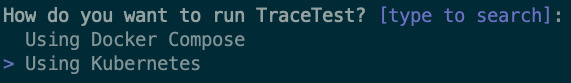

# Installation

## TL;DR

Install the CLI and use it to setup a server:

```shell
curl -L https://raw.githubusercontent.com/kubeshop/tracetest/main/install-cli.sh | bash
tracetest server install
```

## How It Works

Getting started with observability and OpenTelemetry can be complex and overwhelming. It involves different interconected services working together.

Our CLI offers an **install wizard** that helps with the process. It helps not only to setup tracetest itself, but all the tools needed 
to observe your application.

Use the install wizard to install Tracetest locally using Docker Compose or to a local or remote Kubernetes cluster.
It installs all the tools required to set up the desired environment and creates all the configurations, tailored to your case.

## CLI Installation

Every time we release a new version of Tracetest, we generate binaries for Linux, MacOS, and Windows. Supporting both amd64, and ARM64 architectures, in `tar.gz`, `deb`, `rpm` and `exe` formats
You can find the latest version [here](https://github.com/kubeshop/tracetest/releases/latest).

### Linux/MacOS

Tracetest CLI can be installed automatically using the following script:
```sh
curl -L https://raw.githubusercontent.com/kubeshop/tracetest/main/install-cli.sh | bash
```

It works for systems with Hombrew, `apt-get`, `dpkg`, `yum`, `rpm` installed, and if no package manager is available, it will try to download the build and install it manually.

You can also manually install with one of the following methods

#### Homebrew

```sh
brew install kubeshop/tracetest/tracetest
```

#### apt

```sh
# requirements for our deb repo to work
sudo apt-get update && sudo apt-get install -y apt-transport-https ca-certificates

# add repo
echo "deb [trusted=yes] https://apt.fury.io/tracetest/ /" | sudo tee /etc/apt/sources.list.d/fury.list

# update and install
sudo apt-get update
sudo apt-get install tracetest
```

#### yum

```sh
# add repository
cat <<EOF | $SUDO tee /etc/yum.repos.d/tracetest.repo
[tracetest]
name=Tracetest
baseurl=https://yum.fury.io/tracetest/
enabled=1
gpgcheck=0
EOF

# install
sudo yum install tracetest --refresh
```

### Windows
Download one of the files from the latest tag, extract to your machine, and then [add the tracetest binary to your PATH variable](https://stackoverflow.com/a/41895179)

## Server Deployments

### Docker Compose

You can run Tracetest locally using Docker Compose. This setup is great for a development environment. In this form, Tracetest runs in parallel to your Dockerized application,
allowing you to interact with your app and its traces, create and run tests over them, etc.


**Tools required (installed if missing)**:
- Docker
- Docker Compose

**Requirements**:
- Jaeger or other compatible backend. If missing, the installer will help you configure one.
- OpenTelemetry Collector. If missing, the installer will help you configure one.
- A `docker-compose.yaml` (configurable) file in the project directory. If missing, the installer will create an empty file.

**Optionals**:
- [PokeShop demo app](https://github.com/kubeshop/pokeshop/)

**Result**:
- `tracetest/` directory (configurable) with a `docker-compose.yaml` and other config files.
- [Jaeger](https://www.jaegertracing.io/) instance, if selected.
- [OpenTelemetry Collector](https://opentelemetry.io/docs/collector/), if selected.
- [PokeShop demo app](https://github.com/kubeshop/pokeshop/), if selected.

### Kubernetes

You can run Tracetest in a Kubernetes cluster. This setup is ideal for a CI/CD environment, QA teams working on shared environments, etc.
You can use a remote or local (minikube, etc) cluster. We'll even help you setup a local cluster, if you need one.



**Tools required (installed if missing)**:
- kubectl
- helm

If you selected to run locally and want the installer to set up [minikube](https://minikube.sigs.k8s.io/docs/) for you:
- Docker

**Requirements**:
- Jaeger or other compatible backend. If missing, the installer will help you configure one.
- OpenTelemetry Collector. If missing, the installer will help you configure one.

**Optionals**:
- [PokeShop demo app](https://github.com/kubeshop/pokeshop/)

**Result**:
- `tracetest` helm chart deployed in the `tracetest` (configurable) namespace.
- [Jaeger](https://www.jaegertracing.io/) instance deployed in the `tracetest` namespace, if selected.
- [Cert Manager](https://cert-manager.io/), if selected.
- [Jaeger Operator](https://www.jaegertracing.io/docs/latest/operator/), if selected.
- [OpenTelemetry Collector](https://opentelemetry.io/docs/collector/) deployed in the `tracetest` (configurable) namespace, if selected.
- [PokeShop demo app](https://github.com/kubeshop/pokeshop/) deployed in the `demo` namespace, if selected.
