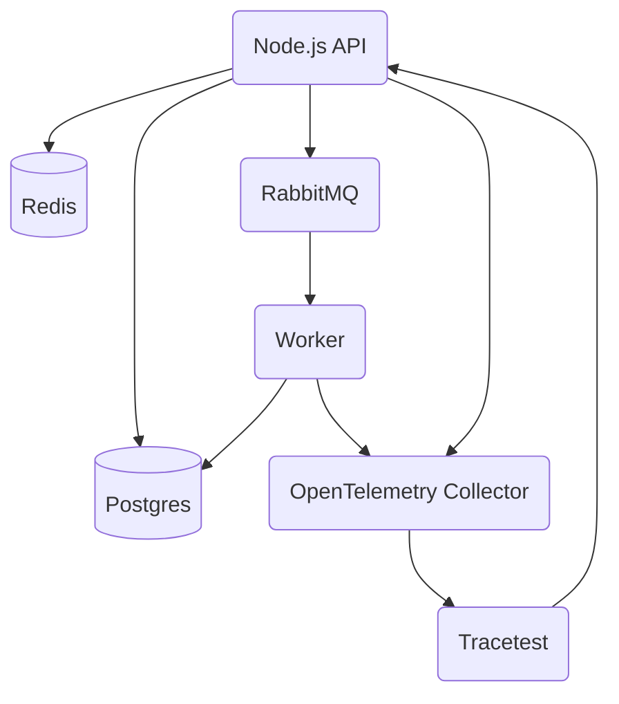

# Installing Tracetest

<!-- Docusaurus imports start -->

import Tabs from '@theme/Tabs';
import TabItem from '@theme/TabItem';
import CodeBlock from '@theme/CodeBlock';
import GtagInstallCliTabs from '@site/src/components/GtagInstallCliTabs';

<!-- Docusaurus imports end -->

This page showcases getting started with Tracetest by using the Tracetest CLI, Docker, or Kubernetes.

This simple installation includes a demo app called [Pokeshop](../live-examples/pokeshop/overview.md) that will be installed alongside Tracetest. It shows how to configure OpenTelemetry and Tracetest and the architecture of the Pokeshop sample app.

:::note Prerequisites
Tracetest requires that you have [OpenTelemetry instrumentation](https://opentelemetry.io/docs/instrumentation/) added in your code, and configured [sending traces to a trace data store](../configuration/connecting-to-data-stores/jaeger.md), or [Tracetest directly](../configuration/connecting-to-data-stores/opentelemetry-collector.md).
:::

:::tip Don't have OpenTelemetry installed?
[Follow these instructions to install OpenTelemetry in 5 minutes without any code changes!](./no-otel.md)
:::

## Install the Tracetest CLI

<GtagInstallCliTabs></GtagInstallCliTabs>

:::tip Want more info?
Read the CLI installation reference [here](./detailed-installation).
:::

## Install the Tracetest Server

Tracetest runs as a standalone container. It runs a Server and exposes a Web UI on port `11633`.

You have two options to install Tracetest Server:

- Using the Tracetest CLI to guide your installation in Docker and Kubernetes
- Using the official [Helm chart](https://github.com/kubeshop/helm-charts/tree/main/charts/tracetest)

<Tabs groupId="installation">
  <TabItem value="cli" label="Tracetest CLI" default>

```bash title="Terminal"
tracetest server install
```

<Tabs groupId="container-orchestrators">
  <TabItem value="docker-compose" label="Docker Compose" default>
    <CodeBlock
        language="text"
        title="Terminal"
    >
    {`How do you want to run TraceTest? [type to search]:
> Using Docker Compose
  Using Kubernetes`}
    </CodeBlock>

Choose to install Tracetest with the OpenTelemetry Collector and the [Pokeshop](../live-examples/pokeshop/overview.md) sample app.

```text title="Expected output:"
Do you have OpenTelemetry based tracing already set up, or would you like us to install a demo tracing environment and app? [type to search]: 
  I have a tracing environment already. Just install Tracetest
> Just learning tracing! Install Tracetest, OpenTelemetry Collector and the sample app.
```

Choosing any option, this installer will create a `tracetest` directory in the current directory and add a `docker-compose.yaml` file to it.

- If you choose the first option, the `docker-compose.yaml` will have only Tracetest and its dependencies.
- **By choosing the second option, a sample app called [Pokeshop](../live-examples/pokeshop/overview.md) will be installed with Tracetest, allowing you to create sample tests right away!**

<details>
  <summary>
    <b>Click to view Pokeshop Sample App Architecture</b>
  </summary>

Here's the Architecture of the Pokeshop Sample App:

- an **API** that serves client requests,
- a **Worker** who deals with background processes.

The communication between the API and Worker is made using a `RabbitMQ` queue, and both services emit telemetry data to OpenTelemetry Collector and communicate with a Postgres database.

Tracetest triggers tests against the Node.js API.


</details>

**Start Docker Compose from the directory where you ran `tracetest server install`.**

<CodeBlock
  language="bash"
  title="Terminal"
>
{`docker compose -f tracetest/docker-compose.yaml up -d`}
</CodeBlock>

This will start the Tracetest Server and expose the Web UI on [`http://localhost:11633`](http://localhost:11633).

:::note
View deployment instructions for Docker [here](../deployment/docker).
:::

  </TabItem>
  <TabItem value="kubernetes" label="Kubernetes">
    <CodeBlock
        language="text"
        title="Terminal"
    >
    {`How do you want to run TraceTest? [type to search]:
  Using Docker Compose
> Using Kubernetes`}
    </CodeBlock>

Choose to install Tracetest with the OpenTelemetry Collector and the [Pokeshop](../live-examples/pokeshop/overview.md) sample app.

```text title="Expected output:"
Do you have OpenTelemetry based tracing already set up, or would you like us to install a demo tracing environment and app? [type to search]: 
  I have a tracing environment already. Just install Tracetest
> Just learning tracing! Install Tracetest, OpenTelemetry Collector and the sample app.
```

Choosing any option, this installer will create a `tracetest` namespace in the Kubernetes context you choose and create deployments for Tracetest and its dependencies.

- If you choose the first option, the `tracetest` namespace will only contain Tracetest and its dependencies.
- **By choosing the second option, a sample app called [Pokeshop](../live-examples/pokeshop/overview.md) will be installed in a `demo` namespace alongside Tracetest, allowing you to create sample tests right away!**

<details>
  <summary>
    <b>Click to view Pokeshop Sample App Architecture</b>
  </summary>

Here's the Architecture of the Pokeshop Sample App:

- an **API** that serves client requests,
- a **Worker** who deals with background processes.

The communication between the API and Worker is made using a `RabbitMQ` queue, and both services emit telemetry data to OpenTelemetry Collector and communicate with a Postgres database.

Tracetest triggers tests against the Node.js API.


</details>

**Access the Tracetest Server by port forwarding to the Tracetest `service`.**

```bash title=Terminal
echo "Access Pokeshop demo app"
export POD_NAME=$(kubectl get pods --namespace demo -l "app.kubernetes.io/name=pokemon-api,app.kubernetes.io/instance=demo" -o jsonpath="{.items[0].metadata.name}")
export CONTAINER_PORT=$(kubectl get pod --namespace demo $POD_NAME -o jsonpath="{.spec.containers[0].ports[0].containerPort}")
kubectl --namespace demo port-forward $POD_NAME 8080:$CONTAINER_PORT
echo "Open http://127.0.0.1:8080 to view the Pokeshop demo app"

echo "Access Tracetest"
kubectl --kubeconfig <path-to-your-home>/.kube/config --context <your-cluster-context> --namespace tracetest port-forward svc/tracetest 11633
echo "Open http://127.0.0.1:11633 to view the Tracetest Web UI"
```

Access the Tracetest Web UI on [`http://localhost:11633`](http://localhost:11633).

:::note
View deployment instructions for Kubernetes [here](../deployment/kubernetes).
:::

  </TabItem>
</Tabs>

  </TabItem>
  <TabItem value="helm" label="Helm Chart">

First, be sure that you have [Helm](https://helm.sh/) installed in your machine.

The Tracetest Helm charts are located [here](https://github.com/kubeshop/helm-charts/tree/main/charts/tracetest).

You can install them locally on your machine with the command:

```bash title=Terminal
helm repo add kubeshop https://kubeshop.github.io/helm-charts
helm repo update
```

After that, you can install Tracetest with `helm install`:

```bash title=Terminal
helm install tracetest kubeshop/tracetest --namespace=tracetest --create-namespace
```

Or, generate a manifest file and apply it manually in your Kubernetes cluster:

```bash title=Terminal
helm template tracetest kubeshop/tracetest > tracetest-kubernetes-manifests.yaml
kubectl apply -f ./tracetest-kubernetes-manifests.yaml
```

**Access the Tracetest Server by port forwarding to the Tracetest `service`.**

```bash title=Terminal
kubectl --kubeconfig <path-to-your-home>/.kube/config --context <your-cluster-context> --namespace tracetest port-forward svc/tracetest 11633
```

Access the Tracetest Web UI on [`http://localhost:11633`](http://localhost:11633).

:::note
View deployment instructions for Kubernetes [here](../deployment/kubernetes).
:::

  </TabItem>
</Tabs>
