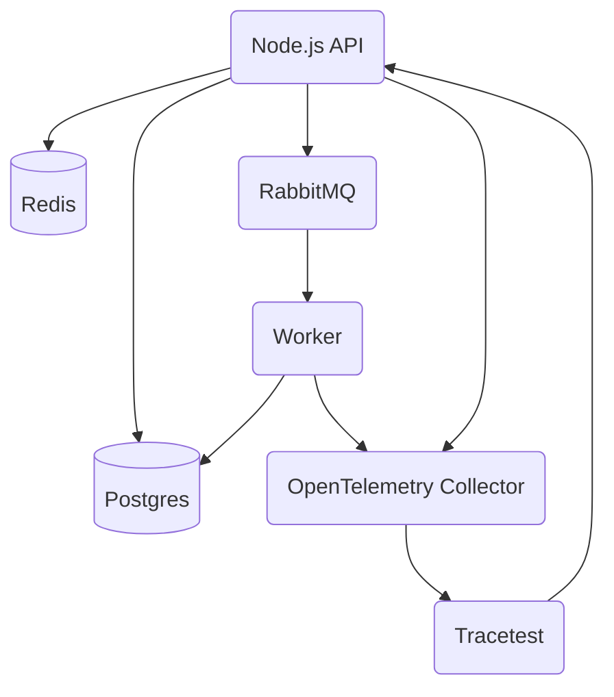

import Tabs from '@theme/Tabs';
import TabItem from '@theme/TabItem';
import CodeBlock from '@theme/CodeBlock';
import GtagInstallCliTabs from '@site/src/components/GtagInstallCliTabs';

This page showcases getting started with [Tracetest](https://app.tracetest.io/).

You can configure Cloud-based Managed Tracetest by using the Tracetest CLI and Tracetest Agent, or Enterprise Self-hosted Tracetest in your own infrastructure.

<Tabs groupId="saas-onprem">
<TabItem value="saas" label="Cloud-based Managed Tracetest" default>

## Install the Tracetest CLI

<GtagInstallCliTabs></GtagInstallCliTabs>

1. [Sign in to Tracetest](https://app.tracetest.io/).
2. Create an [Organization](/concepts/organizations) and [Environment](/concepts/environments).
3. Copy your [Tracetest Organization API Key/Token and Environment ID](https://app.tracetest.io/retrieve-token).
4. Configure the CLI with your Organization API Key/Token and Environment ID.

```bash title="Terminal"
tracetest configure -t <TRACETEST_API_KEY> --environment <TRACETEST_ENVIRONMENT_ID>
```

## Install the Tracetest Agent

[Tracetest Agent](/concepts/agent) runs as a standalone process. It runs either locally on your machine or as a container.

<Tabs groupId="installation">
<TabItem value="cli" label="Tracetest CLI" default>

<CodeBlock
  language="text"
  title="Terminal"
>
{`tracetest start --api-key <TRACETEST_API_KEY> --environment <TRACETEST_ENVIRONMENT_ID>`}
</CodeBlock>

<CodeBlock
  language="text"
  title="Expected output:"
>
{`Tracetest start launches a lightweight agent. It enables you to run tests and collect traces with Tracetest.
Once started, Tracetest Agent exposes OTLP ports 4317 and 4318 to ingest traces via gRCP and HTTP.

 INFO  Running in desktop mode...
 INFO  Starting Agent with name...
Agent is started! Leave the terminal open so tests can be run and traces gathered from this environment.
You can:
> Open Tracetest in a browser to this environment
  (Experimental) Open Dashboard
  Stop this agent`}
</CodeBlock>

Once started, Tracetest Agent exposes OTLP ports `4317` (gRPC) and `4318` (HTTP) for trace ingestion. It executes tests in the environment where it is running and returns the response from triggered tests.

gRPC: `http://localhost:4317`

HTTP: `http://localhost:4318/v1/traces`

</TabItem>
<TabItem value="docker" label="Docker">

<CodeBlock
    language="js"
    title="Terminal"
>
{`docker run \\\n  -p 4317:4317 \\\n  -p 4318:4318 \\\n  -e TRACETEST_API_KEY="<TRACETEST_API_KEY>" \\\n  -e TRACETEST_ENVIRONMENT_ID="<TRACETEST_ENVIRONMENT_ID>" \\\n  kubeshop/tracetest-agent`}
</CodeBlock>

The Tracetest Agent is running in Docker and ready to accept traces.

gRPC: `http://<service-name>:4317`

HTTP: `http://<service-name>:4318/v1/traces`

:::note Docker Network
Running a test against `localhost` will resolve as `127.0.0.1` inside the Tracetest Agent container.

To run tests against apps running on your local machine you have two options:

1. Run Tracetest Agent locally with the `tracetest start` command.
2. Add Tracetest Agent to the same network and use service name mapping. *Example: Instead of running an app on `localhost:8080`, add it to your Docker Compose file, connect it to the same network as your Tracetest Agent service, and use `<service-name>:8080` in the URL field when creating a test.*

You can reach services running on your local machine using:

- Linux (docker version < 20.10.0): `172.17.0.1:8080`
- MacOS (docker version >= 18.03) and Linux (docker version >= 20.10.0): `host.docker.internal:8080`
:::

</TabItem>
<TabItem value="docker-compose" label="Docker Compose">

<CodeBlock
    language="yaml"
    title="docker-compose.yaml"
>
{`tracetest-agent:
  image: kubeshop/tracetest-agent
  environment:
    - TRACETEST_API_KEY=<TRACETEST_API_KEY>
    - TRACETEST_ENVIRONMENT_ID=<TRACETEST_ENVIRONMENT_ID>
  ports:
    - 4317:4317
    - 4318:4318`}
</CodeBlock>

The Tracetest Agent is running in Docker and ready to accept traces.

gRPC: `http://tracetest-agent:4317`

HTTP: `http://tracetest-agent:4318/v1/traces`

:::note Docker Network
Running a test against `localhost` will resolve as `127.0.0.1` inside the Tracetest Agent container.

To run tests against apps running on your local machine you have two options:

1. Run Tracetest Agent locally with the `tracetest start` command.
2. Add Tracetest Agent to the same network and use service name mapping. *Example: Instead of running an app on `localhost:8080`, add it to your Docker Compose file, connect it to the same network as your Tracetest Agent service, and use `<service-name>:8080` in the URL field when creating a test.*

You can reach services running on your local machine using:

- Linux (docker version < 20.10.0): `172.17.0.1:8080`
- MacOS (docker version >= 18.03) and Linux (docker version >= 20.10.0): `host.docker.internal:8080`
:::

</TabItem>
<TabItem value="kubernetes" label="Kubernetes">

<CodeBlock
    language="yaml"
    title="tracetest-agent.yaml"
>
{`---
# Service
apiVersion: v1
kind: Service
metadata:
  name: tracetest-agent
  labels:
    app.kubernetes.io/name: tracetest-agent
    app.kubernetes.io/instance: tracetest-agent
spec:
  selector:
    app.kubernetes.io/name: tracetest-agent
    app.kubernetes.io/instance: tracetest-agent
  ports:
    - name: grpc-collector-entrypoint
      protocol: TCP
      port: 4317
      targetPort: 4317
    - name: http-collector-entrypoint
      protocol: TCP
      port: 4318
      targetPort: 4318
---
# Deployment
apiVersion: apps/v1
kind: Deployment
metadata:
  name: tracetest-agent
  labels:
    app: tracetest-agent
    app.kubernetes.io/name: tracetest-agent
    app.kubernetes.io/instance: tracetest-agent
spec:
  selector:
    matchLabels:
      app.kubernetes.io/name: tracetest-agent
      app.kubernetes.io/instance: tracetest-agent
  template:
    metadata:
      labels:
        app.kubernetes.io/name: tracetest-agent
        app.kubernetes.io/instance: tracetest-agent
    spec:
      containers:
        - name: agent
          image: "kubeshop/tracetest-agent:latest"
          imagePullPolicy: Always
          args: [
            "--environment",
            "<TRACETEST_ENVIRONMENT_ID>", # Add your env id
            "--api-key",
            "$TRACETEST_API_KEY",
            "--server-url",
            "https://app.tracetest.io",
          ]
          env:
          - name: TRACETEST_API_KEY
            value: "<TRACETEST_API_KEY>" # Add your API key
`}
</CodeBlock>

<CodeBlock
    language="css"
    title="Terminal"
>
{`kubectl apply -f ./tracetest-agent.yaml`}
</CodeBlock>

The Tracetest Agent is running in Kubernetes and ready to accept traces.

gRPC: `http://tracetest-agent.default.svc.cluster.local:4317`

HTTP: `http://tracetest-agent.default.svc.cluster.local:4318/v1/traces`

:::note K8s Network
Make sure to check use the correct `<service-name>` if you edit the Tracetest Agent `service` name.

Running a test against `localhost` will resolve as `127.0.0.1` inside the Tracetest Agent container.
Make sure to run tests using the internal Kubernetes service networking eg: `http://api.default.svc.cluster.local:port`.
:::

</TabItem>
<TabItem value="helm" label="Helm">

<CodeBlock
    language="js"
    title="Terminal"
>
{`helm repo add tracetestcloud https://kubeshop.github.io/tracetest-cloud-charts --force-update && \\

helm install agent tracetestcloud/tracetest-agent \\
--set agent.apiKey=<TRACETEST_API_KEY> --set agent.environmentId=<TRACETEST_ENVIRONMENT_ID>`}
</CodeBlock>

The Tracetest Agent is running in Kubernetes and ready to accept traces. With this installation of using `agent` as the `<release-name>`, the trace ingestion endpoints will be:

gRPC: `http://agent-tracetest-agent:4317`

HTTP: `http://agent-tracetest-agent:4318/v1/traces`

:::note K8s Network
Running a test against `localhost` will resolve as `127.0.0.1` inside the Tracetest Agent container.
Make sure to run tests using the internal Kubernetes service networking eg: `http://pokeshop-pokemon-api:8081`.
:::

</TabItem>
</Tabs>

## Start the Sample Pokeshop API

To create tests quickly, start the official sample called [Pokeshop API](/live-examples/pokeshop/overview).

<Tabs groupId="installation">
<TabItem value="cli" label="Tracetest CLI" default>

```bash title="Terminal"
git clone --depth 1 https://github.com/kubeshop/tracetest.git
cd tracetest/examples/tracetest-agent/pokeshop/

docker compose up -d --build
```

- [`https://app.tracetest.io/`](https://app.tracetest.io) - Access the Tracetest Web UI. Sign up and create an organization.
- [`http://localhost:8081`](http://localhost:8081) - Access the Pokeshop API demo to run tests.
- `http://localhost:4317` - Trace ingestion URL where Tracetest Agent will accept traces.
- `http://host.docker.internal` - Pokeshop is running in Docker. Tracetest Agent is running on `localhost`. To ingest traces and trigger tests use the `host.docker.internal` value instead of `localhost`.

</TabItem>

<TabItem value="docker" label="Docker">

```bash title="Terminal"
git clone --depth 1 https://github.com/kubeshop/pokeshop.git
cd pokeshop

docker compose up -d --build
```

- [`https://app.tracetest.io/`](https://app.tracetest.io) - Access the Tracetest Web UI. Sign up and create an organization.
- [`http://localhost:8081`](http://localhost:8081) - The Pokeshop API demo is exposed from Docker to `localhost` on this port. To run tests you will use the Docker internal network and the service name, `http://api:8081`.
- `tracetest-agent:4317` - Trace ingestion URL where Tracetest Agent will accept traces.

</TabItem>

<TabItem value="docker-compose" label="Docker Compose">

```bash title="Terminal"
git clone --depth 1 https://github.com/kubeshop/pokeshop.git
cd pokeshop

docker compose up -d --build
```

- [`https://app.tracetest.io/`](https://app.tracetest.io) - Access the Tracetest Web UI. Sign up and create an organization.
- [`http://localhost:8081`](http://localhost:8081) - The Pokeshop API demo is exposed from Docker to `localhost` on this port. To run tests you will use the Docker internal network and the service name, `http://api:8081`.
- `tracetest-agent:4317` - Trace ingestion URL where Tracetest Agent will accept traces.

</TabItem>

<TabItem value="kubernetes" label="Kubernetes">

```bash title="Terminal"
git clone --depth 1 https://github.com/kubeshop/pokeshop.git
cd pokeshop/k8s

kubectl apply -f .
```

To access the Pokeshop API run a `port-forward`:

```bash
kubectl port-forward svc/api 8081:8081
```

- [`https://app.tracetest.io/`](https://app.tracetest.io) - Access the Tracetest Web UI. Sign up and create an organization.
- [`http://localhost:8081`](http://localhost:8081) - The Pokeshop API demo is port forwarded from Kubernetes to `localhost` on this port.
- To run tests you will use the Kubernetes internal network and the service name, `http://api.default.svc.cluster.local:8081`.
- `tracetest-agent.default.svc.cluster.local:4317` - Trace ingestion URL where Tracetest Agent will accept traces.

</TabItem>

<TabItem value="helm" label="Helm">

```bash title="Terminal"
git clone --depth 1 https://github.com/kubeshop/pokeshop.git
cd pokeshop/helm-charts

helm dependency update
helm install -f values.yaml --create-namespace pokeshop .
```

To access the Pokeshop API run a `port-forward`:

```bash
kubectl port-forward svc/pokeshop-pokemon-api 8081:8081
```

- [`https://app.tracetest.io/`](https://app.tracetest.io) - Access the Tracetest Web UI. Sign up and create an organization.
- [`http://localhost:8081`](http://localhost:8081) - The Pokeshop API demo is port forwarded from Kubernetes to `localhost` on this port.
- To run tests you will use the Kubernetes internal network and the service name, `http://pokeshop-pokemon-api:8081`.
- `http://agent-tracetest-agent:4317` - Trace ingestion URL where Tracetest Agent will accept traces.

</TabItem>

</Tabs>

<details>
  <summary>
    <b>Click to view the sample Pokeshop API architecture</b>
  </summary>

Here's the Architecture of the Pokeshop Sample App:

- an **API** that serves client requests,
- a **Worker** who deals with background processes.

The communication between the API and Worker is made using a `RabbitMQ` queue, and both services emit telemetry data to OpenTelemetry Collector and communicate with a Postgres database.

Tracetest triggers tests against the Node.js API.


</details>

</TabItem>
<TabItem value="on-prem" label="Enterprise Self-hosted Tracetest" default>

## Install Tracetest On-Prem

:::note For Development Environment
This installation is meant for testing purposes only. It uses self signed certificates, so your browser will show a warning about it.
:::

:::tip For Production
For the Production-ready installation:

- [View the official Helm chart readme](https://github.com/kubeshop/tracetest-cloud-charts/blob/main/README.md).
- [View the official installation docs](/install/on-prem-helm).
:::

1. Install [Helm](https://helm.sh/) and [kind](https://kind.sigs.k8s.io/) on your machine. Clone the official Tracetest Helm chart.

```sh
git clone https://github.com/kubeshop/tracetest-cloud-charts.git
cd ./tracetest-cloud-charts
```

2. Request a **license key, [here](https://tracetest.io/on-prem-installation)**.

3. Run the setup script with a demo. Add your license key when you get prompted.

```sh
sh ./scripts/setup_kind_cluster.sh --install-demo
```

4. Add the following lines to your `/etc/hosts` file to access Tracetest.

```sh
sudo sh -c 'echo "127.0.0.1 tracetest.localdev" >> /etc/hosts'
sudo sh -c 'echo "127.0.0.1 pokeshop.localdev" >> /etc/hosts'
```

This setup will configure a local kind cluster with Tracetest On-Prem and the [Pokeshop API demo](/live-examples/pokeshop/overview), with all networking and prerequisites configured to work locally. You can go to the following links:

- [`https://tracetest.localdev:30000`](https://tracetest.localdev:30000) - Access the Tracetest Web UI. You get a user and an organization created for you.
- [`https://pokeshop.localdev:30000`](https://pokeshop.localdev:30000) - Access the Pokeshop API demo to run tests.


</TabItem>
</Tabs>

:::tip Don't have OpenTelemetry installed?
[Follow these instructions to install OpenTelemetry in 5 minutes without any code changes!](./no-otel.mdx)
:::
