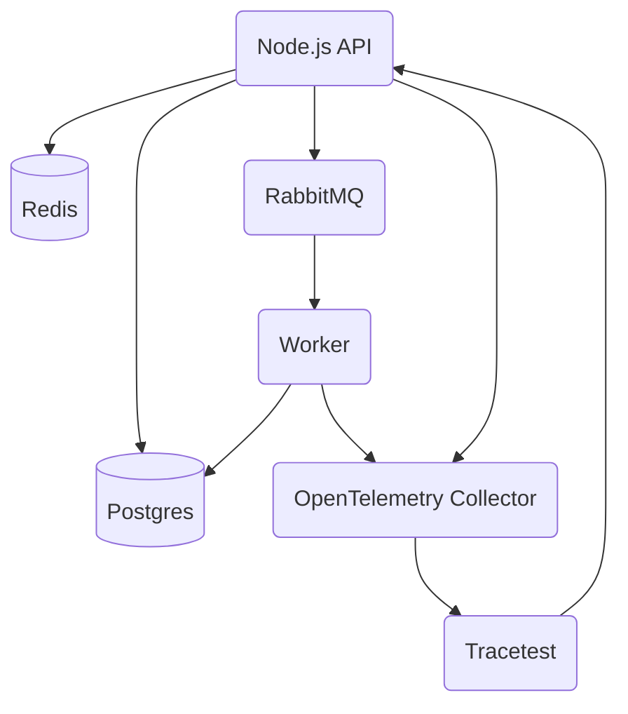

This page showcases opening the Tracetest Web UI and creating a test against the [sample Pokeshop API](/live-examples/pokeshop/overview).

Once you've installed Tracetest, as explained in the [installation guide](./installation.mdx), the Tracetest Agent is running on `localhost` ports `4317` and `4318`. You then access the Tracetest Web UI on [`app.tracetest.io`](https://app.tracetest.io). Here's what will greet you after a fresh install.


## Start the Sample Pokeshop API

To create tests quickly, start the official sample called Pokeshop API.

```bash title=Terminal
git clone --depth 1 https://github.com/kubeshop/tracetest.git
cd tracetest/examples/tracetest-agent/pokeshop/
docker-compose up
```

This will start an HTTP API on `localhost:8081` and a GRPC API on `localhost:8082`.

<details>
  <summary>
    <b>Click to view the sample Pokeshop API architecture</b>
  </summary>

Here's the Architecture of the Pokeshop Sample App:

- an **API** that serves client requests,
- a **Worker** who deals with background processes.

The communication between the API and Worker is made using a `RabbitMQ` queue, and both services emit telemetry data to OpenTelemetry Collector and communicate with a Postgres database.

Tracetest triggers tests against the Node.js API.


</details>


### Configure the Pokeshop API Demo resource

Configure the `demo` [resource](/configuration/provisioning) to quickly create tests either in the Web UI or with the CLI.

In the Web UI go to **Settings > Demo**, toggle **Enable Pokeshop**, and add:

- HTTP Endpoint: `http://localhost:8081`
- GRPC Endpoint: `localhost:8082`


With the CLI, create a file called `tracetest-provision.yaml`.

```yaml title=tracetest-provision.yaml
---
type: Demo
spec:
  type: pokeshop
  enabled: true
  name: pokeshop
  pokeshop:
    httpEndpoint: http://localhost:8081
    grpcEndpoint: localhost:8082
```

Run the command below to enable the `demo` resource.

```bash
tracetest apply demo -f tracetest-provision.yaml
```

You can now quickly create tests against the Pokeshop API.

## Creating Trace-based Tests

You can create tests in two ways:

- Visually, in the Web UI
- Programmatically, in YAML

## Creating Trace-based Tests Visually

This guide will show how to create end-to-end and integration tests in less than 5 minutes via the Web UI.

:::note
To view the in-depth guide on creating tests visually, [check out this docs page](/web-ui/creating-tests).
:::

### Create

On the top right, click the **Create** button and select **Create New Test** in the drop down.


Select an **HTTP Request** as the **test trigger**, and choose the **Pokeshop - Import** example.


This will populate a sample API test against a POST endpoint in the Pokeshop app demo. Clicking **Create & Run** will save and trigger the test.


### Trigger

You'll be redirected to the test page where you can see four tabs and depending on which one you select you'll get access to:

- Test trigger and results.
- The entire distributed trace and trace analysis.
- Test specification and assertions.
- How to automate the test.

:::note
To view the in-depth guide on test results, [check out this docs page](/web-ui/test-results).
:::

The **Trigger** tab shows how the test was triggered and what the API response was.


### Trace

The **Trace** tab shows the entire distributed trace for debugging and a trace analysis score.


### Test

The **Test** tab shows span attributes. Here you add test specs and assertions on attribute values. You also get a test snippets out-of-the-box for common test cases.

In the sample below, you see how to assert that all database spans return in less than `100ms`.


### Automate

The **Automate** tab shows how to automate the test run with the Tracetest CLI and other automation options.


From here you can download a YAML file test definition and run it with the CLI.

## Creating Trace-based Tests Programatically

The test definition will contain:

- The **Trigger** for the test in the `trigger` section.
- The **Test Specifications** in the`specs` section.

You can either download the YAML file test definition, or write one from scratch.

### Create

Using the sample from above, create the Trace-based Test programatically.

```yaml title="pokeshop-import.yaml"
type: Test
spec:
  id: T7-delWIR
  name: Pokemon Import
  trigger:
    type: http
    httpRequest:
      method: POST
      url: http://localhost:8081/pokemon/import
      body: "{\"id\":52}"
      headers:
      - key: Content-Type
        value: application/json
  specs:
  - selector: span[tracetest.span.type="database"]
    name: "All Database Spans: Processing time is less than 100ms"
    assertions:
    - attr:tracetest.span.duration  <  100ms
    - attr:db.system != ""
  - selector: span[tracetest.span.type="http"]
    name: "All HTTP Spans: Status code is 200"
    assertions:
    - attr:http.status_code = 200
```

### Trigger

Using the CLI, trigger a test run.

```bash title="Terminal"
tracetest run test -f pokemon-import.yaml --required-gates test-specs --output pretty
```

### Output

The test run will complete and show a result.

```text title="Output"
✔ Pokemon Import (https://app.tracetest.io/organizations/<org_id>/environments/<env_id>/test/T7-delWIR/run/7/test) - trace id: <trace_id>
	✔ All Database Spans: Processing time is less than 100ms
	✔ All HTTP Spans: Status code is 200
```

The provided link in the test output will open the test run in the Tracetest Web UI.
