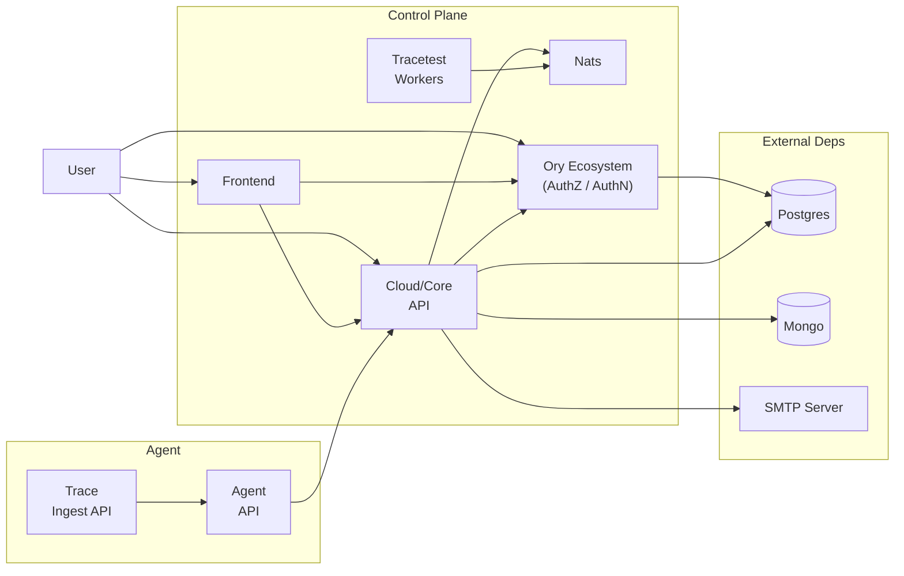
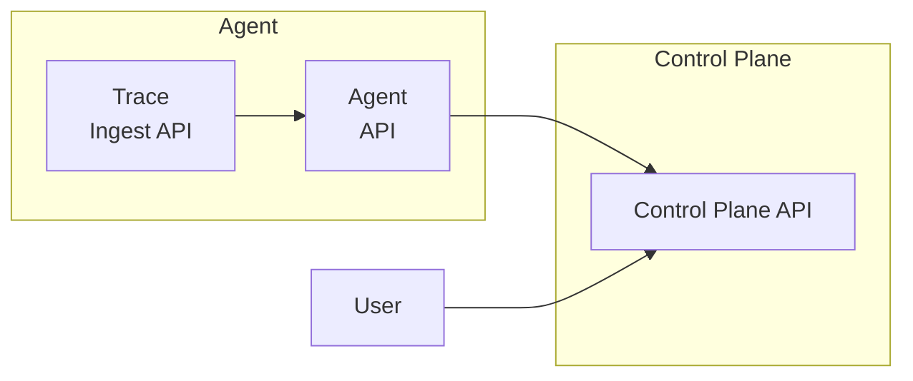

Tracetest contains two parts:

- A Control Plane which includes the Dashboard, Database + Storage, RBAC, etc.
- An Agent running in your environment that runs tests and ingests traces.

You can deploy Tracetest in two ways.

- Deploy Tracetest Agent and use the Cloud-based managed Control Plane.
- Deploy both Tracetest Agent and Control Plane On-Prem.

## Enterprise self-hosted Tracetest

With Enterprise self-hosted Tracetest you deploy both the control plane and agent in your own infrastructure.

To deploy Enterprise self-hosted Tracetest follow the [installing with Helm guide](/install/helm).

## Architecture

Enterprise self-hosted Tracetest is composed of multiple services:

- **Frontend**: WebUI used to interact with the Tracetest, allowing users to [create and manage tests](https://docs.tracetest.io/web-ui/creating-tests).
- **Cloud/Core API**: APIs that are called directly by the Frontend, the Tracetest CLI and the Tracetest Agent to perform operations on the systems, like creating and running tests.
- **Ory Ecosystem**: Tracetest relies on the [Ory Ecosystem](https://www.ory.sh/) for authentication and authorization. This includes [Ory Kratos](https://www.ory.sh/kratos/docs/), [Ory Keto](https://www.ory.sh/keto/docs/), and [Ory Oathkeeper](https://www.ory.sh/oathkeeper/docs/).
- **Tracetest Workers**: A set of workers that manage the test execution.
- **Nats**: An instance of [nats.io](https://nats.io/) uses a message broker that works as a communication bridge between the different services.
- **Agent**: Triggers tests and ingests traces.



## Prerequisites

Tracetest expects some preconditions in the environment where it runs.

### DNS

Tracetest needs to be accessible from a DNS route. We recommend you to use an exposed [Traefik's](#Traefik) `IngressRoute`.

This requires a DNS-resolvable name. You can use a public DNS, an intranet DNS, or even host file based,
as long as clients can resolve the host names to the correct IPs.

You can choose any hostname you want. This Helm repo imposes no limitation on this.

If you choose to use a DNS resolving mechanism that is not available within the Kubernetes cluster where Tracetest runs, 
you can configure the cluster's CoreDNS to point the selected hostname to the Traefik Service. We provide a [script for this](https://github.com/kubeshop/tracetest-cloud-charts/blob/main/scripts/coredns_config.sh).

If you want to use managed agents and send OpenTelemetry trace data to them from outside the cluster, you need to set a wildcard subdomain.

:::tip Does this mean that Tracetest will be accessible from the internet?
Not neccesarily. By default, most cloud providers will automatically map LoadBalancer services to public IPs.

If you want to make your installation only availble within an intranet or similarly private environment check how to configure Private IPs with your cloud provider docs.
:::

:::note Example
Your main domain is `tracetest.mydomain.com`. You need to setup `tracetest.mydomain.com` and `*.tracetest.mydomain.com` to the LoadBalancer IP.
:::

### Cert Manager

Tracetest uses cert-manager to create sign certificates for JWT tokens, and SSL certificates for Ingress.

```bash title="Terminal"
helm repo add jetstack https://charts.jetstack.io --force-update
helm upgrade --install \
    cert-manager jetstack/cert-manager \
    --namespace cert-manager \
    --create-namespace \
    --version v1.15.0 \
    --set crds.enabled=true
```

Cert Manager defines Issuers. If you have existing Issuers that you want to use, you can configure them in `values.yaml`.

In order to have a valid certificate, `cert-manager` requires you to provide proof of ownership of the DNS domain that you are claiming. You can see how to do that in the [Issuers documentation](https://cert-manager.io/docs/configuration/issuers/).

While it is not recommended in a production environment, it is possible by creating a SelfSigned Issuer and create self-signed certificates. With self-signed certificates you will see warnings on the browser when accessing your Tracetest OnPrem instance Web UI.

```bash title="Terminal"
# Create a self signed certificate

cat <<EOF | kubectl apply -f -
apiVersion: cert-manager.io/v1
kind: ClusterIssuer
metadata:
  name: issuer-selfsigned
  labels:
spec:
  selfSigned: {}
EOF
```

### Traefik

Tracetest relies on Traefik for its exposed web UI and API, as well as for the managed agents.
The process is simple, but the process for exposing the Traefik deployment might differ depending on the cloud platform.
See [Install Traefik using a Helm Chart](https://doc.traefik.io/traefik/getting-started/install-traefik/#use-the-helm-chart).

### External Services

Tracetest requires two databases to operate: PostgreSQL and MongoDB. You can use managed services or run them in-cluster.

#### PostgreSQL

We recommend using an out-of-cluster instance. The version should not matter, but it is always a good idea to have the latest version.

You can configure the credentials in `values.yaml`:

```yaml
global:
  postgresql:
    auth:
      host: "path.to.my.postgres.instance"
      username: "some-pg-user"
      password: "some-pg-password"
      database: "tracetest"
```

#### MongoDB

We recommend using an out-of-cluster instance. The version should not matter, but it is always a good idea to have the latest version.

You can configure the credentials in `values.yaml`:

```yaml
global:
  mongodb:
    auth:
      protocol: "mongodb"
      host: "path.to.my.mongodb.instance"
      username: "some-mongo-user"
      password: "some-mongo-password"
      database: "tracetest"
      options:
        retryWrites: "true"
        authSource: admin
```

### SSO

This chart comes with an **EXTREMELY INSECURE** default GitHub OAuth App. It is used for demo purposes only, and should not under any circumstances be used in any real environment.

You can enable GitHub and Google SSO by creating corresponding Apps and setting the credentials in `values.yaml`:

```yaml
global:
  sso:
    google:
      clientID: "clientID"
      clientSecret: "clientSecret"
    github:
      clientID: "clientID"
      clientSecret: "clientSecret"
```

## Cloud-based managed Tracetest

With Cloud-based managed Tracetest you only deploy an agent in your infrastructure.

To deploy Tracetest Agent follow the [installing guide](/install/cli).

## Architecture

Cloud-based managed Tracetest only requires you to run one service:

- **Agent**: Triggers tests and ingests traces.



## Prerequisites

- [Sign in to Tracetest](https://app.tracetest.io/) and retrieve your [Tracetest Organization API Key/Token and Environment ID](https://app.tracetest.io/retrieve-token).
