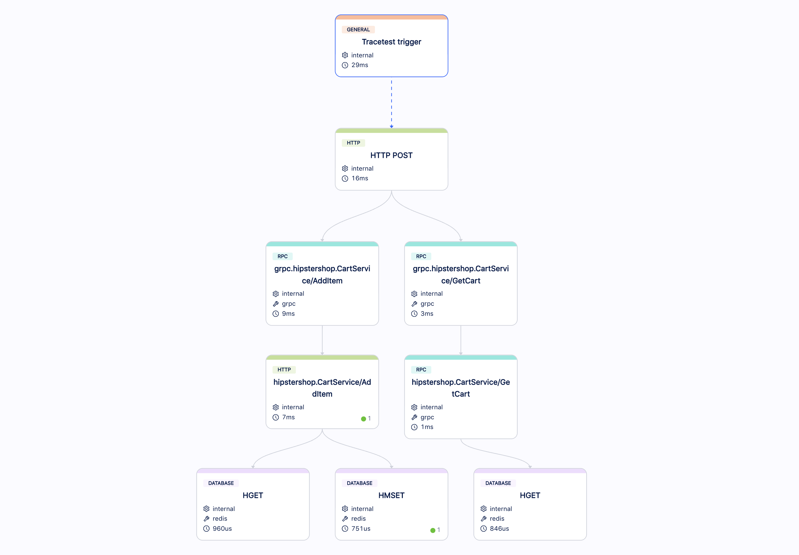

# OpenTelemetry Store - Add item into the shopping cart

In this use case, we want to validate the following story:

```
As a consumer
I want to choose a product from the catalog
And add it to my shopping cart
So I can continue to explore the catalog to fulfill my shopping list
```

You can trigger this use case by calling the endpoint `POST /api/cart` from the Frontend service, with the following request body:
```json
{
  "item": {
    "productId": "OLJCESPC7Z",
    "quantity": 1
  },
  "userId": "2491f868-88f1-4345-8836-d5d8511a9f83"
}
```

It should return a payload similar to this:
```json
{
  "userId": "2491f868-88f1-4345-8836-d5d8511a9f83",
  "items": [
    {
      "productId": "OLJCESPC7Z",
      "quantity": 1
    }
  ]
}
```

## Building a Test for This Scenario

Using Tracetest, we can [create a test](../../../web-ui/creating-tests.md) that will execute an API call on `POST /api/cart` and validate the following properties:
- The correct ProductID was sent to the Product Catalog API.
- The product persisted correctly on the shopping cart.

### Traces

Running these tests for the first time will create an Observability trace like the image below, where you can see spans for the API calls (HTTP and gRPC) and database calls:


### Assertions

With this trace, now we can build [assertions](../../../concepts/assertions.md) on Tracetest and validate the properties:

- **The correct ProductID was sent to the Product Catalog API.**


- **The product persisted correctly on the shopping cart.**


Now, you can validate this entire use case.

### Test Definition

To replicate this entire test on Tracetest, you can replicate these steps on our Web UI or using our CLI, saving the following test definition as the file `test-definition.yml` and later running:

```sh
tracetest test -d test-definition.yml --wait-for-results
```

We are assuming that the Frontend service is exposed on `http://otel-demo-frontend:8080`:

```yaml
type: Test
spec:
  name: Add product to the cart
  description: Add a selected product to user shopping cart
  trigger:
    type: http
    httpRequest:
      url: http://otel-demo-frontend:8080/api/cart
      method: POST
      headers:
      - key: Content-Type
        value: application/json
      body: '{"item":{"productId":"OLJCESPC7Z","quantity":1},"userId":"2491f868-88f1-4345-8836-d5d8511a9f83"}'
  specs:
  - selector: span[tracetest.span.type="http" name="hipstershop.CartService/AddItem"]
     # checking if the correct ProductID was sent
    assertions:
    - attr:app.product.id = "OLJCESPC7Z"
  - selector: span[tracetest.span.type="database" name="HMSET" db.system="redis" db.redis.database_index="0"]
    # checking if the product was persisted correctly on the shopping cart
    assertions:
    - attr:tracetest.selected_spans.count >= 1
```
