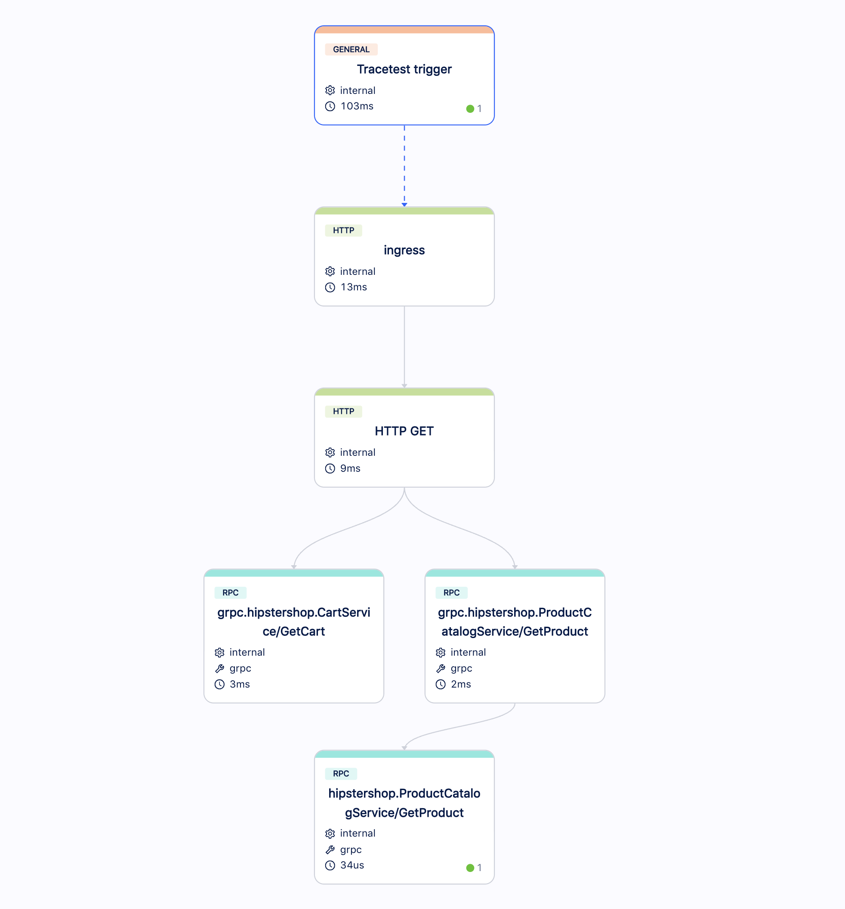

# OpenTelemetry Store - Check shopping cart contents

In this use case, we want to validate the following story:

```
As a consumer
I want to see my shopping cart
And see all products that I've added to it
So I can go to the checkout process
```

You can trigger this use case by calling the endpoint `GET /api/cart?sessionId={some-uuid}&currecyCode=` from the Frontend service. It should return a payload similar to this:
```json
{
  "userId": "8c0465e2-32bb-4ecb-a9c8-5a2861629ff1",
  "items": [
    {
      "productId": "66VCHSJNUP",
      "quantity" : 1,
      "product": {
        "id": "66VCHSJNUP",
        "name": "Starsense Explorer Refractor Telescope",
        "description": "The first telescope that uses your smartphone to analyze the night sky and calculate its position in real time. StarSense Explorer is ideal for beginners thanks to the app’s user-friendly interface and detailed tutorials. It’s like having your own personal tour guide of the night sky",
        "picture": "/images/products/StarsenseExplorer.jpg",
        "priceUsd": {
          "currencyCode": "USD",
          "units": 349,
          "nanos": 950000000
        },
        "categories": [
          "telescopes"
        ]
      }
    }
  ]
}
```

If it is the first time that you are calling this endpoint, to see an item into the shopping cart you need first to [Add item into shopping cart](./add-item-into-shopping-cart.md).

## Building a Test for This Scenario

Using Tracetest, we can [create a test](/web-ui/creating-tests) that will execute an API call on `GET /api/cart?sessionId={some-uuid}&currecyCode=` and validate the following properties:
- The product ID `66VCHSJNUP`, previously added, exists in the cart.
- The size of the shopping cart should be 1.

### Traces

Running these tests for the first time will create an Observability trace like the image below, where you can see spans for the API calls (HTTP and gRPC):


### Assertions

With this trace, now we can build [assertions](/concepts/assertions) on Tracetest and validate the properties:

- **The product ID `66VCHSJNUP`, previously added, exists in the cart.**


- **The size of the shopping cart should be 1.**


Now you can validate this entire use case.

### Test Definition

To replicate this entire test on Tracetest, you can replicate these steps on our Web UI or using our CLI, saving the following test definition as the file `test-definition.yml` and later running:

```sh
tracetest run test -f test-definition.yml
```

We are assuming that the Frontend service is exposed on `http://otel-demo-frontend:8080`:

```yaml
type: Test
spec:
  name: OpenTelemetry Store - Check shopping cart contents
  trigger:
    type: http
    httpRequest:
      url: http://otel-demo-frontend:8080/api/cart?sessionId=8c0465e2-32bb-4ecb-a9c8-5a2861629ff1&currencyCode=
      method: GET
      headers:
      - key: Content-Type
        value: application/json
  specs:
  - selector: span[tracetest.span.type="rpc" name="hipstershop.ProductCatalogService/GetProduct"
      rpc.system="grpc" rpc.method="GetProduct" rpc.service="hipstershop.ProductCatalogService"]
    assertions:
    - attr:app.product.id = "66VCHSJNUP"
  - selector: span[tracetest.span.type="general" name="Tracetest trigger"]
    assertions:
    - attr:tracetest.response.body | json_path '$.items.length' = 1
```
