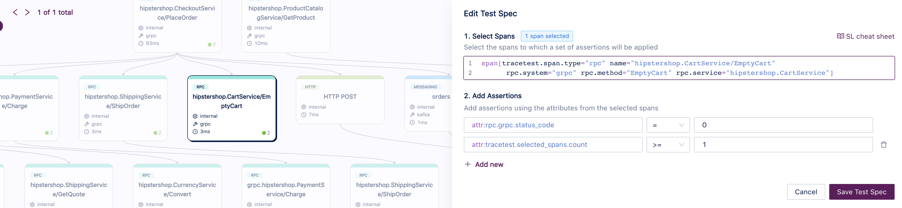

In this use case, we want to validate the following story:

```
As a consumer, after choosing products
I want to pay for all products in my shopping cart
So I can ship them to my address and use them.
```

You can trigger this use case by calling the endpoint `POST /api/checkout` from the Frontend service, with the following request body:
```json
{
    "userId": "2491f868-88f1-4345-8836-d5d8511a9f83",
    "email": "someone@example.com",
    "address": {
        "streetAddress": "1600 Amphitheatre Parkway",
        "state": "CA",
        "country": "United States",
        "city": "Mountain View",
        "zipCode": "94043"
    },
    "userCurrency": "USD",
    "creditCard": {
        "creditCardCvv": 672,
        "creditCardExpirationMonth": 1,
        "creditCardExpirationYear": 2030,
        "creditCardNumber": "4432-8015-6152-0454"
    }
}
```

It should return a payload similar to this:
```json
{
  "orderId": "8ddbf376-a340-11ed-94b1-8a88241c3938",
  "shippingTrackingId": "eb7a5f77-d676-430d-a2b8-e1a5f595227d",
  "shippingCost": {
    "currencyCode": "USD",
    "units": 0,
    "nanos": 0
  },
  "shippingAddress": {
    "streetAddress": "1600 Amphitheatre Parkway",
    "city": "Mountain View",
    "state": "CA",
    "country": "United States",
    "zipCode": "94043"
  },
  "items": [
    //...
  ]
}
```

If it is the first time that you are calling this endpoint, to see an item into the shopping cart you need first to [Add item into shopping cart](/live-examples/opentelemetry-store/use-cases/add-item-into-shopping-cart).

## Building a Test for This Scenario

Using Tracetest, we can [create a test](/web-ui/creating-tests) that will execute an API call on `POST /api/cart` and validate the following properties:
- An order was placed.
- The user was charged.
- The product was shipped.
- The shopping cart was emptied.

### Traces

Running these tests for the first time will create an Observability trace like the image below, where you can see spans for the API calls (HTTP and gRPC) and database calls:


### Assertions

With this trace, now we can build [assertions](/concepts/assertions) on Tracetest and validate the properties:

- **An order was placed.**


- **The user was charged.**


- **The product was shipped.**


- **The shopping cart was emptied.**


Now you can validate this entire use case.

### Test Definition

To replicate this entire test on Tracetest, you can replicate these steps on our Web UI or using our CLI, saving the following test definition as the file `test-definition.yml` and later running:

```sh
tracetest run test -f test-definition.yml
```

We are assuming that the Frontend service is exposed on `http://otel-demo-frontend:8080`:

```yaml
type: Test
spec:
  name: Checking out shopping cart
  description: Checking out shopping cart
  trigger:
    type: http
    httpRequest:
      url: http://otel-demo-frontend:8080/api/checkout
      method: POST
      headers:
      - key: Content-Type
        value: application/json
      body: '{"userId":"2491f868-88f1-4345-8836-d5d8511a9f83","email":"someone@example.com","address":{"streetAddress":"1600
        Amphitheatre Parkway","state":"CA","country":"United States","city":"Mountain View","zipCode":"94043"},"userCurrency":"USD","creditCard":{"creditCardCvv":672,"creditCardExpirationMonth":1,"creditCardExpirationYear":2030,"creditCardNumber":"4432-8015-6152-0454"}}'
  specs:
  - selector: span[tracetest.span.type="rpc" name="hipstershop.CheckoutService/PlaceOrder"
      rpc.system="grpc" rpc.method="PlaceOrder" rpc.service="hipstershop.CheckoutService"]
    assertions: # checking if an order was placed
    - attr:app.user.id = "2491f868-88f1-4345-8836-d5d8511a9f83"
    - attr:app.order.items.count = 1
  - selector: span[tracetest.span.type="rpc" name="hipstershop.PaymentService/Charge"
      rpc.system="grpc" rpc.method="Charge" rpc.service="hipstershop.PaymentService"]
    assertions: # checking if the user was charged
    - attr:rpc.grpc.status_code  =  0
    - attr:tracetest.selected_spans.count >= 1
  - selector: span[tracetest.span.type="rpc" name="hipstershop.ShippingService/ShipOrder"
      rpc.system="grpc" rpc.method="ShipOrder" rpc.service="hipstershop.ShippingService"]
    assertions: # checking if the product was shipped
    - attr:rpc.grpc.status_code = 0
    - attr:tracetest.selected_spans.count >= 1
  - selector: span[tracetest.span.type="rpc" name="hipstershop.CartService/EmptyCart"
      rpc.system="grpc" rpc.method="EmptyCart" rpc.service="hipstershop.CartService"]
    assertions: # checking if the cart was set empty
    - attr:rpc.grpc.status_code = 0
    - attr:tracetest.selected_spans.count >= 1
```
