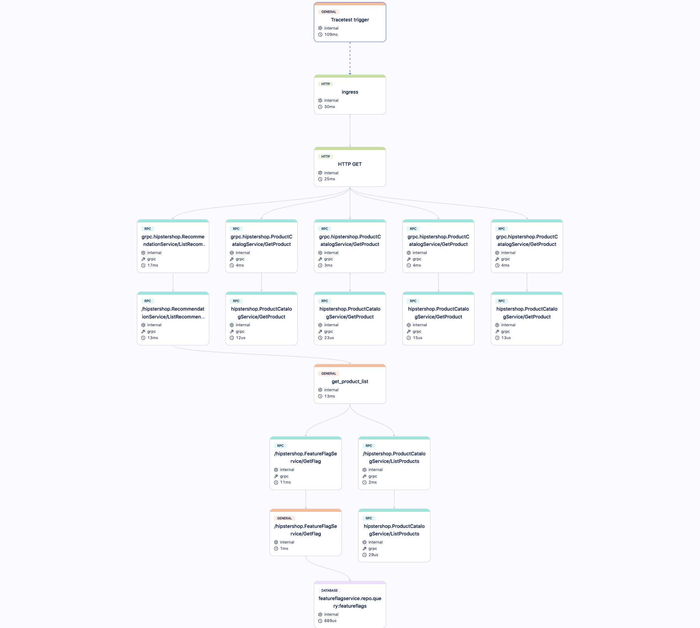
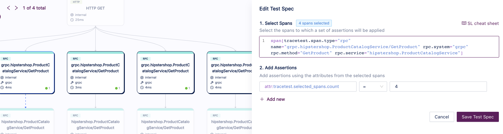
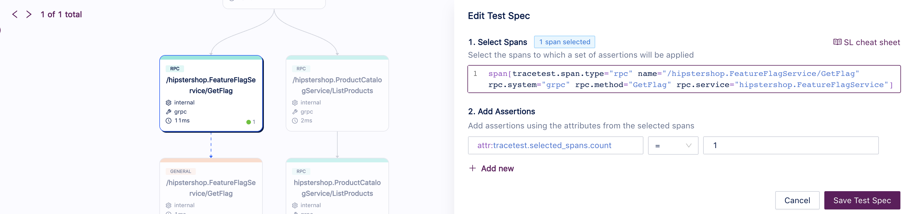

In this use case, we want to validate the following story:

```
As a consumer, after landing at home page
I want to see what are the recommended products
So I can add them into my shopping cart.
```

You can trigger this use case by calling the endpoint `GET /api/recommendations?productIds=&sessionId={some-uuid}&currencyCode=` from the Frontend service. It should return a payload similar to this:
```json
[
    {
        "id": "0PUK6V6EV0",
        "name": "Solar System Color Imager",
        "description": "You have your new telescope and have observed Saturn and Jupiter. Now you're ready to take the next step and start imaging them. But where do you begin? The NexImage 10 Solar System Imager is the perfect solution.",
        "picture": "/images/products/SolarSystemColorImager.jpg",
        "priceUsd": {
            "currencyCode": "USD",
            "units": 175,
            "nanos": 0
        },
        "categories": [
            "accessories",
            "telescopes"
        ]
    },
    // ...
]
```

## Building a Test for This Scenario

Using Tracetest, we can [create a test](/web-ui/creating-tests) that will execute an API call on `GET /api/recommendations?productIds=&sessionId={some-uuid}&currencyCode=` and validate the following properties:
- It should have 4 products on this list.
- The feature flagger should be called for one product.

### Traces

Running these tests for the first time will create an Observability trace like the image below, where you can see spans for the API calls (HTTP and gRPC) and database calls:


### Assertions

With this trace, now we can build [assertions](/concepts/assertions) on Tracetest and validate the properties:

- **It should have 4 products on this list.**


- **The feature flagger should be called for one product.**


Now you can validate this entire use case.

### Test Definition

To replicate this entire test on Tracetest, you can replicate these steps on our Web UI or using our CLI by saving the following test definition as the file `test-definition.yml` and later running:

```sh
tracetest run test -f test-definition.yml
```

We are assuming that the Frontend service is exposed on `http://otel-demo-frontend:8080`:

```yaml
type: Test
spec:
  name: OpenTelemetry Store - Get recommended products
  trigger:
    type: http
    httpRequest:
      url: http://otel-demo-frontend:8080/api/recommendations?productIds=&sessionId=8c0465e2-32bb-4ecb-a9c8-5a2861629ff1&currencyCode=
      method: GET
      headers:
      - key: Content-Type
        value: application/json
  specs:
  - selector: span[tracetest.span.type="rpc" name="grpc.hipstershop.ProductCatalogService/GetProduct"
      rpc.system="grpc" rpc.method="GetProduct" rpc.service="hipstershop.ProductCatalogService"]
    assertions:
    - attr:tracetest.selected_spans.count  =  4
  - selector: span[tracetest.span.type="rpc" name="/hipstershop.FeatureFlagService/GetFlag"
      rpc.system="grpc" rpc.method="GetFlag" rpc.service="hipstershop.FeatureFlagService"]
    assertions:
    - attr:tracetest.selected_spans.count  =  1
```
