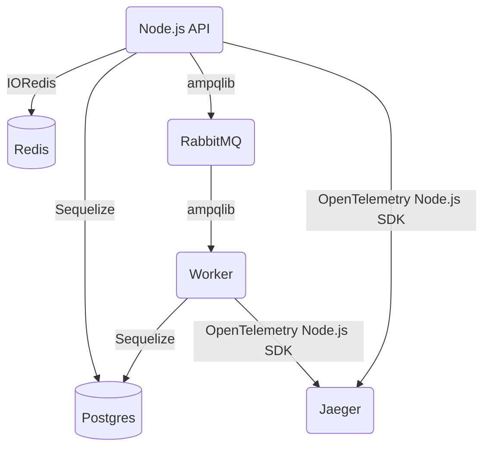

# Pokeshop API

As a testing ground, the team at Tracetest has implemented a sample instrumented API around the [PokeAPI](https://pokeapi.co/).

The idea is to have a microservice-divided system that behaves like a typical scenario by having async processes ([RabbitMQ](https://www.rabbitmq.com/)), cache layers ([Redis](https://redis.io/)), database storage ([Postgres](https://www.postgresql.org/)) and simple CRUD interfaces for Pokemons.

With this, users can get familiar with the Tracetest tool by focusing on creating assertions, visualizing the trace and identifying the different data that comes from the Collector ([Jaeger](https://www.jaegertracing.io/)). Users will learn about basic instrumentation practices: what tools to use, what data to send, when, and what suggested standards need to be followed.

- **Source Code**: https://github.com/kubeshop/pokeshop
- **Running it locally**: [Instructions](https://github.com/kubeshop/pokeshop/blob/master/docs/installing.md#run-it-locally)
- **Running on Kubernetes**: [Instructions](https://github.com/kubeshop/pokeshop/blob/master/docs/installing.md#run-on-a-kubernetes-cluster)

## Use Cases

We have three use cases that use each component of this structure and that can be observed via Open Telemetry and tested with Tracetest. Each one is triggered by an API call to their respective endpoint:

- [Add Pokemon](./use-cases/add-pokemon.md): Add a new Pokemon only relying on user input into the database.
- [Get Pokemon by ID](./use-cases/get-pokemon-by-id.md): Given a Pokemon ID, this endpoint returns the data of a Pokemon. If the same Pokemon was queried, the API will use its cache to return it.
- [List Pokemon](./use-cases/list-pokemon.md): Lists all Pokemons registered into Pokeshop.
- [Import Pokemon](./use-cases/import-pokemon.md): Given a Pokemon ID, this endpoint does an async process, going to PokeAPI to get Pokemon data and adding it to the database.

## System Architecture

The system is divided into two components:

- an **API** that serves client requests,
- a **Worker** who deals with background processes.

The communication between the API and Worker is made using a `RabbitMQ` queue, and both services emit telemetry data to Jaeger and communicate with a Postgres database.

A diagram of the system structure can be seen here:

In our live tests, we are deploying into a single Kubernetes namespace, deployed via a [Helm chart](https://github.com/kubeshop/pokeshop/blob/master/docs/installing.md#run-on-a-kubernetes-cluster).

The Pokeshop API is only accessible from within the Kubernetes cluster network as Tracetest needs to be able to reach it.
