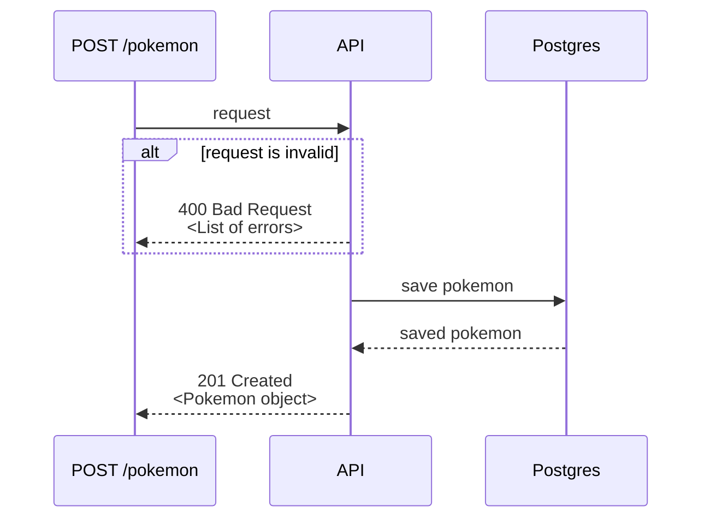
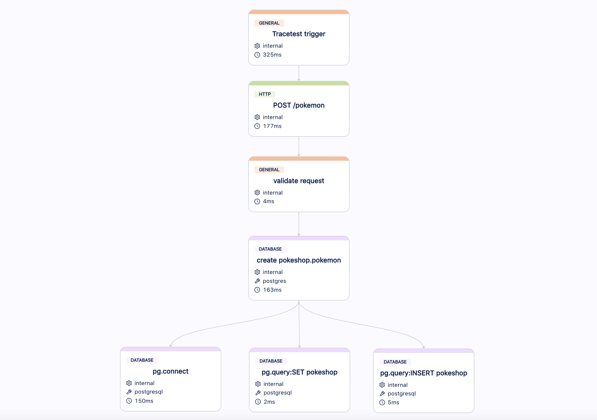
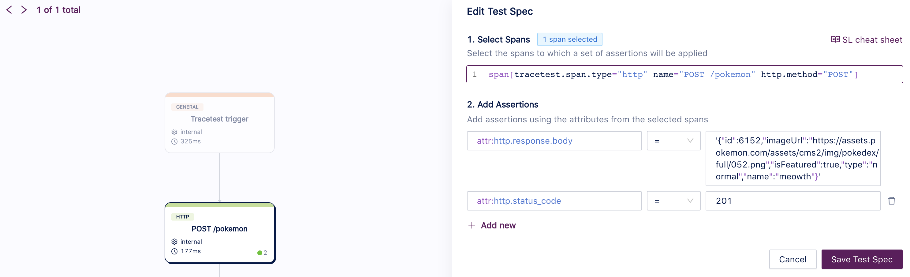
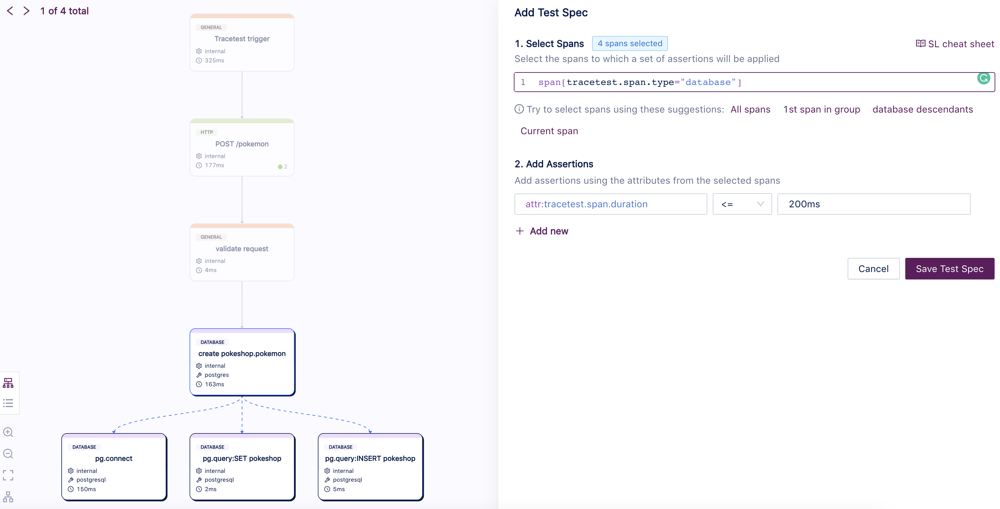

# Pokeshop API - Add Pokemon

This use case showcases a simple example of an API call where call data is validated and persisted into a database.



You can trigger this use case by calling the endpoint `POST /pokemon`, with the following request body:
```json
{
  "name":  "meowth",
  "type":  "normal",
  "imageUrl":  "https://assets.pokemon.com/assets/cms2/img/pokedex/full/052.png",
  "isFeatured":  true
}
```

It should return the following payload:
```json
{
  "id":  1000,
  "name":  "meowth",
  "type":  "normal",
  "imageUrl":  "https://assets.pokemon.com/assets/cms2/img/pokedex/full/052.png",
  "isFeatured":  true
}
```

## Building a Test for This Scenario

Using Tracetest, we can [create a test](../../../web-ui/creating-tests.md) that will execute an API call on `POST /pokemon` and validate two properties:
- The API should return a proper result with **HTTP 201 Created**.
- The database should return with **low latency (< 200ms)**.

### Traces

Running these tests for the first time will create an Observability trace like the image above, where you can see spans for the API call, validation (an API internal operation) and database calls:


### Assertions

With this trace, now we can build [assertions](../../../concepts/assertions.md) on Tracetest and validate the API response and the database latency:

- **The API should return a proper result with HTTP 201 Created:**


- **The database should return with low latency (< 200ms):**


Now you can validate this entire use case.

### Test Definition

If you want to replicate this entire test on Tracetest, you can replicate these steps on our Web UI or using our CLI, saving the following test definition as the file `test-definition.yml` and later running:

```sh
tracetest test run -d test-definition.yml --wait-for-results
```

```yaml
type: Test
spec:
  name: Pokeshop - Add
  description: Add a Pokemon
  trigger:
    type: http
    httpRequest:
      url: http://demo-pokemon-api.demo/pokemon
      method: POST
      headers:
      - key: Content-Type
        value: application/json
      body: '{"name":"meowth","type":"normal","imageUrl":"https://assets.pokemon.com/assets/cms2/img/pokedex/full/052.png","isFeatured":true}'
  specs:
  - selector: span[tracetest.span.type="http" name="POST /pokemon" http.method="POST"]
    assertions:
    - attr:http.response.body  =  '{"id":6152,"imageUrl":"https://assets.pokemon.com/assets/cms2/img/pokedex/full/052.png","isFeatured":true,"type":"normal","name":"meowth"}'
    - attr:http.status_code  =  201
  - selector: span[tracetest.span.type="database"]
    assertions:
    - attr:tracetest.span.duration <= 200ms
```
