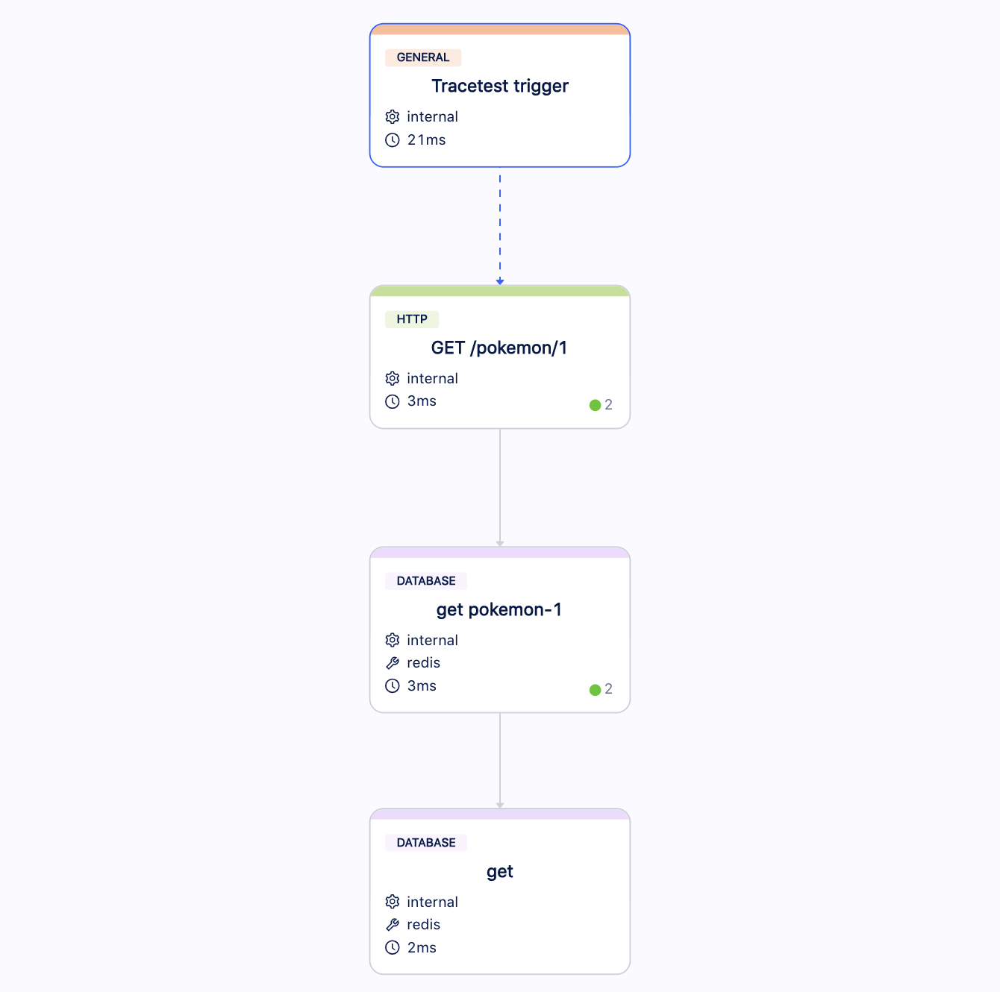

# Pokeshop API - Get Pokemon by ID

This use case retrieves a specific Pokemon from the cache if it is cached or from the database (Postgres) also populating the cache. The idea of this query is to showcase a straightforward scenario, where the API layer receives a request from the outside and needs to evaluate a different behavior depending of its dependencies.


You can trigger this use case by calling the endpoint `GET /pokemon/25` without payload and should receive a payload similar to this: 
```json
{
  "id":  25,
  "name":  "pikachu",
  "type":  "electric",
  "imageUrl":  "https://assets.pokemon.com/assets/cms2/img/pokedex/full/025.png",
  "isFeatured":  true
}
```

## Building a Test for the Described Scenarios

Using Tracetest, we can [create two tests](../../../web-ui/creating-tests.md) that will execute an API call on `GET /pokemon/25` and validate the following scenarios:
1. **An API call with a cache hit.**
   - The API should return a valid result with HTTP 200 OK.
   - The cache should be queried.
   - The database should not be queried.
2. **An API call with a cache miss.**
   - The API should return a valid result with HTTP 200 OK.
   - The cache should be queried.
   - The cache should be populated.
   - The database should be queried.

### Traces

Running these tests for the first time will create an Observability trace with two different shapes, depending on the cache situation.

1. **Cache Miss** where we can see spans from the API, database, and cache:


2. **Cache Hit** where we can see spans from the API and cache:


### Assertions

With this trace, we can build [assertions](../../../concepts/assertions.md) on Tracetest and validate API, cache, and database responses:

- [Both Cases] The API should return a valid result with HTTP 200 OK.


- [Both Cases] The cache should be queried.


- [Cache Hit] The database should not be queried.


- [Cache Miss] The cache should be populated.


- [Cache Miss] The database should be queried.


Now you can validate this entire use case.

### Test Definition

If you want to replicate those tests on Tracetest, you can replicate these steps on our Web UI or using our CLI, saving one of the test definitions as the file `test-definition.yml` and running:

```sh
tracetest test -d test-definition.yml --wait-for-results
```

#### Cache Miss Scenario

```yaml
type: Test
spec:
  name: Pokeshop - Get Pokemon by ID [cache miss scenario]
  trigger:
    type: http
    httpRequest:
      url: http://demo-pokemon-api.demo/pokemon/${env:POKEMON_ID}
      method: GET
      headers:
      - key: Content-Type
        value: application/json
  specs:
  - selector: span[tracetest.span.type="http" http.method="GET"]
    assertions:
    - attr:http.status_code  =  200
    - attr:http.response.body | json_path '$.id'  =  '${env:POKEMON_ID}'
  - selector: span[tracetest.span.type="database" db.system="redis" db.operation="get"]
    assertions:
    - attr:name  =  "get pokemon-${env:POKEMON_ID}"
  - selector: span[tracetest.span.type="database" db.system="redis" db.operation="set"]
    assertions:
    - attr:name = "set pokemon-${env:POKEMON_ID}"
  - selector: |-
      span[tracetest.span.type="database" name="findOne pokeshop.pokemon"
            db.system="postgres" db.name="pokeshop" db.operation="findOne" db.sql.table="pokemon"]
    assertions:
    - attr:tracetest.selected_spans.count > 0
```

#### Cache Miss Scenario

```yml
type: Test
spec:
  name: Pokeshop - Get Pokemon by ID [cache hit scenario]
  trigger:
    type: http
    httpRequest:
      url: http://demo-pokemon-api.demo/pokemon/${env:POKEMON_ID}
      method: GET
      headers:
      - key: Content-Type
        value: application/json
  specs:
  - selector: span[tracetest.span.type="http" http.method="GET"]
    assertions:
    - attr:http.status_code  =  200
    - attr:http.response.body | json_path '$.id'  =  "${env:POKEMON_ID}"
  - selector: span[tracetest.span.type="database" db.system="redis" db.operation="get"]
    assertions:
    - attr:name = "get pokemon-${env:POKEMON_ID}"
    - attr:db.result | json_path '$.id' = "${env:POKEMON_ID}"
  - selector: |-
      span[tracetest.span.type="database" name="findOne pokeshop.pokemon"
            db.system="postgres" db.name="pokeshop" db.operation="findOne" db.sql.table="pokemon"]
    assertions:
    - attr:tracetest.selected_spans.count  =  0
```
