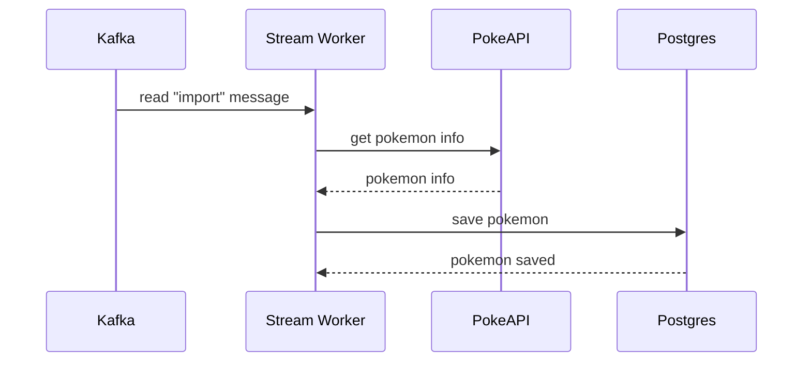
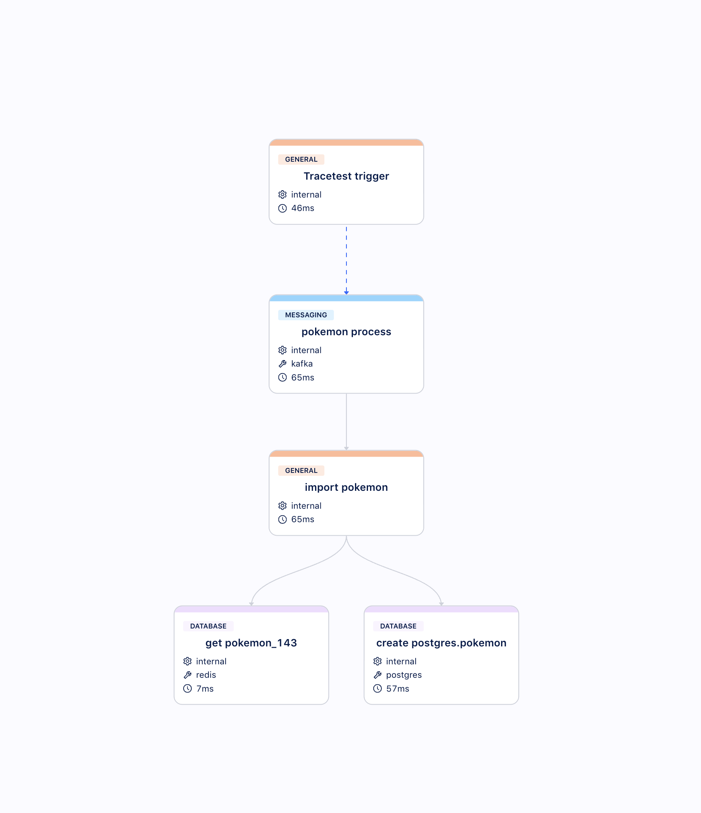
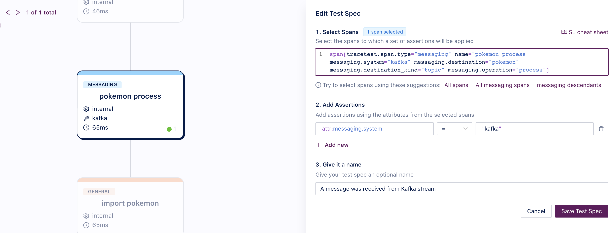
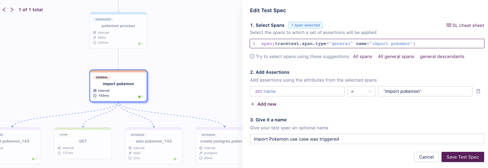
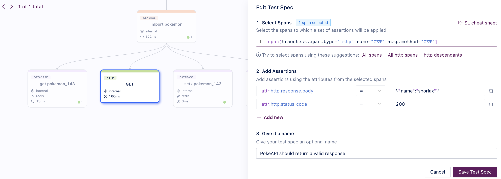
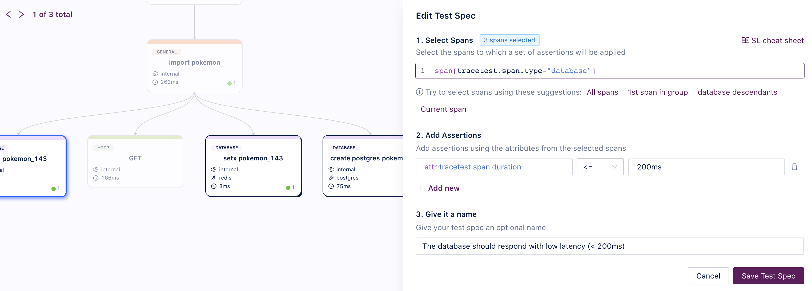

This use case showcases a more complex scenario involving an async process. Usually, when working with microservices, there are use cases where some of the processing needs to happen asynchronously. For example, when triggering a user notification, generating reports or processing a payment order. With this endpoint, we provide an example of how users can implement trace-based testing for such scenarios.

Here the process listens to a stream, and whenever an event is read from it, the following process is triggered:



You can trigger this use case by sending a message to Kafka on the `pokemon` topic with the following message value:

```json
{
  "id":  143
}
```

## Building a Test for This Scenario

Using Tracetest, we can [create a test](/web-ui/creating-tests) that will produce a message to Kafka on `pokemon` topic and validate the following properties:

- The worker should read the import task.
- PokeAPI should return a valid response.
- The database should respond with low latency (< 200ms).

### Traces

Running these tests for the first time will create a distributed trace like the image below, where you can see spans for the stream messaging, the PokeAPI (external API) call and database calls.



### Assertions

With this trace, we can build [assertions](/concepts/assertions) with Tracetest and validate the API and Worker behavior:

- **A message was received from Kafka stream:**


- **Import Pokemon use case was triggered**:
- 

- **PokeAPI should return a valid response:**


- **The database should respond with low latency (< 200ms):**


Now you can validate this entire use case.

### Test Definition

If you want to replicate this entire test with Tracetest, you can replicate these steps in the Web UI or using the CLI, saving the following test definition as the file `test-definition.yml` and running:

```sh
tracetest run test -f test-definition.yml
```

```yaml
type: Test
spec:
  id: a97syfdkjad
  name: Import a Pokemon reading a Stream
  description: Import a Pokemon via Stream
  trigger:
    type: kafka
    kafka:
      brokerUrls:
      - stream:9092
      topic: pokemon
      headers: []
      messageKey: snorlax-key
      messageValue: "{\"id\":143}"
  specs:
  - selector: span[tracetest.span.type="messaging" name="pokemon process" messaging.system="kafka" messaging.destination="pokemon" messaging.destination_kind="topic" messaging.operation="process"]
    name: A message was received from Kafka stream
    assertions:
    - attr:messaging.system = "kafka"
  - selector: span[tracetest.span.type="general" name="import pokemon"]
    name: Import Pokemon use case was triggered
    assertions:
    - attr:name = "import pokemon"
  - selector: span[tracetest.span.type="http" name="GET" http.method="GET"]
    name: PokeAPI should return a valid response
    assertions:
    - attr:http.response.body  =  '{"name":"snorlax"}'
    - attr:http.status_code  =  200
  - selector: span[tracetest.span.type="database"]
    name: The database should respond with low latency (< 200ms)
    assertions:
    - attr:tracetest.span.duration <= 200ms

```
