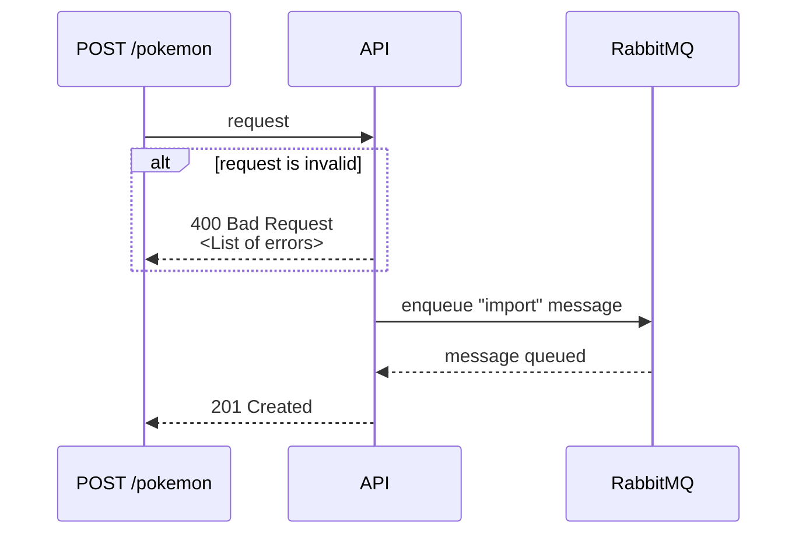
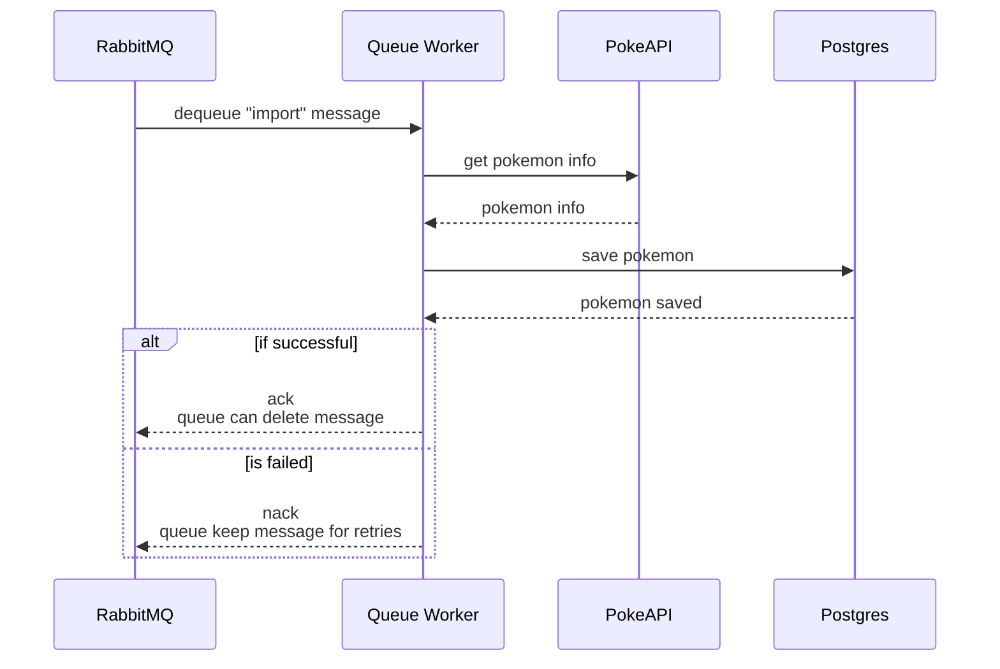
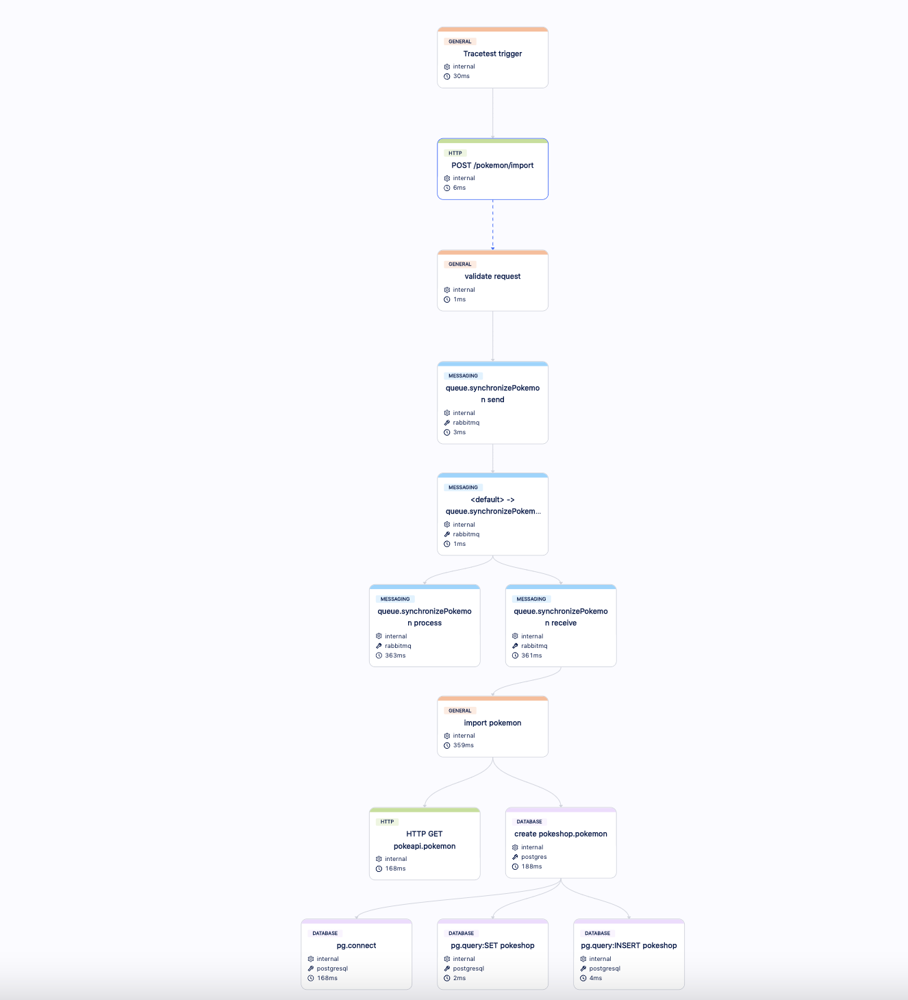
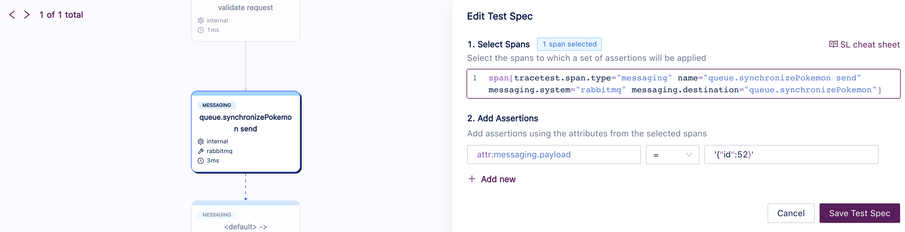
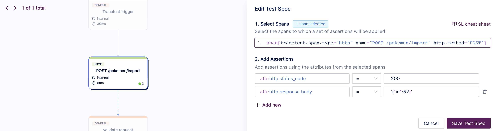
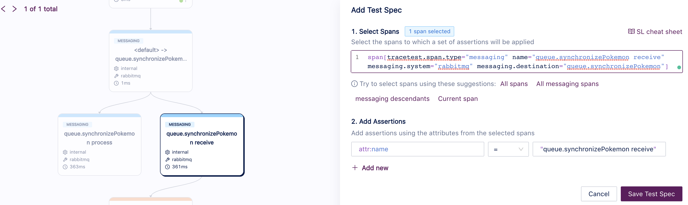
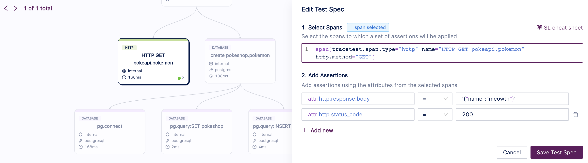
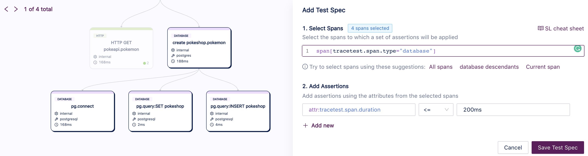

This use case showcases a more complex scenario involving an async process. Usually, when working with microservices, there are use cases where some of the processing needs to happen asynchronously, for example, when triggering a user notification, generating reports or processing a payment order. With this endpoint, we provide an example of how users can implement trace-based testing for such scenarios.

Here the process is split into two phases:

1. An API call that enqueues an import request to a queue.


2. A Worker that dequeues messages and completes the async process.


You can trigger this use case by calling the endpoint `POST /pokemon/import`, with the following request body:
```json
{
  "id":  52
}
```

It should return the following payload:
```json
{
  "id":  52
}
```

## Building a Test for This Scenario

Using Tracetest, we can [create a test](/web-ui/creating-tests) that will execute an API call on `POST /pokemon/import` and validate the following properties:
- The API should enqueue an import task and return HTTP 200 OK.
- The worker should dequeue the import task.
- PokeAPI should return a valid response.
- The database should respond with low latency (< 200ms).

### Traces

Running these tests for the first time will create an Observability trace like the image below, where you can see spans for the API call, the queue messaging, the PokeAPI (external API) call and database calls. One interesting thing about this trace is that **you can observe the entire use case, end to end**:



### Assertions

With this trace, we can build [assertions](/concepts/assertions) on Tracetest and validate the API and Worker behaviors:

- **The API should enqueue an import task and return HTTP 200 OK:**



- **The worker should dequeue the import task:**


- **PokeAPI should return a valid response:**


- **The database should respond with low latency (< 200ms):**


Now you can validate this entire use case.

### Test Definition

If you want to replicate this entire test on Tracetest, you can replicate these steps on our Web UI or using our CLI, saving the following test definition as the file `test-definition.yml` and later running:

```sh
tracetest run test -f test-definition.yml
```

```yaml
type: Test
spec:
  name: Pokeshop - Import
  description: Import a Pokemon
  trigger:
    type: http
    httpRequest:
      url: http://demo-pokemon-api.demo/pokemon/import
      method: POST
      headers:
      - key: Content-Type
        value: application/json
      body: '{"id":52}'
  specs:
  - selector: span[tracetest.span.type="messaging" name="queue.synchronizePokemon
      send" messaging.system="rabbitmq" messaging.destination="queue.synchronizePokemon"]
    assertions:
    - attr:messaging.payload = '{"id":52}'
  - selector: span[tracetest.span.type="http" name="POST /pokemon/import" http.method="POST"]
    assertions:
    - attr:http.status_code = 200
    - attr:http.response.body = '{"id":52}'
  - selector: span[tracetest.span.type="messaging" name="queue.synchronizePokemon
      receive" messaging.system="rabbitmq" messaging.destination="queue.synchronizePokemon"]
    assertions:
    - attr:name = "queue.synchronizePokemon receive"
  - selector: span[tracetest.span.type="http" name="HTTP GET pokeapi.pokemon" http.method="GET"]
    assertions:
    - attr:http.response.body  =  '{"name":"meowth"}'
    - attr:http.status_code  =  200
  - selector: span[tracetest.span.type="database"]
    assertions:
    - attr:tracetest.span.duration <= 200ms

```
