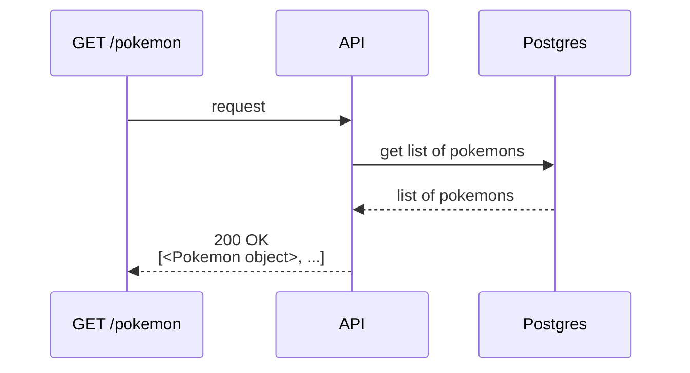
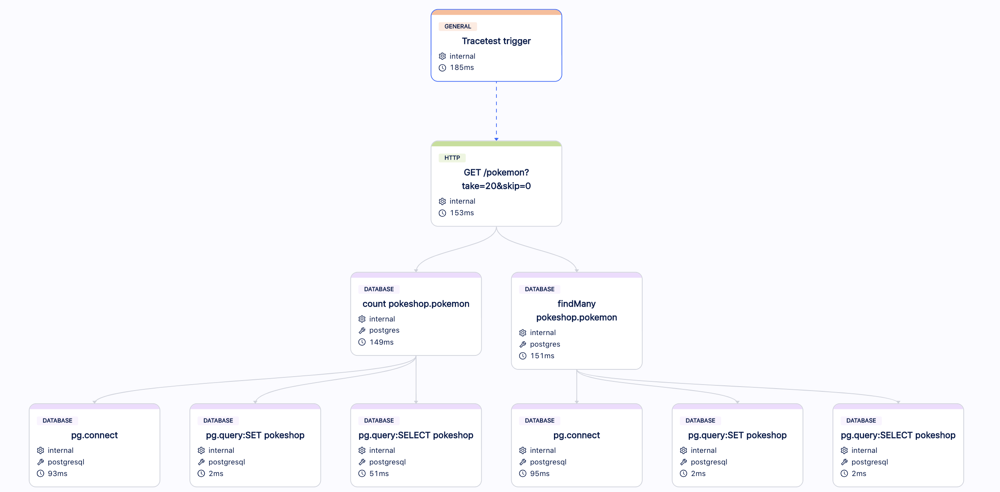
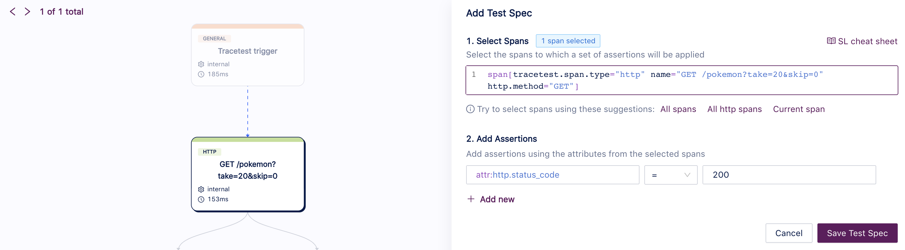
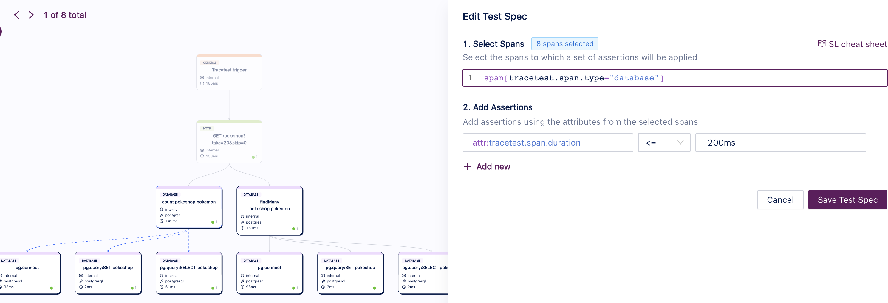
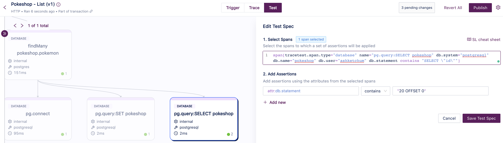

# Pokeshop API - List Pokemon

This use case retrieves the list of Pokemon directly from the database (Postgres) based on the provided query through the API. The purpose of this query is to showcase a straightforward scenario, where the API layer receives a request from the outside and needs to trigger a database query to get some data and return it to the client.



You can trigger this use case by calling the endpoint `GET /pokemon?take=20&skip=0` without a payload and should receive a payload similar to this: 
```json
[
  {
    "id":  25,
    "name":  "pikachu",
    "type":  "electric",
    "imageUrl":  "https://assets.pokemon.com/assets/cms2/img/pokedex/full/025.png",
    "isFeatured":  true
  },
  {
    "id":  26,
    "name":  "raichu",
    "type":  "electric",
    "imageUrl":  "https://assets.pokemon.com/assets/cms2/img/pokedex/full/026.png",
    "isFeatured":  true
  },
  //...
]
```

## Building a Test for This Scenario

Using Tracetest, we can [create a test](/web-ui/creating-tests) that will execute an API call on `GET /pokemon` and validate three properties:
- The API should return results with HTTP 200 OK.
- The database should respond with low latency (< 200ms).
- The database query should use the query string parameters `take` and `skip` correctly.

### Traces

Running these tests for the first time will create an Observability trace like the image below, where you can see spans for the API call and database calls:


### Assertions

With this trace, we can build [assertions](/concepts/assertions) on Tracetest and validate the API response and the database responses:

- **The API should return results with HTTP 200 OK:**


- **The database should respond with low latency (< 200ms):**


- **The database query should use the query string parameters `take` and `skip` correctly:**


Now you can validate this entire use case.

### Test Definition

If you want to replicate this entire test on Tracetest, you can replicate these steps on our Web UI or using our CLI, saving the following test definition as the file `test-definition.yml` and later running:

```sh
tracetest run test -f test-definition.yml
```

```yaml
type: Test
spec:
  name: Pokeshop - List
  description: Get a Pokemon
  trigger:
    type: http
    httpRequest:
      url: http://demo-pokemon-api.demo/pokemon?take=20&skip=0
      method: GET
      headers:
      - key: Content-Type
        value: application/json
  specs:
  - selector: span[tracetest.span.type="http" name="GET /pokemon?take=20&skip=0" http.method="GET"]
    assertions:
    - attr:http.status_code = 200
  - selector: span[tracetest.span.type="database"]
    assertions:
    - attr:tracetest.span.duration   <=   200ms
  - selector: span[tracetest.span.type="database" name="pg.query:SELECT pokeshop"
      db.system="postgresql" db.name="pokeshop" db.user="ashketchum" db.statement
      contains "SELECT \"id\""]
    assertions:
    - attr:db.statement        contains  "20 OFFSET 0"
```
