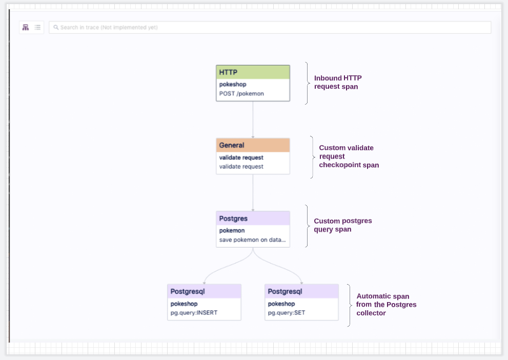
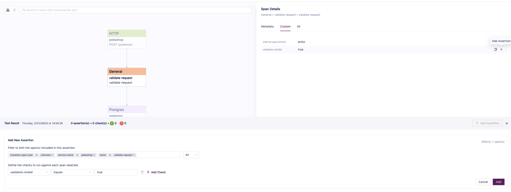
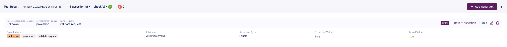
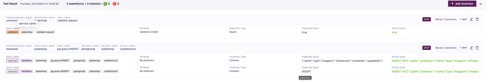

# Pokeshop - Add Pokemon Endpoint

This endpoint showcases the different checkpoints that can be added to an application to include custom instrumentation such as validation of the incoming data before inserting it into the database.


## **Endpoint Specification**

Route: `/pokemon`

Method: `POST`

Request Body:

```java

{

"name":  "meowth",

"type":  "normal",

"imageUrl":  "https://assets.pokemon.com/assets/cms2/img/pokedex/full/052.png",

"isFeatured":  true

}

```

Response:

```java

{

"id":  1000,

"name":  "meowth",

"type":  "normal",

"imageUrl":  "https://assets.pokemon.com/assets/cms2/img/pokedex/full/052.png",

"isFeatured":  true

}

```

## **Trace Details**



## **Assertions**

Here are some key points that are relevant to this query.

**Validate the Request Body is Valid**

To demonstrate the custom span capability from OTEL, this trace contains a checkpoint that validates the incoming request body before inserting the data into the database.

To add an assertion to this checkpoint simply click the General span and then head into the custom tab where the custom attribute `validation.isValid` is displayed.

Then click the **add assertion** button to open the form with the prefilled data.



You’ll see the check automatically added to the form, where the selectors and checks can be manually updated if necessary.

To finalize the assertion creation just click the **save** button.



**Validate the Insert Database Statement**

To add an assertion to validate that the insert statement was executed with the proper information, we can start by selecting the database span and clicking the add assertion button.

Then we can add one or multiple checks on the `db.statement` attribute to validate the different portions of the statement.


After clicking **save**, the new assertion should show up.


