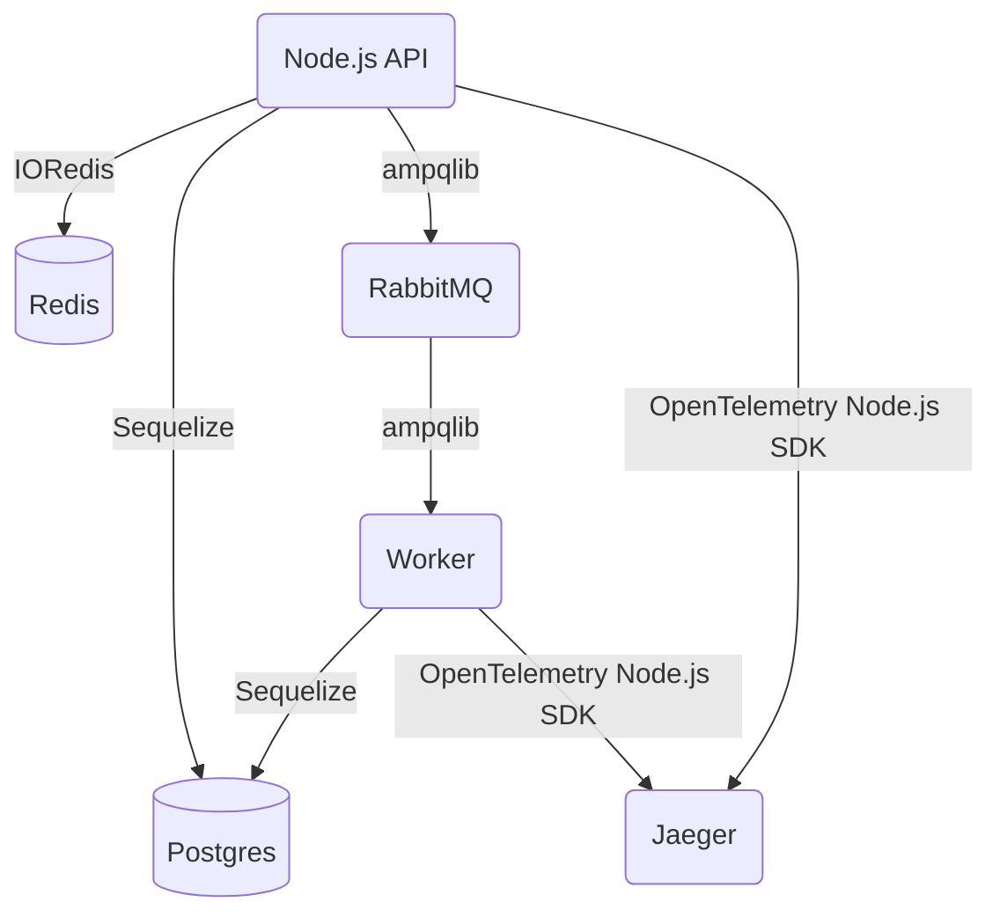

# Pokeshop Microservice API (PMA)

As a testing ground, the team at Tracetest has implemented a sample instrumented API around the [PokeAPI](https://pokeapi.co/).

The idea is to have a microservice-divided system that could behave like a typical scenario by having async processes (RabbitMQ), cache layers (Redis), database storage (Postgres), and simple CRUD interfaces for Pokemons.

With this, users can get familiar with the Tracetest tool by focusing on creating assertions, visualizing the trace, and identifying the different data that comes from the Collector (Jeager). Users will learn about basic instrumentation practices like what tools to use, what data to send, when, and what suggested standards need to be followed.

The PMA is only accessible from within the Kubernetes cluster network as the Tracetest needs to be able to reach it.

## System architecture

### Kubernetes Cluster

