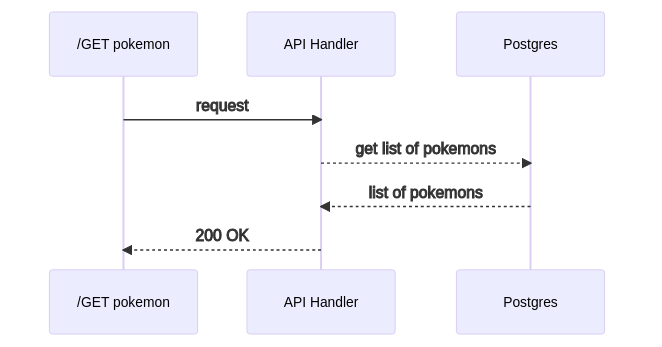
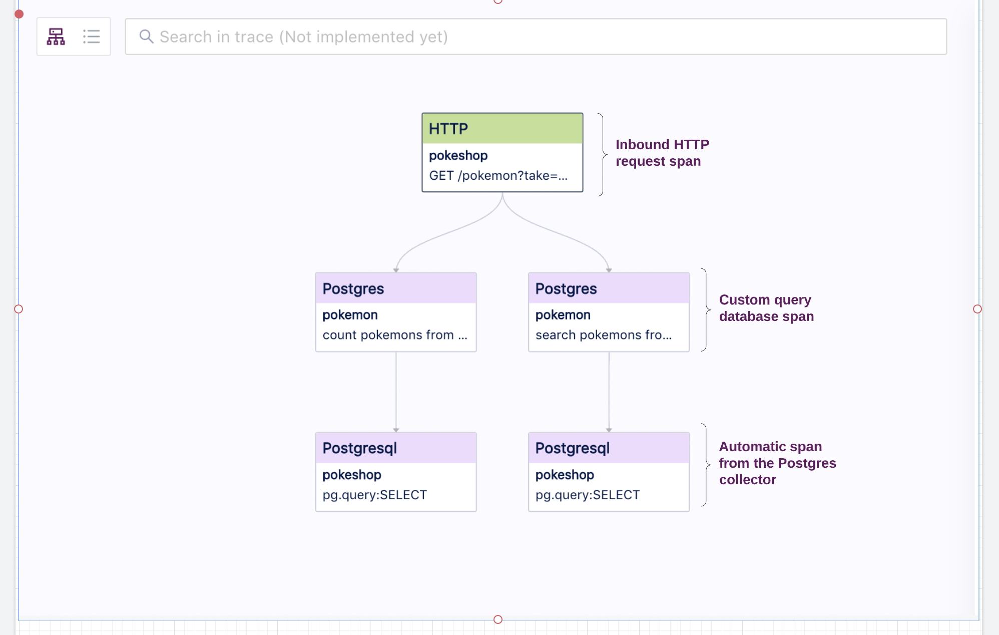
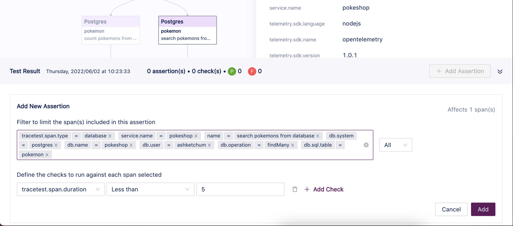
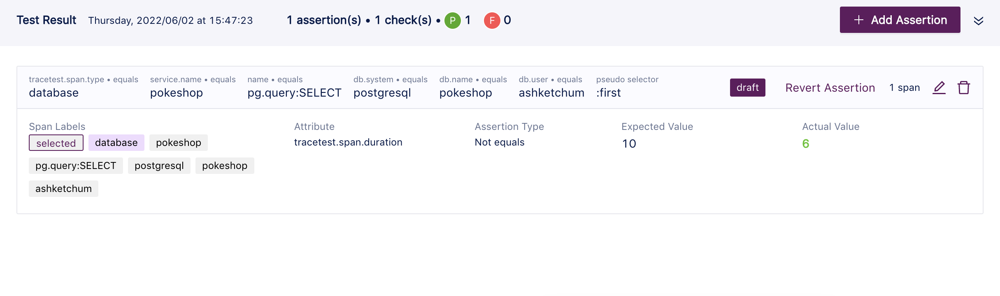
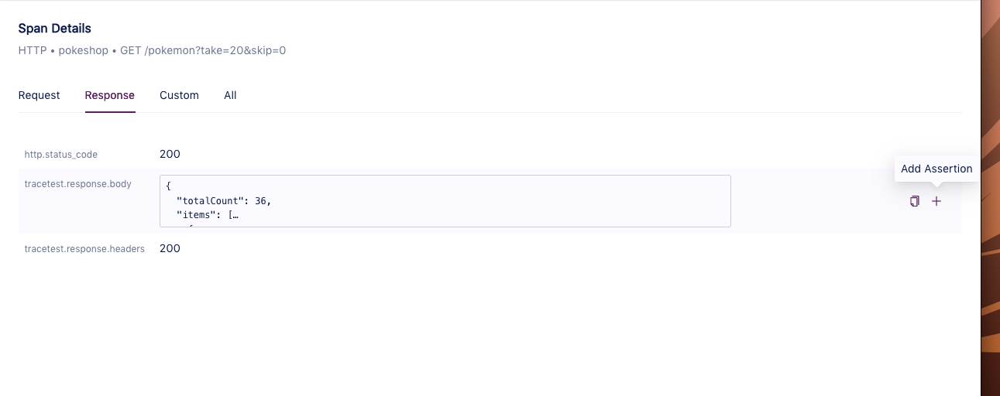
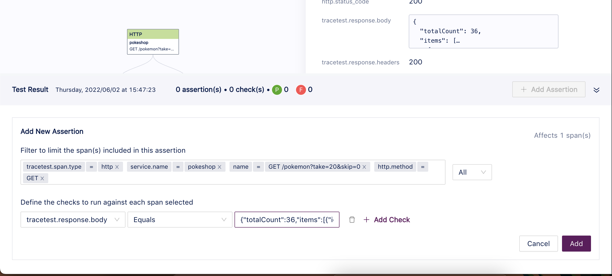
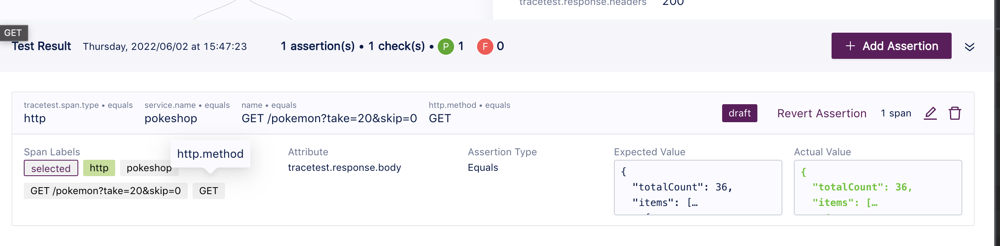
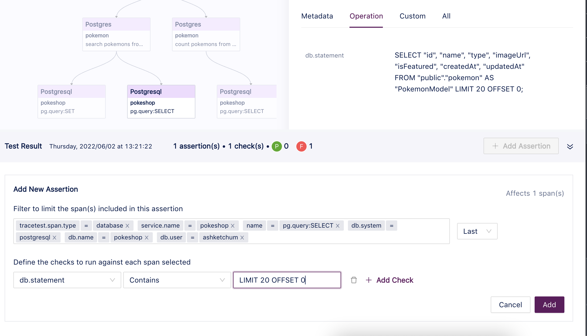

# Pokeshop - List Pokemon Endpoint

This endpoint returns the list of Pokemon directly from the database (Postgres) based on the provided query. The idea of this query is to showcase a straightforward scenario, where the API layer receives a request from the outside and needs to trigger a database query to get some data and return it to the client.



## **Endpoint Specification**

Route: `/pokemon?take=20&skip=0`

Method: `GET`

Response:

```java

[

{

"id":  25,

"name":  "pikachu",

"type":  "electric",

"imageUrl":  "https://assets.pokemon.com/assets/cms2/img/pokedex/full/025.png",

"isFeatured":  true

},

{

"id":  26,

"name":  "raichu",

"type":  "electric",

"imageUrl":  "https://assets.pokemon.com/assets/cms2/img/pokedex/full/026.png",

"isFeatured":  true

}

]

```

## **Trace**



## **Assertions**

Here are some key points that are relevant for this query.

**Validating the Database Query Speed**

To add a validation based on a span duration, we can click the specific database span we want to add the test to. After clicking the add assertion button which will display the form, based on the predefined selector, we can start adding the assertions at the bottom.



Tracetest adds a custom attribute to all spans called `tracetest.span.duration` which contains the duration in milliseconds. By selecting that attribute, we can now add the operator and value we want to use. In this case, we are checking that the duration is less than 5 milliseconds.

The next step is selecting add and then the assertion should show up in the bottom section as draft mode.



**Validate the Resulting Body**

To validate the resulting body we can use one of the attributes coming from the inbound HTTP request called `http.response.body`.

A different way to open the assertion form with prefilled data is by clicking the **add assertion** plus sign from the span detail attribute section.



This way the assertion form will have the selected attribute added as a check from the start.



We can compare it directly by using **equals** or using **contains** to match a substring.

After selecting **add**, it should show as part of the assertions in edit mode.



**Validate the Database Statement to Include the Query Parameters**

To achieve this, we can add an assertion targeting the select query span to contain the limit and offset parameters.

To do that we need to select the specific span and click **add assertion**. Then, we can add a check for the `db.statement` to contain `LIMIT 20 OFFSET 0` like:



And by selecting **add**, it should show up like this:


