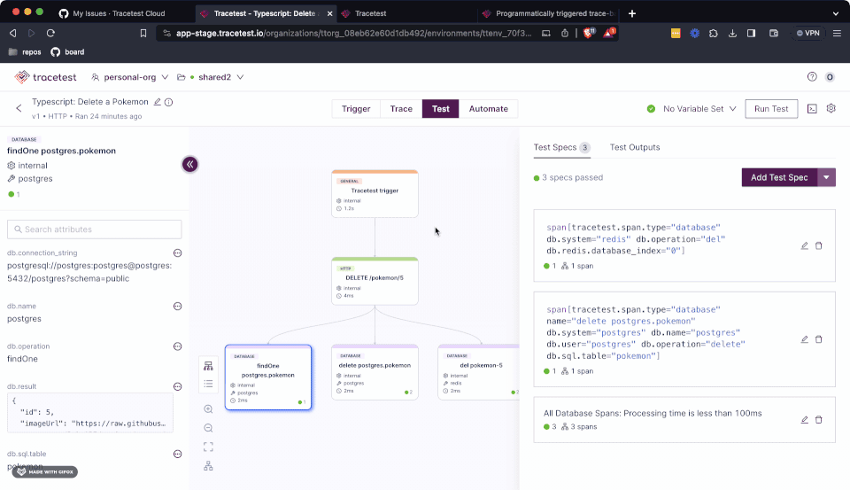

:::tip Commercial Feature
[Feature available only in Cloud-based Managed Tracetest & Enterprise Self-hosted Tracetest.](https://tracetest.io/pricing)
:::

:::info Version Compatibility
This integration is compatible with [Artillery v2.0.10](https://github.com/artilleryio/artillery/releases/tag/artillery-2.0.10) and above.
:::

:::note
[Check out the source code on GitHub here.](https://github.com/kubeshop/tracetest/tree/main/examples/quick-start-artillery)
:::

[Tracetest](https://app.tracetest.io/) is a testing tool based on [OpenTelemetry](https://opentelemetry.io/) that allows you to test your distributed application. It allows you to use data from distributed traces generated by OpenTelemetry to validate and assert if your application has the desired behavior defined by your test definitions.

[Artillery](https://artillery.io/) is a modern, powerful load-testing toolkit. Artillery is designed to help developers and testers simulate traffic to their applications, APIs, and microservices. It allows users to define scenarios to test how their systems behave under different loads.

## Why is this important?

Artillery is it's a great tool in its own right that allows you to replicate most of the production challenges you might encounter. But, as with all of the tools that only test the initial transaction between the client side and the server, you can only run validations against the immediate response from the service.

## The Tracetest Artillery Integration NPM Packages

The [`artillery-engine-tracetest`](https://www.npmjs.com/package/artillery-engine-tracetest) package enables you to run performance tests using Tracetest's as the main engine. Reaching directly to your APIs and fetching the generated telemetry data to be used to run trace-based tests.

:::note
Are you using the HTTP engine for your Artillery Test Scripts? Take a look at the [`artillery-plugin-tracetest`](./artillery-plugin) guide on how to seemingly integrate it with your existing setup.
:::

## Today You'll Learn How to integrate Trace-Based Tests with your Aritllery Test Scripts

This is a simple quick-start guide on how to use the Tracetest `artillery-engine-tracetest` NPM package to enhance your Artillery Test Scripts with trace-based testing. The infrastructure will use the Pokeshop Demo as a testing ground, triggering requests against it and generating telemetry data.

## Requirements

**Tracetest Account**:

- Sign up to [`app.tracetest.io`](https://app.tracetest.io) or follow the [get started](/getting-started/installation) docs.
- Create an [environment](/concepts/environments).
- Create an [environment token](/concepts/environment-tokens).
- Have access to the environment's [agent API key](/configuration/agent).

**Docker**: Have [Docker](https://docs.docker.com/get-docker/) and [Docker Compose](https://docs.docker.com/compose/install/) installed on your machine.

## Run This Quckstart Example

The example below is provided as part of the Tracetest project. You can download and run the example by following these steps:

Clone the Tracetest project and go to the TypeScript Quickstart:

```bash
git clone https://github.com/kubeshop/tracetest
cd tracetest/examples/quick-start-artillery
```

Follow these instructions to run the included demo app and TypeScript example:

1. Copy the `.env.template` file to `.env`.
2. Log into the [Tracetest app](https://app.tracetest.io/).
3. This example is configured to use Jaeger. Ensure the environment you will be utilizing to run this example is also configured to use the Jaeger Tracing Backend by clicking on Settings, Tracing Backend, Jaeger, updating the url to `jaeger:16685`, Test Connection and Save.
4. Fill out the [token](https://docs.tracetest.io/concepts/environment-tokens) and [agent API key](https://docs.tracetest.io/concepts/agent) details by editing your `.env` file. You can find these values in the Settings area for your environment.
5. Run `docker compose up -d`.
6. Run `npm i` to install the required dependencies.
7. Run `npm run test:engine` to run the example.
8. The output will show the test results and the Tracetest URL for each test run.
9. Follow the links in the log to view the test runs programmatically created by the Atillery execution.

Follow along with the sections below for an in detail breakdown of what the example you just ran did and how it works.

## Project Structure

The quick-start Artillery project is built with Docker Compose.

The [Pokeshop Demo App](/live-examples/pokeshop/overview) is a complete example of a distributed application using different back-end and front-end services. We will be launching it and running tests against it as part of this example.

The `docker-compose.yaml` file in the root directory of the quick start runs the Pokeshop Demo app, the OpenTelemetry Collector, Jaeger, and the [Tracetest Agent](/concepts/agent) setup.

The Artillery Plugin quick start has two primary files: a Test Script file `engine-test.yaml` that defines the Artillery execution, and a Tracetest Definition file `import-pokemon.yaml` that contains the specs and execution of the trace-based tests.

## Installing the `artillery-engine-tracetest` NPM Package

The first step when using the Artillery Plugin NPM package is to install the `artillery-engine-tracetest` NPM Package. It is as easy as running the following command:

```bash
npm i artillery-engine-tracetest
```

Once you have installed the `artillery-engine-tracetest` package, you can use it as part of your Artillery Test Scripts to trigger trace-based tests and run checks against the resulting telemetry data.

## Tracetest Test Definitions

The `import-pokemon.yaml` file contains the YAML version of the test definitions that will be used to run the tests. It uses the Artillery trigger to execute requests against the Pokeshop Demo.

```yaml title="import-pokemon.yaml"
type: Test
spec:
  id: artillery-engine-import-pokemon
  name: "Artillery Engine: Import Pokemon"

  # Executing a POST request to the /pokemon/import endpoint
  trigger:
    type: http
    httpRequest:
      method: POST
      url: ${var:ENDPOINT}/pokemon/import
      body: '{"id": ${var:POKEMON_ID}}'
      headers:
        - key: Content-Type
          value: application/json

  # Defining the trace-based tests
  specs:
    - selector: span[tracetest.span.type="general" name = "validate request"] span[tracetest.span.type="http"]
      name: "All HTTP Spans: Status  code is 200"
      assertions:
        - attr:http.status_code = 200
    - selector: span[tracetest.span.type="http" name="GET" http.method="GET"]
      assertions:
        - attr:http.route = "/api/v2/pokemon/${var:POKEMON_ID}"
    - selector: span[tracetest.span.type="database"]
      name: "All Database Spans: Processing time is less than 1s"
      assertions:
        - attr:tracetest.span.duration < 1s

  # Defining the outputs
  outputs:
    - name: DATABASE_POKEMON_ID
      selector: span[tracetest.span.type="database" name="create postgres.pokemon" db.system="postgres" db.name="postgres" db.user="postgres" db.operation="create" db.sql.table="pokemon"]
      value: attr:db.result | json_path '$.id'
```

## Creating the Artillery Test Script

The `engine-test.yaml` file contains the Artillery Test Script that will be used to trigger requests against the Pokeshop Demo and run trace-based tests. The steps executed by this script are the following:

1. Congures a phase that will execute `10` Tracetest test runs.
2. Includes the API `token` to access the Tracetest APIs.
3. Defines the scenarios using the `tracetest` engine adding the Test definition from the `import-pokemon.yaml` which is an HTTP request to the `POST pokemon/import` endpoint sending `6` (Charizard) as the Pokemon ID.
4. The summary format is set to `pretty` to display the results in the console.

```yaml title="engine-test.yaml"
config:
  target: my_target
  tracetest:
    token: <your-api-token>
  phases:
    - duration: 2
      arrivalRate: 5
  engines:
    tracetest: {}
scenarios:
  - name: tracetest_engine_test
    engine: tracetest
    flow:
      - test:
          definition: import-pokemon.yaml
          runInfo:
            variables:
              - key: ENDPOINT
                value: http://api:8081
              - key: POKEMON_ID
                value: "6"
      - summary:
          format: "pretty"
```

## Running the Full Example

To start the full setup, run the following command:

```bash
docker compose up -d
npm run test:engine
```

## Finding the Results

The output from the Tracetest Engine script should be visible in the console log after running the test command. This log will show links to Tracetest for each of the test runs invoked by the Artillery Testing Script. Click a link to launch Tracetest and view the test result.

```bash

> quick-start-artillery@1.0.0 test:engine
> artillery run engine-test.yaml

Test run id: t47ez_f4gmj899tr4nnp465h38d4mnker7z_w8yp
Phase started: unnamed (index: 0, duration: 2s) 09:29:33(-0600)

Phase completed: unnamed (index: 0, duration: 2s) 09:29:35(-0600)

--------------------------------------
Metrics for period to: 09:29:40(-0600) (width: 1.203s)
--------------------------------------

vusers.created: ................................................................ 10
vusers.created_by_name.tracetest_engine_test: .................................. 10


Warning: multiple batches of metrics for period 1709825370000 2024-03-07T15:29:30.000Z
⠏ ✘ Artillery Engine: Import Pokemon (https://app.tracetest.io/organizations/ttorg_2179a9cd8ba8dfa5/environments/ttenv_231b49e808c29e6a/test/artillery-plugin-import-pokemon/run/70) - trace id: 4a2e41bf5b497a643056c8a08d122d82
  > All HTTP Spans: Status  code is 200 (span[tracetest.span.type="general" name = "validate request"] span[tracetest.span.type="http"])

    • Expected: attr:http.status_code = 200

      No Spans
      Received: resolution error: there are no matching spans to retrieve the attribute "http.status_code" from. To fix this error, create a selector matching at least one span.
  > span[tracetest.span.type="http" name="GET" http.method="GET"]

    • Expected: attr:http.route = "/api/v2/pokemon/${var:POKEMON_ID}"

      No Spans
      Received: resolution error: there are no matching spans to retrieve the attribute "http.route" from. To fix this error, create a selector matching at least one span.
  > All Database Spans: Processing time is less than 1s (span[tracetest.span.type="database"])
⠙ ✘ Artillery Engine: Import Pokemon (https://app.tracetest.io/organizations/ttorg_2179a9cd8ba8dfa5/environments/ttenv_231b49e808c29e6a/test/artillery-plugin-import-pokemon/run/74) - trace id: a00ff614a06be196ec5cf74ace906b3e
  > All HTTP Spans: Status  code is 200 (span[tracetest.span.type="general" name = "validate request"] span[tracetest.span.type="http"])

    • Expected: attr:http.status_code = 200

      No Spans
      Received: resolution error: there are no matching spans to retrieve the attribute "http.status_code" from. To fix this error, create a selector matching at least one span.
  > span[tracetest.span.type="http" name="GET" http.method="GET"]

    • Expected: attr:http.route = "/api/v2/pokemon/${var:POKEMON_ID}"

      No Spans
      Received: resolution error: there are no matching spans to retrieve the attribute "http.route" from. To fix this error, create a selector matching at least one span.
  > All Database Spans: Processing time is less than 1s (span[tracetest.span.type="database"])
⠸ ✘ Artillery Engine: Import Pokemon (https://app.tracetest.io/organizations/ttorg_2179a9cd8ba8dfa5/environments/ttenv_231b49e808c29e6a/test/artillery-plugin-import-pokemon/run/76) - trace id: 1fb3ded60f582ecfd151a019df2479cd
  > All HTTP Spans: Status  code is 200 (span[tracetest.span.type="general" name = "validate request"] span[tracetest.span.type="http"])

    • Expected: attr:http.status_code = 200

      No Spans
      Received: resolution error: there are no matching spans to retrieve the attribute "http.status_code" from. To fix this error, create a selector matching at least one span.
  > span[tracetest.span.type="http" name="GET" http.method="GET"]

    • Expected: attr:http.route = "/api/v2/pokemon/${var:POKEMON_ID}"

      No Spans
      Received: resolution error: there are no matching spans to retrieve the attribute "http.route" from. To fix this error, create a selector matching at least one span.
  > All Database Spans: Processing time is less than 1s (span[tracetest.span.type="database"])
⠹ ✘ Artillery Engine: Import Pokemon (https://app.tracetest.io/organizations/ttorg_2179a9cd8ba8dfa5/environments/ttenv_231b49e808c29e6a/test/artillery-plugin-import-pokemon/run/78) - trace id: 750df8c1d55ed6a4e18f4b2b8b573a14
  > All HTTP Spans: Status  code is 200 (span[tracetest.span.type="general" name = "validate request"] span[tracetest.span.type="http"])

    • Expected: attr:http.status_code = 200

      No Spans
      Received: resolution error: there are no matching spans to retrieve the attribute "http.status_code" from. To fix this error, create a selector matching at least one span.
  > span[tracetest.span.type="http" name="GET" http.method="GET"]

    • Expected: attr:http.route = "/api/v2/pokemon/${var:POKEMON_ID}"

      No Spans
      Received: resolution error: there are no matching spans to retrieve the attribute "http.route" from. To fix this error, create a selector matching at least one span.
  > All Database Spans: Processing time is less than 1s (span[tracetest.span.type="database"])
⠦ ✔ Artillery Engine: Import Pokemon (https://app.tracetest.io/organizations/ttorg_2179a9cd8ba8dfa5/environments/ttenv_231b49e808c29e6a/test/artillery-plugin-import-pokemon/run/71) - trace id: c3bdcfb86ca77a9455b29882f593848a
⠏ ✘ Artillery Engine: Import Pokemon (https://app.tracetest.io/organizations/ttorg_2179a9cd8ba8dfa5/environments/ttenv_231b49e808c29e6a/test/artillery-plugin-import-pokemon/run/79) - trace id: 76ecf991c6eb37c2a0dee857a699dc76
  > All HTTP Spans: Status  code is 200 (span[tracetest.span.type="general" name = "validate request"] span[tracetest.span.type="http"])

    • Expected: attr:http.status_code = 200

      No Spans
      Received: resolution error: there are no matching spans to retrieve the attribute "http.status_code" from. To fix this error, create a selector matching at least one span.
  > span[tracetest.span.type="http" name="GET" http.method="GET"]

    • Expected: attr:http.route = "/api/v2/pokemon/${var:POKEMON_ID}"

      No Spans
      Received: resolution error: there are no matching spans to retrieve the attribute "http.route" from. To fix this error, create a selector matching at least one span.
  > All Database Spans: Processing time is less than 1s (span[tracetest.span.type="database"])
⠙ ✘ Artillery Engine: Import Pokemon (https://app.tracetest.io/organizations/ttorg_2179a9cd8ba8dfa5/environments/ttenv_231b49e808c29e6a/test/artillery-plugin-import-pokemon/run/72) - trace id: cece9c79434b3313bf23150bc967e82f
  > All HTTP Spans: Status  code is 200 (span[tracetest.span.type="general" name = "validate request"] span[tracetest.span.type="http"])

    • Expected: attr:http.status_code = 200

      No Spans
      Received: resolution error: there are no matching spans to retrieve the attribute "http.status_code" from. To fix this error, create a selector matching at least one span.
  > span[tracetest.span.type="http" name="GET" http.method="GET"]

    • Expected: attr:http.route = "/api/v2/pokemon/${var:POKEMON_ID}"

      No Spans
      Received: resolution error: there are no matching spans to retrieve the attribute "http.route" from. To fix this error, create a selector matching at least one span.
  > All Database Spans: Processing time is less than 1s (span[tracetest.span.type="database"])
⠇ ✘ Artillery Engine: Import Pokemon (https://app.tracetest.io/organizations/ttorg_2179a9cd8ba8dfa5/environments/ttenv_231b49e808c29e6a/test/artillery-plugin-import-pokemon/run/77) - trace id: b3f3682eb328195ede902177ff4170a1
  > All HTTP Spans: Status  code is 200 (span[tracetest.span.type="general" name = "validate request"] span[tracetest.span.type="http"])

    • Expected: attr:http.status_code = 200

      No Spans
      Received: resolution error: there are no matching spans to retrieve the attribute "http.status_code" from. To fix this error, create a selector matching at least one span.
  > span[tracetest.span.type="http" name="GET" http.method="GET"]

    • Expected: attr:http.route = "/api/v2/pokemon/${var:POKEMON_ID}"

      No Spans
      Received: resolution error: there are no matching spans to retrieve the attribute "http.route" from. To fix this error, create a selector matching at least one span.
  > All Database Spans: Processing time is less than 1s (span[tracetest.span.type="database"])
⠸ ✘ Artillery Engine: Import Pokemon (https://app.tracetest.io/organizations/ttorg_2179a9cd8ba8dfa5/environments/ttenv_231b49e808c29e6a/test/artillery-plugin-import-pokemon/run/75) - trace id: c2d4624f20060565b0b5e9f97ad7e7a7
  > All HTTP Spans: Status  code is 200 (span[tracetest.span.type="general" name = "validate request"] span[tracetest.span.type="http"])

    • Expected: attr:http.status_code = 200

      No Spans
      Received: resolution error: there are no matching spans to retrieve the attribute "http.status_code" from. To fix this error, create a selector matching at least one span.
  > span[tracetest.span.type="http" name="GET" http.method="GET"]

    • Expected: attr:http.route = "/api/v2/pokemon/${var:POKEMON_ID}"

      No Spans
      Received: resolution error: there are no matching spans to retrieve the attribute "http.route" from. To fix this error, create a selector matching at least one span.
  > All Database Spans: Processing time is less than 1s (span[tracetest.span.type="database"])
⠙ ✘ Artillery Engine: Import Pokemon (https://app.tracetest.io/organizations/ttorg_2179a9cd8ba8dfa5/environments/ttenv_231b49e808c29e6a/test/artillery-plugin-import-pokemon/run/73) - trace id: 878bb73b5234f764f4d289bf657b40cf
  > All HTTP Spans: Status  code is 200 (span[tracetest.span.type="general" name = "validate request"] span[tracetest.span.type="http"])

    • Expected: attr:http.status_code = 200

      No Spans
      Received: resolution error: there are no matching spans to retrieve the attribute "http.status_code" from. To fix this error, create a selector matching at least one span.
  > span[tracetest.span.type="http" name="GET" http.method="GET"]

    • Expected: attr:http.route = "/api/v2/pokemon/${var:POKEMON_ID}"

      No Spans
      Received: resolution error: there are no matching spans to retrieve the attribute "http.route" from. To fix this error, create a selector matching at least one span.
  > All Database Spans: Processing time is less than 1s (span[tracetest.span.type="database"])
--------------------------------------
Metrics for period to: 09:30:00(-0600) (width: 0.015s)
--------------------------------------

tracetest.tests_failed: ........................................................ 1
vusers.completed: .............................................................. 1
vusers.failed: ................................................................. 0
vusers.session_length:
  min: ......................................................................... 21797.1
  max: ......................................................................... 21797.1
  mean: ........................................................................ 21797.1
  median: ...................................................................... 21813.5
  p95: ......................................................................... 21813.5
  p99: ......................................................................... 21813.5


All VUs finished. Total time: 34 seconds

--------------------------------
Summary report @ 09:30:09(-0600)
--------------------------------

tracetest.tests_failed: ........................................................ 9
tracetest.tests_succeeded: ..................................................... 1
vusers.completed: .............................................................. 10
vusers.created: ................................................................ 10
vusers.created_by_name.tracetest_engine_test: .................................. 10
vusers.failed: ................................................................. 0
vusers.session_length:
  min: ......................................................................... 21797.1
  max: ......................................................................... 33447
  mean: ........................................................................ 28651.1
  median: ...................................................................... 28862.3
  p95: ......................................................................... 32542.3
  p99: ......................................................................... 32542.3
```

:::note
Most of the tests will fail as the import Pokemon flow reads from memory if the info already exists. This is expected behavior.
:::

:::tip View these tests in our Demo environment
[👉 Join our shared Pokeshop API Demo environment.](https://app.tracetest.io/organizations/ttorg_2179a9cd8ba8dfa5/invites/invite_760904a64b4b9dc9/accept)
:::

## What's Next?

After running the initial set of tests, you can click the run link for any of them, update the assertions, and run the scripts once more. This flow enables complete a trace-based TDD flow.



## Learn More

Please visit our [examples in GitHub](https://github.com/kubeshop/tracetest/tree/main/examples) and join our [Slack Community](https://dub.sh/tracetest-community) for more info!
