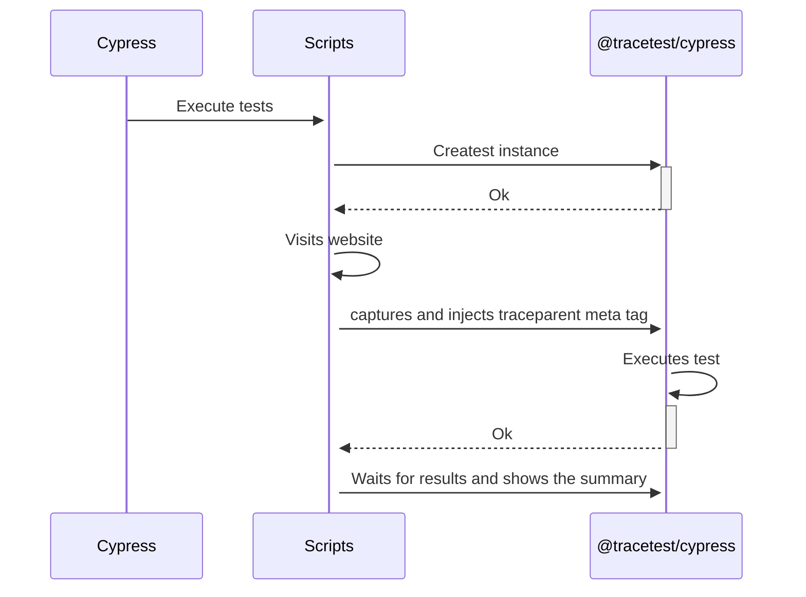
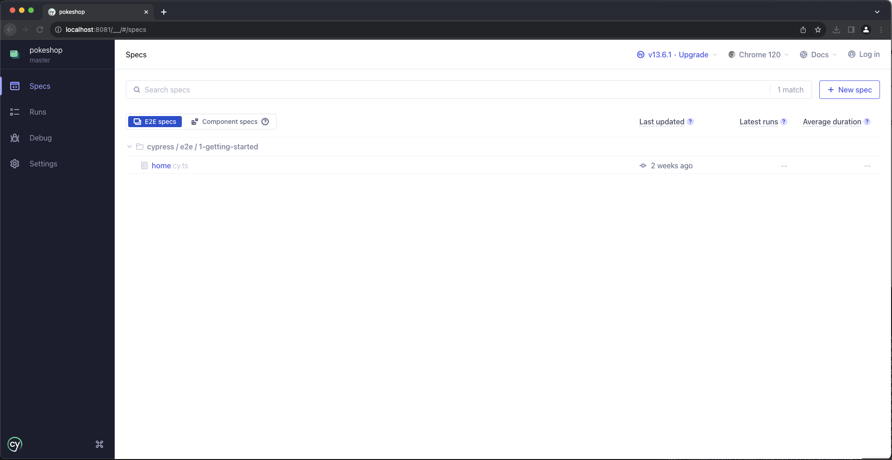
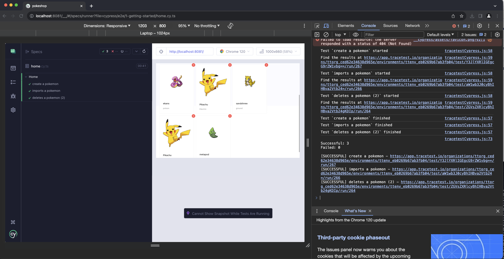
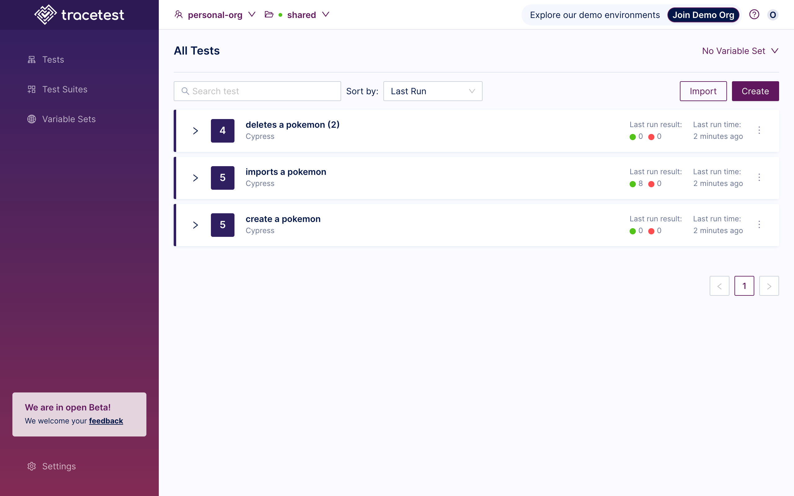
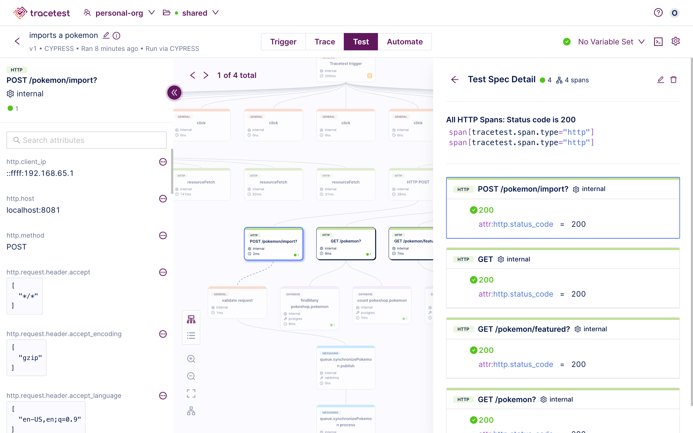

[Tracetest](https://tracetest.io/) is a testing tool based on [OpenTelemetry](https://opentelemetry.io/) that permits you to test your distributed application. It allows you to use the trace data generated by your OpenTelemetry tools to check and assert if your application has the desired behavior defined by your test definitions.

[Cypress](https://www.cypress.io/) is a JavaScript end-to-end testing framework. It is used for testing web applications by simulating user interactions within the browser. Cypress provides a fast, reliable, and easy-to-use testing environment for developers.

## Why is this important?

Cypress is currently one of the top end to end testing frameworks, it is a great tool in its own right that allows you to replicate most of the production challenges you might encounter by allowing developers to test the system from the user perspective. But, as with all of the tools that only test the UI portion application, you can only run validations against what the user would see while going through the flows.

## How It Works

The following is a high-level sequence diagram of how Cypress and Tracetest interact with the different pieces of the system.



## The `@tracetest/cypress` npm Package

The `@tracetest/cypress` npm package is a Cypress plugin that allows you to run Trace-based testing using Tracetest and Cypress. It is a wrapper around the Tracetest API that allows you to configure, orchestrate and run tests from Cypress.

## Requirements

**Tracetest Account**:

- Sign up to [`app.tracetest.io`](https://app.tracetest.io) or follow the [get started](/getting-started/installation) docs.
- Create an [environment](/concepts/environments).
- Create an [environment token](/concepts/environment-tokens).
- Have access to the environment's [agent API key](/configuration/agent).

**Pokeshop Demo:**

Clone the official [Tracetest Pokeshop Demo App Repo](https://github.com/kubeshop/pokeshop) to your local machine.

```bash
git clone https://github.com/kubeshop/pokeshop.git
cd pokeshop
```

Before moving forward, run `npm i` in the root folder to install the dependencies.

```bash
npm i
```

**Docker**:

- Have [Docker](https://docs.docker.com/get-docker/) and [Docker Compose](https://docs.docker.com/compose/install/) installed on your machine.

## Project Structure

The project is built with Docker Compose.

### Pokeshop Demo App

The [Pokeshop Demo App](/live-examples/pokeshop/overview) is a complete example of a distributed application using different backend and front-end services, implementation code is written in Typescript.

The `docker-compose.yml` file in the root directory is for the Pokeshop Demo app and the OpenTelemetry setup.

And the `docker-compose.e2e.yml` includes the [Tracetest Agent](/concepts/agent).

Finally, the Cypress end-to-end tests can be found in `cypress/e2e/1-getting-started`.

## The Cypress Setup

The Cypress setup is generated by [installing Cypress locally](https://docs.cypress.io/guides/getting-started/installing-cypress) and configuring it from the UI after running `cypress open`.

The configuration script file is `cypress.config.ts` looks like this:

```typescript title=cypress.config.ts
import { defineConfig } from "cypress";
import { config } from "dotenv"; // loads the environment variables

config();

module.exports = defineConfig({
  chromeWebSecurity: false,
  e2e: {
    baseUrl: process.env.POKESHOP_DEMO_URL || "http://localhost:3000",
    env: {
      TRACETEST_API_TOKEN: process.env.TRACETEST_API_TOKEN, // used to authenticate with Tracetest
    },
    setupNodeEvents() {
      // implement node event listeners here
    },
  },
});
```

### The `home.cy` Test Script

The `cypress/e2e/1-getting-started/home.cy` test script contains three different tests based on the Pokeshop Demo UI fetures, which are:

1. Create a Pokemon
2. Import a Pokemon (using an async process)
3. Delete a Pokemon

### Tracetest Library Setup

If you go to the `package.json` file you will find the inclusion of a Tracetest package for Cypress `@tracetest/cypress`.
The first thing the test script does is import the package, grab the Tracetest API token from the environment variables and create the Tracetest instance.

```typescript
import Tracetest, { Types } from "@tracetest/cypress";

const TRACETEST_API_TOKEN = Cypress.env("TRACETEST_API_TOKEN") || "";
let tracetest: Types.TracetestCypress | undefined = undefined;
```

Afterward, during the `before` hook, create the Tracetest instance with the API token.

```typescript
before((done) => {
  Tracetest({ apiToken: TRACETEST_API_TOKEN }).then((instance) => {
    tracetest = instance;

    // optional, set the definition files and run info for the tests
    tracetest
      .setOptions({
        "imports a pokemon": {
          definition,
        },
      })
      .then(() => done());
  });
});
```

Then, during the `beforeEach` hook, the script **captures** the document to inject the `traceparent` to the meta tag.

```typescript
beforeEach(() => {
  cy.visit("/", {
    onBeforeLoad: (win) => tracetest.capture(win.document),
  });
});
```

**OPTIONAL**: If you want to wait for the test to finish and break the Cypress execution based on a failed Tracetest test, you can add the `after` hook and call the `summary` method.

```typescript
after((done) => {
  tracetest.summary().then(() => done());
});
```

The rest of the test script is the Cypress test definitions for the test cases mentioned above. The complete test script looks like this:

```typescript
import Tracetest, { Types } from '@tracetest/cypress';

const TRACETEST_API_TOKEN = Cypress.env('TRACETEST_API_TOKEN') || '';
let tracetest: Types.TracetestCypress | undefined = undefined;

const definition = `
  type: Test
  spec:
    id: aW1wb3J0cyBhIHBva2Vtb24=
    name: imports a pokemon
    trigger:
      type: cypress
    specs:
    - selector: span[tracetest.span.type="http"] span[tracetest.span.type="http"]
      name: "All HTTP Spans: Status  code is 200"
      assertions:
      - attr:http.status_code   =   200
    - selector: span[tracetest.span.type="database"]
      name: "All Database Spans: Processing time is less than 100ms"
      assertions:
      - attr:tracetest.span.duration < 2s
    outputs:
    - name: MY_OUTPUT
      selector: span[tracetest.span.type="general" name="Tracetest trigger"]
      value: attr:name
    `;

describe('Home', { defaultCommandTimeout: 60000 }, () => {
  before(done => {
    Tracetest({ apiToken: TRACETEST_API_TOKEN }).then(instance => {
      tracetest = instance;
      tracetest
        .setOptions({
          'imports a pokemon': {
            definition,
          },
        })
        .then(() => done());
    });
  });

  beforeEach(() => {
    cy.visit('/', {
      onBeforeLoad: win => tracetest.capture(win.document),
    });
  });

  // uncomment to wait for trace tests to be done
  after(done => {
    tracetest.summary().then(() => done());
  });

  it('create a pokemon', () => {
    cy.get('[data-cy="create-pokemon-button"]').should('be.visible').click();
    cy.get('[data-cy="create-pokemon-modal"]').should('be.visible');
    cy.get('#name').type('Pikachu');
    cy.get('#type').type('Electric');
    cy.get('#imageUrl').type('https://oyster.ignimgs.com/mediawiki/apis.ign.com/pokemon-blue-version/8/89/Pikachu.jpg');

    cy.get('button').contains('OK').click();
  });

  it('imports a pokemon', () => {
    cy.get('[data-cy="import-pokemon-button"]').click();
    cy.get('[data-cy="import-pokemon-form"]').should('be.visible');

    cy.get('[id="id"]')
      .last()
      .type(Math.floor(Math.random() * 101).toString());
    cy.get('button').contains('OK').click({ force: true });
  });

  it('deletes a pokemon', () => {
    cy.get('[data-cy="pokemon-list"]').should('be.visible');
    cy.get('[data-cy="pokemon-card"]').first().click().get('[data-cy="delete-pokemon-button"]').first().click();
  });
});
```

### Setting the Environment Variables

Copy the `.env.template` content into a new `.env` file. Add the [Tracetest API Token](/concepts/environment-tokens) and [Tracetest Agent API Key](/configuration/agent) to the `TRACETEST_API_TOKEN` and `TRACETEST_AGENT_API_KEY` variables.

```bash
cp .env.template .env
vi .env
```

### Starting the Pokeshop Demo App

To start the Pokeshop Demo App, run the following command from the root directory:

```bash
docker compose -f docker-compose.yml -f docker-compose.e2e.yml up
```

### Running the Tests

Next, you can run the tests by using both the Cypress CLI and the Cypress UI.

#### Using the Cypress CLI

To run the tests using the Cypress CLI, run the following command from the root directory:

```bash
npm run cy:run
```

You should see the following output:

```bash
> pokeshop@1.0.0 cy:run
> cypress run


DevTools listening on ws://127.0.0.1:54740/devtools/browser/8c9d2503-cbaa-4ef2-b716-5bc1ad6cf6c8
Missing baseUrl in compilerOptions. tsconfig-paths will be skipped

====================================================================================================

  (Run Starting)

  ┌────────────────────────────────────────────────────────────────────────────────────────────────┐
  │ Cypress:        13.6.1                                                                         │
  │ Browser:        Electron 114 (headless)                                                        │
  │ Node Version:   v16.15.1 (/Users/oscarr.reyesgaucin/.nvm/versions/node/v16.15.1/bin/node)      │
  │                                                                                                │
  │ Specs:          1 found (home.cy.ts)                                                           │
  │ Searched:       cypress/e2e/**/*.cy.{js,jsx,ts,tsx}                                            │
  └────────────────────────────────────────────────────────────────────────────────────────────────┘


────────────────────────────────────────────────────────────────────────────────────────────────────

  Running:  home.cy.ts                                                                      (1 of 1)


  Home
    ✓ create a pokemon (4108ms)
    ✓ imports a pokemon (756ms)
    ✓ deletes a pokemon (2) (653ms)


  3 passing (42s)


  (Results)

  ┌────────────────────────────────────────────────────────────────────────────────────────────────┐
  │ Tests:        3                                                                                │
  │ Passing:      3                                                                                │
  │ Failing:      0                                                                                │
  │ Pending:      0                                                                                │
  │ Skipped:      0                                                                                │
  │ Screenshots:  0                                                                                │
  │ Video:        false                                                                            │
  │ Duration:     41 seconds                                                                       │
  │ Spec Ran:     home.cy.ts                                                                       │
  └────────────────────────────────────────────────────────────────────────────────────────────────┘


====================================================================================================

  (Run Finished)


       Spec                                              Tests  Passing  Failing  Pending  Skipped
  ┌────────────────────────────────────────────────────────────────────────────────────────────────┐
  │ ✔  home.cy.ts                               00:41        3        3        -        -        - │
  └────────────────────────────────────────────────────────────────────────────────────────────────┘
    ✔  All specs passed!                        00:41        3        3        -        -        -

```

#### Using the Cypress UI

To run the tests using the Cypress UI, run the following command from the root directory:

```bash
npm run cy:open
```

Then, navigate your way to the `e2e` section and select the `home.cy` test script.



You should see the three tests running and passing.
And by looking at the browser console log you can find the statuses and results of the tests.



Then, you can follow any of the result links in the console log to the Tracetest App and see the results of the tests.

The Tracetest library uses the spec name for the trace-based tests. That way you can identify them more easily and it also fills some of the metadata directly from the Cypress execution.



Lastly, you can now create assertions based on the trace data that was captured from the browser to the backend services.

Starting with the click events and the fetch request from the client side, to the HTTP requests and database queries from the backend services, including async processes like the one showcased during the import pokemon test.


