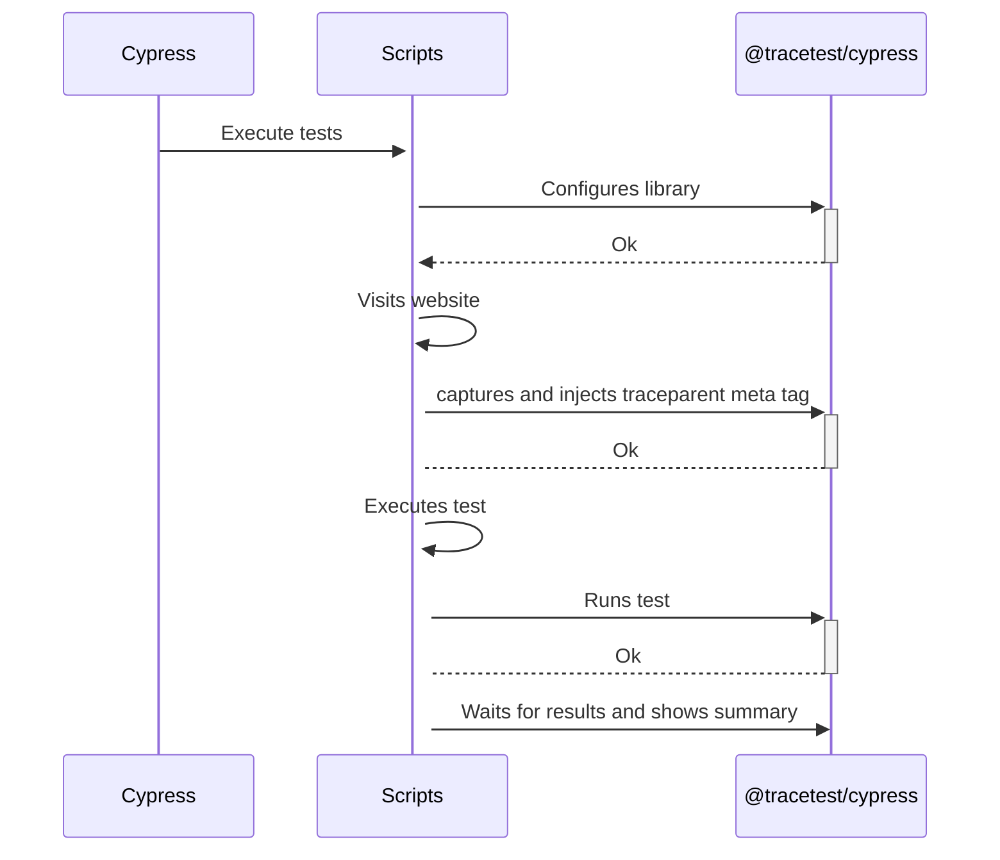

[Tracetest](https://tracetest.io/) is a testing tool based on [OpenTelemetry](https://opentelemetry.io/) that permits you to test your distributed application. It allows you to use the trace data generated by your OpenTelemetry tools to check and assert if your application has the desired behavior defined by your test definitions.

[Cypress](https://www.cypress.io/) is a JavaScript end-to-end testing framework. It is used for testing web applications by simulating user interactions within the browser. Cypress provides a fast, reliable, and easy-to-use testing environment for developers.

## Why is this important?

Cypress is currently one of the top e2e testing frameworks, it is a great tool in its own right that allows you to replicate most of the production challenges you might encounter by allowinig developers test the system from the user perspective. But, as with all of the tools that only test the UI portion application, you can only run validations against what the user would see while going through the flows.

## How It Works

The following is a high-level sequence diagram of how Cypress and Tracetest interact with the different pieces of the system.



## The `@tracetest/cypress` npm package

The `@tracetest/cypress` npm package is a Cypress plugin that allows you to run Trace-based testing using Tracetest and Cypress. It is a wrapper around the Tracetest API that allows you to configure, orchestrate and run tests from Cypress.

## Requirements

**Tracetest Account**:

- Sign up to [`app.tracetest.io`](https://app.tracetest.io) or follow the [get started](/getting-started/installation) docs.
- Create an [environment](/concepts/environments).
- Create an [environment token](/concepts/environment-tokens).
- Have access to the environment's [agent API key](/configuration/agent).

**Pokeshop Demo:** Clone the official Tracetest Pokeshop Demo App to your local machine.

**Docker**: Have [Docker](https://docs.docker.com/get-docker/) and [Docker Compose](https://docs.docker.com/compose/install/) installed on your machine.

## Project Structure

The project is built with Docker Compose.

### Pokeshop Demo App

The [Pokeshop Demo App](/live-examples/pokeshop/overview) is a complete example of a distributed application using different backend and front-end services, implementation code is written in Typescript.

The `docker-compose.yml` file in the root directory is for the Pokeshop Demo app and the OpenTelemetry setup.
Then, `docker-compose.e2e.yml` includes the and the [Tracetest Agent](/concepts/agent).

Finally, the Cypress E2E tests can be found in `cypress/e2e/1-getting-started`.

## The Cypress setup

The Cypress setup is pretty straightforward, it was generated by installing the cypress dependency and configuring it from the UI after running `cypress open`. The configuration script looks like this:

```typescript
import { defineConfig } from "cypress";
import { config } from "dotenv"; // loads the environment variables

config();

module.exports = defineConfig({
  chromeWebSecurity: false,
  e2e: {
    baseUrl: process.env.POKESHOP_DEMO_URL || "http://localhost:3000",
    env: {
      TRACETEST_API_TOKEN: process.env.TRACETEST_API_TOKEN, // used to authenticate with Tracetest
    },
    setupNodeEvents() {
      // implement node event listeners here
    },
  },
});
```

### The `home.cy` test script

The `home.cy` test script contains three different tests based on the Pokeshop Demo UI fetures, which are:

1. Creates a Pokemon
2. Imports a Pokemon (using an async process)
3. Deletes a Pokemon

### Tracetest library setup

If you go to the `package.json` file you will find the inclusion of a Tracetest package for cypress `@tracetest/cypress`.
The first thing the test script does is to import the package, grab the Tracetest API token from the environment variables and create the Tracetest instance.

```typescript
import Tracetest from "@tracetest/cypress";
const TRACETEST_API_TOKEN = Cypress.env("TRACETEST_API_TOKEN") || "";
const tracetest = Tracetest();
```

Afterward, during the `before` hook, the test script **configures** the Tracetest instance with the API token.

```typescript
before((done) => {
  tracetest.configure(TRACETEST_API_TOKEN).then(() => done());
});
```

Then, during the `beforeEach` hook, the script **captures** the document to inject the `traceparent` to the meta tag.

```typescript
beforeEach(() => {
  cy.visit("/", {
    onBeforeLoad: (win) => tracetest.capture(win.document),
  });
});
```

Lastly, during the `afterEach` hook, the script **runs** the test with an optional definition string.

```typescript
afterEach((done) => {
  const definition = Cypress.env("definition") || "";
  tracetest.runTest(definition).then(() => done());
});
```

**OPTIONAL**: If you want to wait for the test to finish and break the cypress execution based on a failed Tracetest test, you can add the `after` hook and call the `summary` method.

```typescript
after((done) => {
  tracetest.summary().then(() => done());
});
```

The rest of the test script is the Cypress test definitions for the test cases mentioned above. The complete test script looks like this:

```typescript
import Tracetest from "@tracetest/cypress";
const TRACETEST_API_TOKEN = Cypress.env("TRACETEST_API_TOKEN") || "";
const tracetest = Tracetest();

// trace-based tests can take a little bit longer than regular cypress scripts, this why we set the `defaultCommandTimeout` to 1 minute
describe("Home", { defaultCommandTimeout: 60000 }, () => {
  before((done) => {
    tracetest.configure(TRACETEST_API_TOKEN).then(() => done());
  });

  beforeEach(() => {
    cy.visit("/", {
      onBeforeLoad: (win) => tracetest.capture(win.document),
    });
  });

  afterEach((done) => {
    const definition = Cypress.env("definition") || "";
    tracetest.runTest(definition).then(() => done());
  });

  // uncomment to wait for trace tests to be done
  after((done) => {
    tracetest.summary().then(() => done());
  });

  it("create a pokemon", () => {
    cy.get('[data-cy="create-pokemon-button"]').should("be.visible").click();
    cy.get('[data-cy="create-pokemon-modal"]').should("be.visible");
    cy.get("#name").type("Pikachu");
    cy.get("#type").type("Electric");
    cy.get("#imageUrl").type("https://oyster.ignimgs.com/mediawiki/apis.ign.com/pokemon-blue-version/8/89/Pikachu.jpg");

    cy.get("button").contains("OK").click();
  });

  /// optional definition string used for TDD
  const definition = `
  type: Test
  spec:
    id: aW1wb3J0cyBhIHBva2Vtb24=
    name: imports a pokemon
    trigger:
      type: cypress
    specs:
    - selector: span[tracetest.span.type="http"] span[tracetest.span.type="http"]
      name: "All HTTP Spans: Status  code is 200"
      assertions:
      - attr:http.status_code   =   200
    - selector: span[tracetest.span.type="database"]
      name: "All Database Spans: Processing time is less than 100ms"
      assertions:
      - attr:tracetest.span.duration < 100ms
    outputs:
    - name: MY_OUTPUT
      selector: span[tracetest.span.type="general" name="Tracetest trigger"]
      value: attr:name
    `;

  it("imports a pokemon", { env: { definition } }, () => {
    cy.get('[data-cy="import-pokemon-button"]').click();
    cy.get('[data-cy="import-pokemon-form"]').should("be.visible");

    cy.get('[id="id"]')
      .last()
      .type(Math.floor(Math.random() * 101).toString());
    cy.get("button").contains("OK").click({ force: true });
  });

  it("deletes a pokemon (2)", () => {
    cy.get('[data-cy="pokemon-list"]').should("be.visible");
    cy.get('[data-cy="pokemon-card"]').first().click().get('[data-cy="delete-pokemon-button"]').first().click();
  });
});
```

### Setting the environment variables

Copy the `.env.example` file to `.env` and add the Tracetest API token and agent tokens to the `TRACETEST_API_TOKEN` and `TRACETEST_AGENT_API_KEY` variables.

### Starting the Pokeshop Demo App

To start the Pokeshop Demo App, run the following command from the root directory:

```bash
docker compose up -f docker-compose.yml -f docker-compose.e2e.yml
```

### Running the tests

Next, you can run the tests by using both the Cypress CLI and the Cypress UI.

#### Using the Cypress CLI

To run the tests using the Cypress CLI, run the following command from the root directory:

```bash
npm run cy:run
```

You should see the following output:

```bash
  
```

#### Using the Cypress UI

To run the tests using the Cypress UI, run the following command from the root directory: vcx c

```bash
npm run cy:open
```

Then, navigate your way to the `e2e` section and select the `home.cy` test script.
