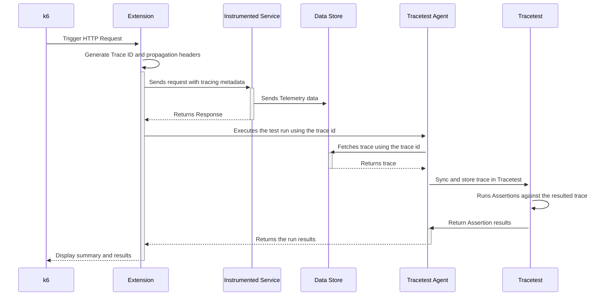

import Tabs from '@theme/Tabs';
import TabItem from '@theme/TabItem';
import CodeBlock from '@theme/CodeBlock';

:::note
[Check out the source code on GitHub here.](https://github.com/kubeshop/tracetest/tree/main/examples/tracetest-k6)
:::

[Tracetest](https://app.tracetest.io/) is a testing tool based on [OpenTelemetry](https://opentelemetry.io/) that allows you to test your distributed application. It allows you to use data from distributed traces generated by OpenTelemetry to validate and assert if your application has the desired behavior defined by your test definitions.

[k6](https://k6.io/) is an open-source performance testing tool used for testing the performance of APIs, microservices, and websites. It is designed to be developer-centric, making it easy for developers to write and maintain performance tests as code.

## Why is this important?

k6 is it's a great tool in its own right that allows you to replicate most of the production challenges you might encounter. But, as with all of the tools that only test the initial transaction between the client side and the server, you can only run validations against the immediate response from the service.

<div style={{ position: "relative", paddingBottom: "62.5%", height: "0" }}>
  <iframe
    src="https://www.loom.com/embed/5c5e1261bb0b4fefa30081294378908c"
    frameborder="0"
    webkitallowfullscreen
    mozallowfullscreen
    allowfullscreen
    width="100%"
    style={{ position: "absolute", top: "0", left: "0", width: "100%", height: "100%" }}
  ></iframe>
</div>

## The k6 Tracetest Extension

With the [k6 Tracetest extension](https://github.com/kubeshop/xk6-tracetest), you will unlock the power of OpenTelemetry that allows you to run deeper testing based on the traces and spans generated by each of the checkpoints that you define within your services.

Language and Vendor agnostic, with this extension you can use your existing Tracing Data Store and Setup to leverage the work you have already done to instrument your services.

## How It Works

The following is high level sequence diagram on how k6 and Tracetest interact with the different pieces of the system.



## Today You'll Learn About Performance & Trace-Based Tests

This is a simple quick start guide on how to run the Tracetest k6 extension to run enhanced performance tests with trace-based testing. The infrastructure will use the Pokeshop Demo as a testing ground, triggering requests against it and generating telemetry data.

## Requirements

**Tracetest Account**:

- Sign up to [`app.tracetest.io`](https://app.tracetest.io) or follow the [get started](/getting-started/installation) docs.
- Create an [environment](/concepts/environments).
- Create an [environment token](/concepts/environment-tokens).
- Have access to the environment's [agent API key](/configuration/agent).

**Docker**:

- Have [Docker](https://docs.docker.com/get-docker/) and [Docker Compose](https://docs.docker.com/compose/install/) installed on your machine.

## Run This Quckstart Example

Clone the official [Tracetest Pokeshop Demo App Repo](https://github.com/kubeshop/pokeshop) to your local machine.

```bash
git clone https://github.com/kubeshop/pokeshop.git
cd pokeshop
```

Follow these instructions to run the Cypress example:

1. Copy the `.env.template` file to `.env`.
2. Log into the [Tracetest app](https://app.tracetest.io/).
3. This example is configured to use Jaeger. Ensure the environment you will be utilizing to run this example is also configured to use the Jaeger Tracing Backend by clicking on Settings, Tracing Backend, Jaeger, updating the URL to `jaeger:16685`, Test Connection and Save.
4. Fill out the [token](https://docs.tracetest.io/concepts/environment-tokens) and [agent API key](https://docs.tracetest.io/concepts/agent) details by editing your `.env` file. You can find these values in the Settings area for your environment.
5. Run `docker compose -f docker-compose.yml -f docker-compose.e2e.yml up -d`.
6. Run `npm i` in the root folder to install the dependencies.
7. [Install k6 Tracetest extension](https://github.com/grafana/xk6) for your OS. This will create a `k6` binary.
8. Run `XK6_TRACETEST_API_TOKEN=<TRACETEST_API_TOKEN> ./k6 run ./test/k6/import-pokemon.js -o xk6-tracetest`.

Follow along with the sections below for an in detail breakdown of what the example you just ran did and how it works.

## Project Structure

The project is built with Docker Compose.

### Pokeshop Demo App

The [Pokeshop Demo App](/live-examples/pokeshop/overview) is a complete example of a distributed application using different backend and front-end services, implementation code is written in Typescript.

The `docker-compose.yml` file in the root directory is for the Pokeshop Demo app and the OpenTelemetry setup.
And the `docker-compose.e2e.yml` includes the [Tracetest Agent](/concepts/agent).

Finally, the k6 load tests can be found in `test/k6/import-pokemon.js`.

## Installing the k6 Tracetest Extension

[Installing the k6 Tracetest extension](https://github.com/grafana/xk6) is as easy as running the following command:

<Tabs groupId="k6">
  <TabItem value="Linux" label="Linux" default>

```bash title="Terminal"
docker run --rm -it -u "$(id -u):$(id -g)" -v "${PWD}:/xk6" \
  grafana/xk6 build v0.43.1 \
  --with github.com/kubeshop/xk6-tracetest
```

  </TabItem>

  <TabItem value="MacOS" label="MacOS" default>

```bash title="Terminal"
docker run --rm -it -e GOOS=darwin -u "$(id -u):$(id -g)" -v "${PWD}:/xk6" \
  grafana/xk6 build v0.43.1 \
  --with github.com/kubeshop/xk6-tracetest
```

  </TabItem>

  <TabItem value="Windows" label="Windows" default>

```bash title="Terminal"
docker run --rm -it -e GOOS=windows -u "$(id -u):$(id -g)" -v "${PWD}:/xk6" `
  grafana/xk6 build v0.43.1 --output k6.exe `
  --with github.com/kubeshop/xk6-tracetest
```

  </TabItem>
</Tabs>

This will generate the `k6-tracetest` binary in the current directory.

The instructions can be also found in the main [k6 docs](https://k6.io/docs/extensions/get-started/bundle/) in case you need to combine multiple extensions into one binary.

## Using the Tracetest Extension For Load Tests

Once you have installed the k6 Tracetest binary, you can use the base k6 functionality to run load tests against instrumented services and Tracetest to run checks against the resulting telemetry data.

## Creating Your Tracetest Test Definition

The `test/k6/import-pokemon.yaml` file contains the test definition that will be used to run the tests. It uses the trace id trigger which is required for the k6 integrations as well as adding assertions using test-based TDD patterns.

```yaml
type: Test
spec:
  id: kc_MgKoVR
  name: K6
  description: K6
  trigger:
    type: traceid
    traceid:
      id: ${env:TRACE_ID}
  specs:
    - selector: span[tracetest.span.type="general" name="import pokemon"]
      name: Should have imported the pokemon
      assertions:
        - attr:tracetest.selected_spans.count = 1
    - selector: |-
        span[tracetest.span.type="http" net.peer.name="pokeapi.co" http.method="GET"]
      name: Should trigger a request to the POKEAPI
      assertions:
        - attr:http.url   =  "https://pokeapi.co/api/v2/pokemon/6"
    - selector: span[tracetest.span.type="database" name="create postgres.pokemon"]
      name: Should insert the pokemon to the DB
      assertions:
        - attr:db.result | json_path '.name'  =  "charizard"
```

Create the test using the following command:

```bash
tracetest configure -t <TRACETEST_API_TOKEN>
tracetest apply test -f ./test/k6/import-pokemon.yaml
```

## Creating Your k6 Script

The `test/k6/import-pokemon.js` file contains the k6 script that will be used to run the performance tests. It is a simple script that will trigger a `POST` request to the `/pokemon/import` Pokeshop Demo app endpoint.

```javascript
import { Http, Tracetest } from "k6/x/tracetest";
import { sleep } from "k6";

export const options = {
  vus: 1,
  duration: "5s",
};

const http = new Http();
const testId = "kc_MgKoVR";
const tracetest = Tracetest();

let pokemonId = 6; // charizard

export default function () {
  const url = "http://localhost:8081/pokemon/import";
  const payload = JSON.stringify({
    id: pokemonId++,
  });
  const params = {
    headers: {
      "Content-Type": "application/json",
    },
    tracetest: {
      testId,
    },
  };

  const response = http.post(url, payload, params);

  tracetest.runTest(
    response.trace_id,
    {
      test_id: testId,
      variable_name: "TRACE_ID",
      should_wait: true,
    },
    {
      id: "123",
      url,
      method: "GET",
    }
  );

  sleep(1);
}

export function handleSummary() {
  return {
    stdout: tracetest.summary(),
  };
}

export function teardown() {
  tracetest.validateResult();
}
```

### Setting the Environment Variables

Copy the `.env.template` content into a new `.env` file.

```bash title=Terminal
cp .env.template .env
```

Add the [Tracetest API Token](/concepts/environment-tokens) and [Tracetest Agent API Key](/configuration/agent) to the `TRACETEST_API_TOKEN` and `TRACETEST_AGENT_API_KEY` variables.

```bash title=.env
TRACETEST_API_TOKEN=<YOUR_API_TOKEN> # your environment token
TRACETEST_AGENT_API_KEY=<YOUR_AGENT_API_KEY>
POKESHOP_DEMO_URL=http://localhost:8081
```

### Starting the Pokeshop Demo App

To start the Pokeshop Demo App, run the following command from the root directory:

```bash
docker compose -f docker-compose.yml -f docker-compose.e2e.yml up
```

This will start the Pokeshop Demo HTTP API on `http://localhost:8081/`.

## Run the k6 Script

Having the full setup ready, the final step is to run the k6 script. To do that, run the following command:

```bash
XK6_TRACETEST_API_TOKEN=<TRACETEST_API_TOKEN> ./k6 run ./test/k6/import-pokemon.js -o xk6-tracetest
context menu


          /\      |‾‾| /‾‾/   /‾‾/
     /\  /  \     |  |/  /   /  /
    /  \/    \    |     (   /   ‾‾\
   /          \   |  |\  \ |  (‾)  |
  / __________ \  |__| \__\ \_____/ .io

  execution: local
     script: ./import-pokemon.js
     output: xk6-tracetest-output (TestRunID: 38055)

  scenarios: (100.00%) 1 scenario, 1 max VUs, 35s max duration (incl. graceful stop):
           * default: 1 looping VUs for 5s (gracefulStop: 30s)

[TotalRuns=6, SuccessfulRus=1, FailedRuns=5]
[FAILED]
[Request=GET - http://localhost:8081/pokemon/import, TraceID=dc0718bcecceeec731b343235eb9c15a, RunState=FINISHED FailingSpecs=true, TracetestURL= https://app.tracetest.io/organizations/ttorg_ced62e34638d965e/environments/ttenv_807d0129a10be776/test/kc_MgKoVR/run/11]
[Request=POST - http://localhost:8081/pokemon/import, TraceID=dc0718fe83cfeec7315daf10d212d351, RunState=FINISHED FailingSpecs=true, TracetestURL= https://app.tracetest.io/organizations/ttorg_ced62e34638d965e/environments/ttenv_807d0129a10be776/test/kc_MgKoVR/run/4]
[Request=POST - http://localhost:8081/pokemon/import, TraceID=dc0718a8f4ceeec731e47f13762e61b8, RunState=FINISHED FailingSpecs=true, TracetestURL= https://app.tracetest.io/organizations/ttorg_ced62e34638d965e/environments/ttenv_807d0129a10be776/test/kc_MgKoVR/run/8]
[Request=POST - http://localhost:8081/pokemon/import, TraceID=dc0718bcecceeec731b343235eb9c15a, RunState=FINISHED FailingSpecs=true, TracetestURL= https://app.tracetest.io/organizations/ttorg_ced62e34638d965e/environments/ttenv_807d0129a10be776/test/kc_MgKoVR/run/9]
[Request=POST - http://localhost:8081/pokemon/import, TraceID=dc071893fcceeec731148270c6671a1e, RunState=FINISHED FailingSpecs=true, TracetestURL= https://app.tracetest.io/organizations/ttorg_ced62e34638d965e/environments/ttenv_807d0129a10be776/test/kc_MgKoVR/run/6]
[SUCCESSFUL]
[Request=POST - http://localhost:8081/pokemon/import, TraceID=dc0718cee4ceeec731f3f414bf3a2a16, RunState=FINISHED FailingSpecs=false, TracetestURL= https://app.tracetest.io/organizations/ttorg_ced62e34638d965e/environments/ttenv_807d0129a10be776/test/kc_MgKoVR/run/3]

running (05.0s), 0/1 VUs, 5 complete and 0 interrupted iterations
default ✓ [======================================] 1 VUs  5s
```

## What's Next?

After running the initial set of tests, you can click the run link for any of them, update the assertions and run the scripts once more. This flow enables complete a trace-based TDD flow.


## Learn More

Please visit our [examples in GitHub](https://github.com/kubeshop/tracetest/tree/main/examples) and join our [Slack Community](https://dub.sh/tracetest-community) for more info!
