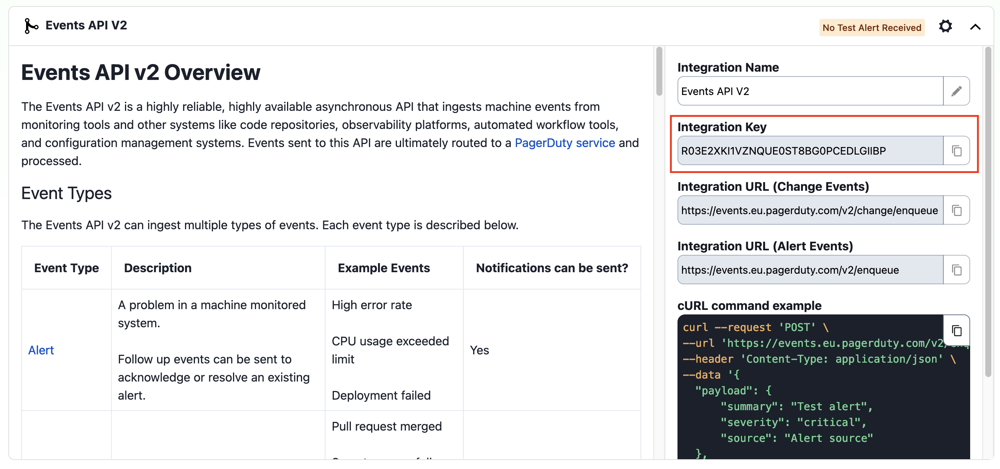

[Tracetest](https://tracetest.io/) is a testing tool based on OpenTelemetry that permits you to test your distributed application. It allows you to use your trace data generated on your OpenTelemetry tools to check and assert if your application has the desired behavior defined by your test definitions. It also supports [Synthetic Monitoring](../examples-tutorials/recipes/synthetic-monitoring-trace-based-api-tests.mdx)

[PagerDuty](https://www.pagerduty.com/) is a powerful tool to let you know when things go wrong and require manual intervention to fix it.

By using Tracetest with PagerDuty, you can ensure your application runs as you expect and also get notified when it doesn't work.

## Quickstart

In this guide, we will show how to use Tracetest's Synthetic Monitoring to run these tests and use its webhook mechanism to alert you when things fail.

## Prerequisites

* A Tracetest account
* A PagerDuty account

### Create a PagerDuty Service

:::note
For a detailed guide, navigate to PagerDuty's support page [Services and Integrations](https://support.pagerduty.com/docs/services-and-integrations#create-a-service).
:::

To create a service in the PagerDuty web app:

1. Go to **Services** -> **Service Directory** and click **New Service**. On the next screen you will be guided through several steps.
   1. Enter **Name**. We suggest to put a cluster name, for example: "Production EU".
   2. Click **Next** to continue.
2. Select Escalation Policy that suits you best. Click **Next** to continue.
3. Select Reduce Noise policy that suits you best. Click **Next** to continue.
4. Select the **Events API V2** integration.

   

5. Click **Create Service**.
6. Now you will be in the service’s Integrations tab, where you’ll find the **Integration Key**.
7. Copy the **Integration Key** and proceed with the next section.

   

### Create a Monitor

1. Go to [Tracetest](https://app.tracetest.io)
2. Access your account
3. Click on "Monitors"
4. Click on "Create"
5. Setup your monitor as you like
6. On the "Alert" tab, add the information provided by PagerDuty
    1. For the method, use "POST"
    2. Set the URL to "https://events.pagerduty.com/v2/enqueue"
    3. Select "JSON" in the "Body" dropdown
    4. Paste the suggested body from the PagerDuty page and adjust the messages as needed, it should look like this:
    ```json
    {
        "payload": {
            "summary": "Title of my alert",
            "severity": "critical",
            "source": "Alert source"
        },
        "routing_key": "<routing_key>",
        "event_action": "trigger"
    }
    ```
    5. Click on the play button to test your alert, PagerDuty should be notified by this action
7. Click on "Create" to finish the Monitor setup