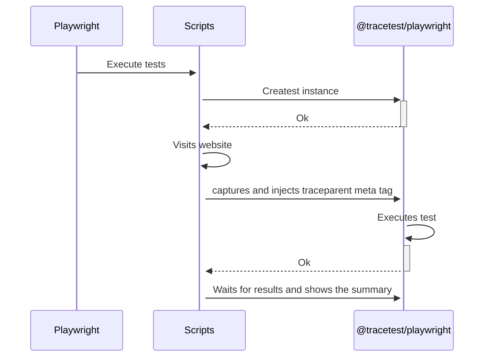
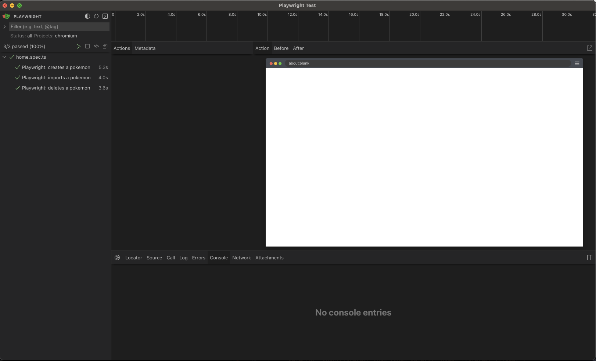
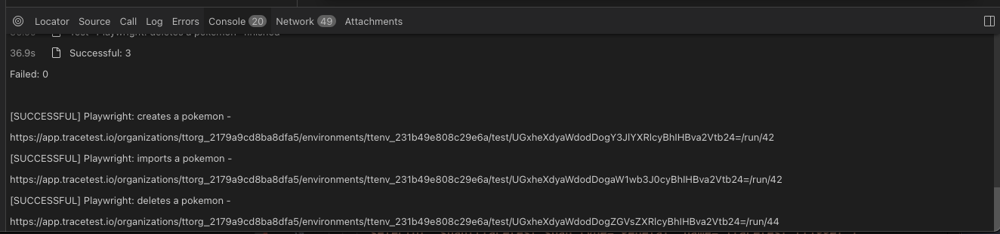
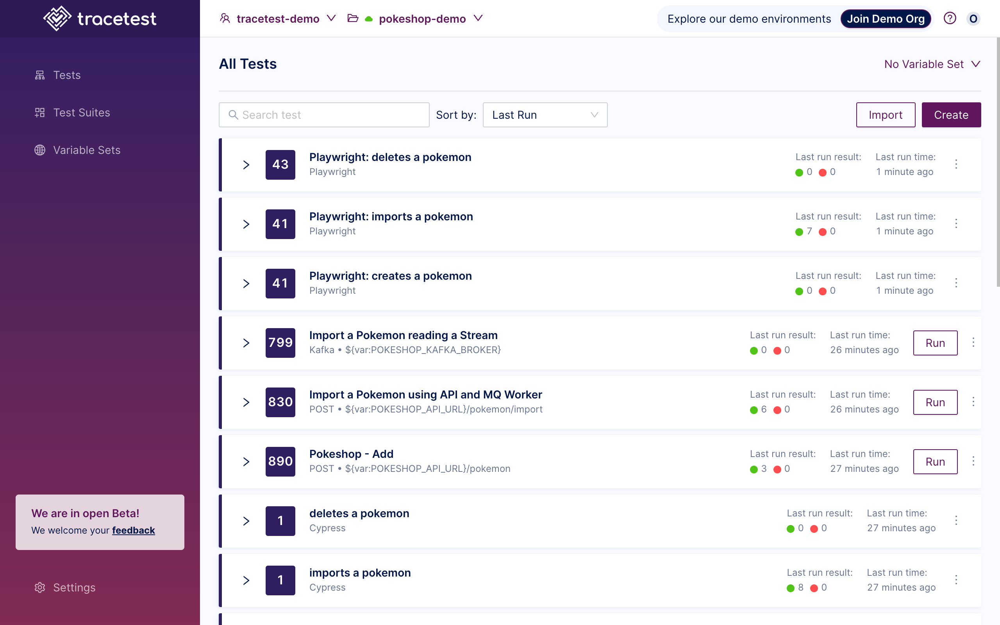
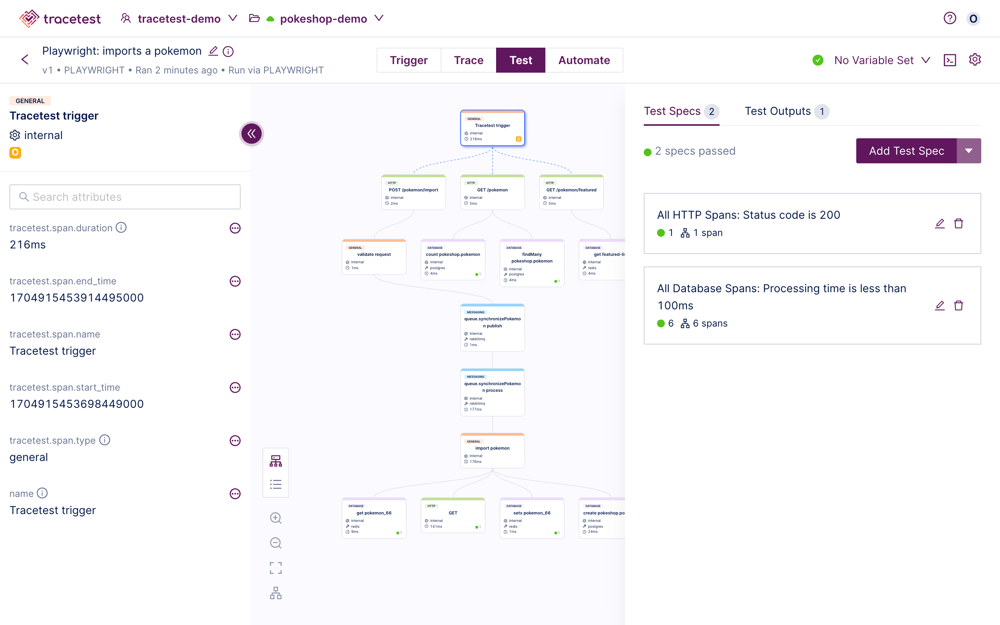

[Tracetest](https://tracetest.io/) is a testing tool based on [OpenTelemetry](https://opentelemetry.io/) that permits you to test your distributed application. It allows you to use the trace data generated by your OpenTelemetry tools to check and assert if your application has the desired behavior defined by your test definitions.

[Playwright](https://playwright.dev/) is an open-source automation framework developed by Microsoft that enables cross-browser automation for web applications. It provides a set of APIs and libraries for automating interactions with web browsers such as Chrome, Firefox, and Microsoft Edge.

## Why is this important?

The Tracetest integration for Playwright enables your current Playwright tests to easily capture a full distributed trace from your OpenTelemetry instrumented frontend and backend system. You can embed a Tracetest in this Playwright test, and allow trace-based testing assertions to be applied across this entire flow, enabling true end-to-end tests across your entire system.

## How It Works

The following is a high-level sequence diagram of how Playwright and Tracetest interact with the different pieces of the system.



## The `@tracetest/playwright` npm Package

The [`@tracetest/playwright`](https://www.npmjs.com/package/@tracetest/playwright) npm package is a Playwright plugin that allows you to run trace-based testing using Tracetest and Playwright. It is a wrapper around the Tracetest API that allows you to configure, orchestrate and run tests from Playwright.

## Requirements

**Tracetest Account**:

- Sign up to [`app.tracetest.io`](https://app.tracetest.io) or follow the [get started](/getting-started/installation) docs.
- Create an [environment](/concepts/environments).
- Create an [environment token](/concepts/environment-tokens).
- Have access to the environment's [agent API key](/configuration/agent).

**Pokeshop Demo:** Clone the official [Tracetest Pokeshop Demo App Repo](https://github.com/kubeshop/pokeshop) to your local machine.

**Docker**: Have [Docker](https://docs.docker.com/get-docker/) and [Docker Compose](https://docs.docker.com/compose/install/) installed on your machine.

## Project Structure

The project is built with Docker Compose.

### Pokeshop Demo App

The [Pokeshop Demo App](/live-examples/pokeshop/overview) is a complete example of a distributed application using different backend and front-end services, implementation code is written in Typescript.

The `docker-compose.yml` file in the root directory is for the Pokeshop Demo app and the OpenTelemetry setup.
And the `docker-compose.e2e.yml` includes the [Tracetest Agent](/concepts/agent).

Finally, the Playwright E2E tests can be found in `playwright/e2e/1-getting-started`.

## The Playwright Setup

The Playwright setup is pretty straightforward, it was generated by installing the Playwright dependency and configuring it from the UI after running `playwright open`. The configuration script looks like this:

```typescript
import { defineConfig, devices } from "@playwright/test";
import { config } from "dotenv";

config();
export default defineConfig({
  testDir: "./playwright",
  fullyParallel: true,
  forbidOnly: !!process.env.CI,
  retries: process.env.CI ? 2 : 0,
  workers: process.env.CI ? 1 : undefined,
  reporter: "html",
  use: {
    baseURL: process.env.POKESHOP_DEMO_URL || "http://localhost:3000",
    trace: "on-first-retry",
  },
  projects: [
    {
      name: "chromium",
      use: { ...devices["Desktop Chrome"] },
    },
  ],
});
```

Before moving forward, run `npm i` in the root folder to install the dependencies.

### The `home.spec.ts` Test Script

The `home.spec.ts` test script contains three different tests based on the Pokeshop Demo UI fetures, which are:

1. Create a Pokemon
2. Import a Pokemon (using an async process)
3. Delete a Pokemon

### Tracetest Library Setup

If you go to the `package.json` file you will find the inclusion of a Tracetest package for Playwright `@tracetest/playwright`.
The first thing the test script does is import the package, grab the Tracetest API token from the environment variables and create the Tracetest instance.

```typescript
import { test, expect } from "@playwright/test";
import Tracetest, { Types } from "@tracetest/playwright";
const { TRACETEST_API_TOKEN = "" } = process.env;

let tracetest: Types.TracetestPlaywright | undefined = undefined;
```

Afterward, during the `beforeAll` hook, create the Tracetest instance with the API token.

```typescript
test.beforeAll(async () => {
  tracetest = await Tracetest({ apiToken: TRACETEST_API_TOKEN });

  // optional, set the definition files and run info for the tests
  tracetest.setOptions({
    "Playwright: imports a pokemon": {
      definition,
    },
  });
});
```

Then, during the `beforeEach` hook, the script **captures** the document to inject the `traceparent` to the meta tag.

```typescript
test.beforeEach(async ({ page }, { title }) => {
  await page.goto("/");
  await tracetest?.capture(title, page);
});
```

**OPTIONAL**: If you want to wait for the test to finish and break the Playwright execution based on a failed Tracetest test, you can add the `after` hook and call the `summary` method.

```typescript
test.afterAll(async ({}, testInfo) => {
  testInfo.setTimeout(60000);
  await tracetest.summary();
});
```

The rest of the test script is the Playwright test definitions for the test cases mentioned above. The complete test script looks like this:

```typescript
import { test, expect } from "@playwright/test";
import Tracetest, { Types } from "@tracetest/playwright";
const { TRACETEST_API_TOKEN = "" } = process.env;

let tracetest: Types.TracetestPlaywright | undefined = undefined;

test.describe.configure({ mode: "serial" });

const definition = `
  type: Test
  spec:
    id: UGxheXdyaWdodDogaW1wb3J0cyBhIHBva2Vtb24=
    name: "Playwright: imports a pokemon"
    trigger:
      type: playwright
    specs:
    - selector: span[tracetest.span.type="http"] span[tracetest.span.type="http"]
      name: "All HTTP Spans: Status  code is 200"
      assertions:
      - attr:http.status_code   =   200
    - selector: span[tracetest.span.type="database"]
      name: "All Database Spans: Processing time is less than 100ms"
      assertions:
      - attr:tracetest.span.duration < 2s
    outputs:
    - name: MY_OUTPUT
      selector: span[tracetest.span.type="general" name="Tracetest trigger"]
      value: attr:name
    `;

test.beforeAll(async () => {
  tracetest = await Tracetest({ apiToken: TRACETEST_API_TOKEN });
  tracetest.setOptions({
    "Playwright: imports a pokemon": {
      definition,
    },
  });
});

test.beforeEach(async ({ page }, { title }) => {
  await page.goto("/");
  await tracetest?.capture(title, page);
});

// optional step to break the playwright script in case a Tracetest test fails
test.afterAll(async ({}, testInfo) => {
  testInfo.setTimeout(60000);
  await tracetest?.summary();
});

test("Playwright: creates a pokemon", async ({ page }) => {
  expect(await page.getByText("Pokeshop")).toBeTruthy();

  await page.click("text=Add");

  await page.getByLabel("Name").fill("Charizard");
  await page.getByLabel("Type").fill("Flying");
  await page
    .getByLabel("Image URL")
    .fill("https://upload.wikimedia.org/wikipedia/en/1/1f/Pok%C3%A9mon_Charizard_art.png");
  await page.getByRole("button", { name: "OK", exact: true }).click();
});

test("Playwright: imports a pokemon", async ({ page }) => {
  expect(await page.getByText("Pokeshop")).toBeTruthy();

  await page.click("text=Import");

  await page.getByLabel("ID").fill(Math.floor(Math.random() * 101).toString());
  await page.getByRole("button", { name: "OK", exact: true }).click();
});

test("Playwright: deletes a pokemon", async ({ page }) => {
  await page.locator('[data-cy="pokemon-list"]');

  await page.locator('[data-cy="pokemon-card"]').first().click();
  await page.locator('[data-cy="pokemon-card"] [data-cy="delete-pokemon-button"]').first().click();
});
```

### Setting the Environment Variables

Copy the `.env.example` file to `.env` and add the Tracetest API token and agent tokens to the `TRACETEST_API_TOKEN` and `TRACETEST_AGENT_API_KEY` variables.

### Starting the Pokeshop Demo App

To start the Pokeshop Demo App, run the following command from the root directory:

```bash
docker compose up -f docker-compose.yml -f docker-compose.e2e.yml
```

### Running the Tests

Next, you can run the tests by using both the Playwright CLI and the Playwright UI.

#### Using the Playwright CLI

To run the tests using the Playwright CLI, run the following command from the root directory:

```bash
npm run pw:run
```

You should see the following output:

```bash

> pokeshop@1.0.0 pw:run
> playwright test


Running 3 tests using 1 worker
[chromium] › home.spec.ts:30:5 › Playwright: creates a pokemon
Test `Playwright: creates a pokemon` started
Find the results at https://app.tracetest.io/organizations/ttorg_2179a9cd8ba8dfa5/environments/ttenv_231b49e808c29e6a/test/UGxheXdyaWdodDogY3JlYXRlcyBhIHBva2Vtb24=/run/41
[chromium] › home.spec.ts:65:5 › Playwright: imports a pokemon
Test `Playwright: imports a pokemon` started
Find the results at https://app.tracetest.io/organizations/ttorg_2179a9cd8ba8dfa5/environments/ttenv_231b49e808c29e6a/test/UGxheXdyaWdodDogaW1wb3J0cyBhIHBva2Vtb24=/run/41
[chromium] › home.spec.ts:76:5 › Playwright: deletes a pokemon
Test `Playwright: deletes a pokemon` started
Find the results at https://app.tracetest.io/organizations/ttorg_2179a9cd8ba8dfa5/environments/ttenv_231b49e808c29e6a/test/UGxheXdyaWdodDogZGVsZXRlcyBhIHBva2Vtb24=/run/43
Test `Playwright: creates a pokemon` finished
Test `Playwright: imports a pokemon` finished
Test `Playwright: deletes a pokemon` finished

Successful: 3
Failed: 0

[SUCCESSFUL] Playwright: creates a pokemon - https://app.tracetest.io/organizations/ttorg_2179a9cd8ba8dfa5/environments/ttenv_231b49e808c29e6a/test/UGxheXdyaWdodDogY3JlYXRlcyBhIHBva2Vtb24=/run/41
[SUCCESSFUL] Playwright: imports a pokemon - https://app.tracetest.io/organizations/ttorg_2179a9cd8ba8dfa5/environments/ttenv_231b49e808c29e6a/test/UGxheXdyaWdodDogaW1wb3J0cyBhIHBva2Vtb24=/run/41
[SUCCESSFUL] Playwright: deletes a pokemon - https://app.tracetest.io/organizations/ttorg_2179a9cd8ba8dfa5/environments/ttenv_231b49e808c29e6a/test/UGxheXdyaWdodDogZGVsZXRlcyBhIHBva2Vtb24=/run/43

  3 passed (47.9s)

To open last HTML report run:

npx playwright show-report
```

#### Using the Playwright UI

To run the tests using the Playwright UI, run the following command from the root directory:

```bash
npm run pw:open
```

Then, click the play button at the top.



You should see the three tests running and passing.
And by looking at the console log you can find the statuses and results of the tests.



Then, you can follow any of the result links in the console log to the Tracetest App and see the results of the tests.

The Tracetest library uses the test name for the trace-based tests. That way you can identify them more easily and it also fills some of the metadata directly from the Playwright execution.



Lastly, you can now create assertions based on the trace data that was captured from the browser to the backend services.

Starting with the click events and the fetch request from the client side, to the HTTP requests and database queries from the backend services, including async processes like the one showcased during the import pokemon test.


