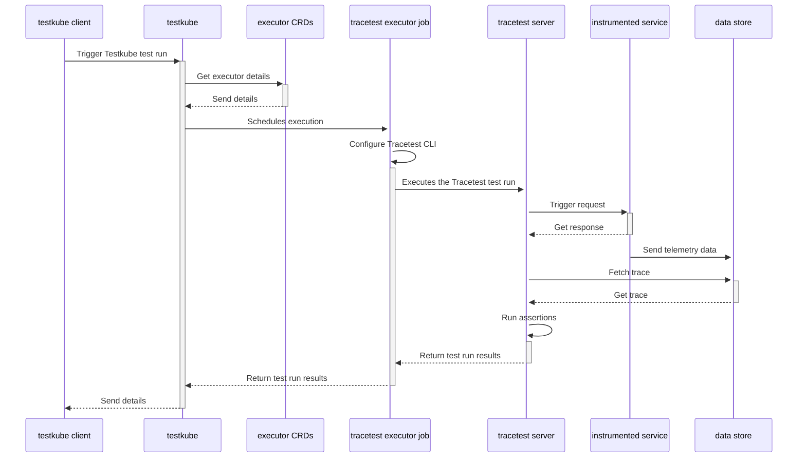

# Running Tracetest with Testkube

[Tracetest](https://tracetest.io/) is a testing tool based on [OpenTelemetry](https://opentelemetry.io/) that permits you to test your distributed application. It allows you to use the trace data generated by your OpenTelemetry tools to check and assert if your application has the desired behavior defined by your test definitions.

[Testkube](https://testkube.io/) is a Kubernetes-native testing framework for Testers and Developers that allows you to automate the executions of your existing testing tools inside your Kubernetes cluster, removing all the complexity from your CI/CD/GitOps pipelines.

For Testkube, tests are meant to be part of a cluster's state and can be executed as needed:

- Manually via kubectl CLI.
- Externally triggered via API (CI, external tooling, etc).
- Automatically on deployment of annotated/labeled services/pods/etc.

By using the [Testkube Tracetest Executor](https://github.com/kubeshop/testkube-executor-tracetest) you can unlock Testkube's capacity in conjunction with Tracetest, and leverage the work you have already done to instrument your services.

## How does it work?

The following is high level sequence diagram on how Testkube and Tracetest interact with the different pieces of the system:



## Quickstart

This guide will show how to use Testkube alongside Tracetest to run your tests in a Kubernetes cluster.

### Prerequisites

In your Kubernetes cluster you should have:

1. `Testkube`: Use HELM or the Testkube CLI to [install](https://kubeshop.github.io/testkube/installing) Testkube Server components in your cluster.
2. `Trecetest Server`: You need a running instance of Tracetest which is going to be executing your assertions. To do so you can follow the instructions defined in the Tracetest [documentation](https://docs.tracetest.io/deployment/kubernetes).
3. `OpenTelemetry Instrumented Service`: In order to generate traces and spans, the service under test must support the basics for [propagation](https://opentelemetry.io/docs/reference/specification/context/api-propagators/) through HTTP requests, and also store traces and spans into a Data Store Backend (Jaeger, Grafana Tempo, OpenSearch, etc) or use the [OpenTelemetry Collector](https://docs.tracetest.io/configuration/overview#using-tracetest-without-a-trace-data-store).

On your machine you should have:

1. `Kubectl` [installed](https://kubernetes.io/docs/tasks/tools/).
2. `Testkube CLI` [installed](https://kubeshop.github.io/testkube/installing#1-installing-the-testkube-cli).

With everything set up, we will start configuring Testkube and Tracetest.

### 1. Deploy the Tracetest Executor

Testkube works with the concept of [Executors](https://kubeshop.github.io/testkube/test-types/executor-custom). An Executor is a wrapper around a testing framework (Tracetest in this case) in the form of a Docker container and runs as a Kubernetes job. To start, you need to register and deploy the Tracetest executor in your cluster using the Testkube CLI:

```bash
kubectl testkube create executor --image kubeshop/testkube-executor-tracetest:latest --types "tracetest/test" --name tracetest-executor --icon-uri icon --content-type string --content-type file-uri
```

### 2. Create a Test

Now you need a Tracetest test. Have a look at the [Tracetest documentation](https://docs.tracetest.io/cli/creating-tests) for details on writing tests. Here is a simple test definition example:

```yaml
type: Test
spec:
  id: R5NITR14g
  name: Pokeshop - List
  description: Get a Pokemon
  trigger:
    type: http
    httpRequest:
      url: http://demo-pokemon-api.demo/pokemon?take=20&skip=0
      method: GET
      headers:
        - key: Content-Type
          value: application/json
  specs:
    - selector: span[tracetest.span.type="http"]
      assertions:
        - attr:http.method = "GET"
    - selector: span[tracetest.span.type="database"]
      assertions:
        - attr:db.name = "pokeshop"
```

Execute the following command to create the test executor object in Testkube. Do not forget to provide the path to your Tracetest definition file using the `--file` argument, and also the Tracetest Server endpoint using the `TRACETEST_ENDPOINT` `--variable` (remember that the TRACETEST_ENDPOINT should be reachable from the Testkube instance):

```bash
kubectl testkube create test --file my/file/location.yaml --type "tracetest/test" --name pokeshop-tracetest-test --variable TRACETEST_ENDPOINT=http://tracetest
```

Note: In case you are doing a port forward to your Tracetest instance and you want to have the correct Tracetest URL in your results printed by the Testkube output, you can also provide an optional `TRACETEST_OUTPUT_ENDPOINT` variable (e.g. `--variable TRACETEST_OUTPUT_ENDPOINT=http://localhost:11633`).

### 3. Run the Test

Finally, to see the integration working, run the test by executing the following command:

```bash
kubectl testkube run test --watch pokeshop-tracetest-test
```
