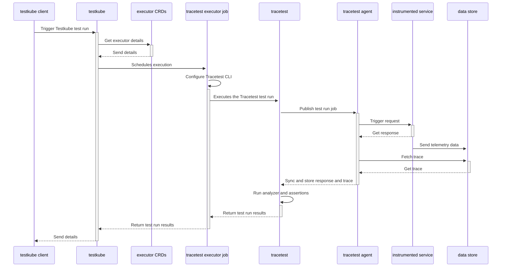

[Tracetest](https://app.tracetest.io/) is a testing tool based on [OpenTelemetry](https://opentelemetry.io/) that allows you to test your distributed application. It uses data from distributed traces generated by OpenTelemetry to validate and assert if your application has the desired behavior described by your test definitions.

[Testkube](https://testkube.io/) is a Kubernetes-native testing framework for Testers and Developers that allows you to automate the executions of your existing testing tools inside your Kubernetes cluster, removing all the complexity from your CI/CD/GitOps pipelines.

## Why is this important?

Integrating Tracetest with Testkube enhances testing processes by leveraging Kubernetes-native capabilities, improving scalability, and reliability of testing workflows for distributed applications.

<div style={{ position: "relative", paddingBottom: "62.5%", height: "0" }}>
  <iframe
    src="https://www.youtube.com/embed/nAp3zYgykok"
    title="Trace-based testing in Kubernetes with Testkube and Tracetest"
    frameborder="0"
    webkitallowfullscreen
    mozallowfullscreen
    allowfullscreen
    width="100%"
    style={{ position: "absolute", top: "0", left: "0", width: "100%", height: "100%" }}
  ></iframe>
</div>

## The Testkube Tracetest Executor

For Testkube, tests are meant to be part of a cluster's state and can be executed as needed:

- Manually via kubectl CLI.
- Externally triggered via API (CI, external tooling, etc).
- Automatically on deployment of annotated/labeled services/pods/etc.

By using the [Testkube Tracetest Executor](https://docs.testkube.io/test-types/executor-tracetest) you can unlock Testkube's capacity in conjunction with Tracetest, and leverage the work you have already done to instrument your services.

## How does it work?

The following is high level sequence diagram on how Testkube and Tracetest interact with the different pieces of the system:



## Quickstart

This guide will show how to use Testkube alongside Tracetest to run your tests in a Kubernetes cluster.

### Prerequisites

**Tracetest account**:

- Sign up to [`app.tracetest.io`](https://app.tracetest.io) or follow the [get started](/getting-started/installation) docs.
- Create an [organization](/concepts/organizations) and [environment](/concepts/environments).
- Deploy the [Tracetest Agent](/configuration/agent) in your cluster.
- Create an [environment token](/concepts/environment-tokens).

**Testkube account**:

- Sign up to [`app.testkube.io`](https://app.testkube.io) or follow the [get started](https://docs.testkube.io/articles/getting-started) docs.
- Create a Testkube environment.
- Deploy the [Testkube Agent](https://docs.testkube.io/testkube-pro/articles/installing-agent) in your cluster.

Remember, in your Kubernetes cluster you should have:

1. `Tracetest Agent`.
2. `Testkube Agent`.
3. `OpenTelemetry Instrumented Service`: In order to generate traces and spans, the service under test must support the basics for [propagation](https://opentelemetry.io/docs/reference/specification/context/api-propagators/) through HTTP requests, and also store traces and spans into a Tracing Backend (Jaeger, Grafana Tempo, OpenSearch, etc) or use the [OpenTelemetry Collector](https://docs.tracetest.io/configuration/overview#using-tracetest-without-a-trace-data-store). If you are using a Tracing Backend, the Tracetest Agent requires network access to it. In case of using the OpenTelemetry Collector, you need to setup your collector to send trace data to the Tracetest Agent.

On your machine you should have:

1. `Kubectl` [installed](https://kubernetes.io/docs/tasks/tools/).
2. `Testkube CLI` [installed](https://docs.testkube.io/articles/install/cli).

With everything set up, we will start configuring Testkube and Tracetest.

### 1. Connect your Testkube CLI to your Testkube Environment

To use the Testkube CLI with your Testkube account you need to set the CLI Context. For that you need a Testkube Pro token. When the token is created, you are ready to change the Testkube CLI context:

```bash
testkube set context -c cloud -e testkube-environment-id -o testkube-organization-id -k testkube-token
```

For more information see the Testkube [Connecting from the CLI](https://docs.testkube.io/testkube-pro/articles/managing-cli-context) docs.

### 2. Create a Test

For this step you need a Tracetest test. Have a look at the [Tracetest documentation](/cli/creating-tests) for details on writing tests. Here is a simple test definition example:

```yaml
type: Test
spec:
  id: R5NITR14g
  name: Pokeshop - List
  description: Get a Pokemon
  trigger:
    type: http
    httpRequest:
      url: http://demo-pokemon-api.demo/pokemon?take=20&skip=0
      method: GET
      headers:
        - key: Content-Type
          value: application/json
  specs:
    - selector: span[tracetest.span.type="http"]
      assertions:
        - attr:http.method = "GET"
    - selector: span[tracetest.span.type="database"]
      assertions:
        - attr:db.name = "pokeshop"
```

Execute the following command to create the test executor object in Testkube. Do not forget to provide the path to your Tracetest definition file using the `--file` argument, and also the following variables:

- `TRACETEST_TOKEN`: your [environment token](../concepts/environment-token.mdx).
- `TRACETEST_ENVIRONMENT`: your [environment id](../concepts/environments.mdx).
- `TRACETEST_ORGANIZATION`: your [organization id](../concepts/organizations.mdx).

```bash
kubectl testkube create test --file my/file/location.yaml --type "tracetest/test" --name pokeshop-tracetest-test --variable TRACETEST_TOKEN=tracetest-token --variable TRACETEST_ENVIRONMENT=tracetest-environment-id --variable TRACETEST_ORGANIZATION=tracetest-organization-id
```

### 3. Run the Test

To see the integration working, run the test by executing the following command:

```bash
kubectl testkube run test --watch pokeshop-tracetest-test
```

### 4. Explore the results

Finally, you can see the Tracetest results in your CLI:

```bash
🚚 [TracetestRunner]: Preparing test run
🌍 Configuring Tracetest CLI with Token
🌍 Using arguments to configure CLI: [configure --token tracetest-token --organization tracetest-organization-id --environment tracetest-environment-id]
🚀 Configure command tracetest configure --token tracetest-token --organization tracetest-organization-id --environment tracetest-environment-id
🔬 Executing in directory :
 $ tracetest configure --token tracetest-token --organization tracetest-organization-id --environment tracetest-environment-id
 SUCCESS  Successfully configured Tracetest CLI

✅ Execution succeeded
🌍 Using arguments to run test: [run test --file /data/test-content --output pretty]
🚀 Test run command tracetest run test --file /data/test-content --output pretty
🔬 Executing in directory :
 $ tracetest run test --file /data/test-content --output pretty

✔ RunGroup: #58WmDuBSR (https://app.tracetest.io/organizations/tracetest-organization-id/environments/tracetest-environment-id/run/58WmDuBSR)
 Summary: 1 passed, 0 failed, 0 pending
  ✔ Pokeshop - List (https://app.tracetest.io/organizations/tracetest-organization-id/environments/tracetest-environment-id/test/R5NITR14g/run/1/test) - trace id: 3cdcb56d6c226f7083f45d6b3d278051
	✔ span[tracetest.span.type="http"]
	✔ span[tracetest.span.type="database"]
```

You can click the run link to open the test run in the Tracetest app. From there you can explore the generated trace, update the assertions and get the test definition to execute your test once more.


You can also explore the test execution from the Testkube dashboard.


## What's Next?

After running this quickstart, you can now add Tracetest to the native CI/CD pipeline in your Kubernetes cluster. It allows you to execute scheduled test runs and synthetic tests. All while following the trace-based testing principle and enabling full in-depth assertions against trace data, not just the response.

## Learn More

Please visit our [documentation](https://docs.tracetest.io/) and join our [Slack Community](https://dub.sh/tracetest-community) for more info!
