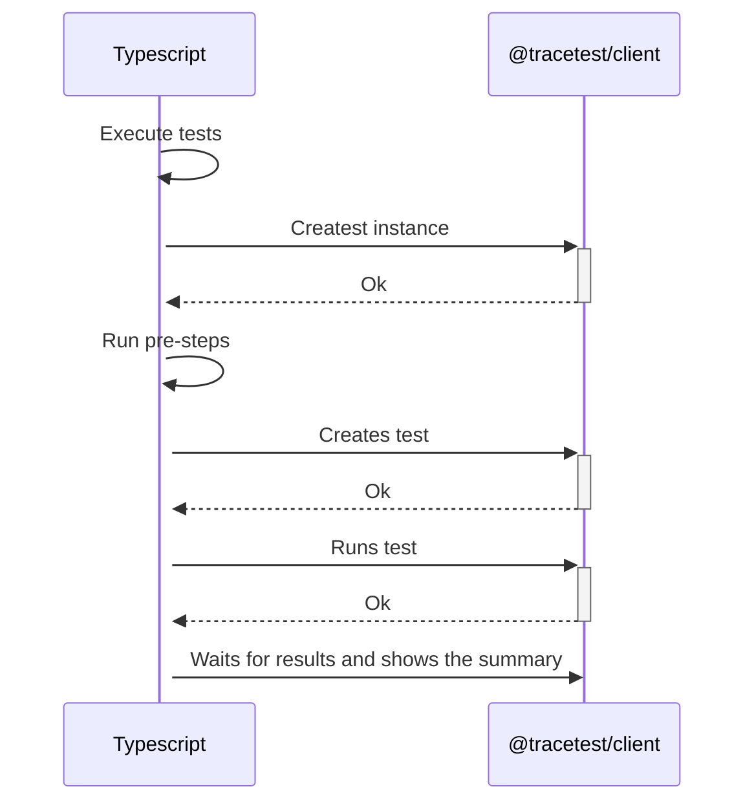
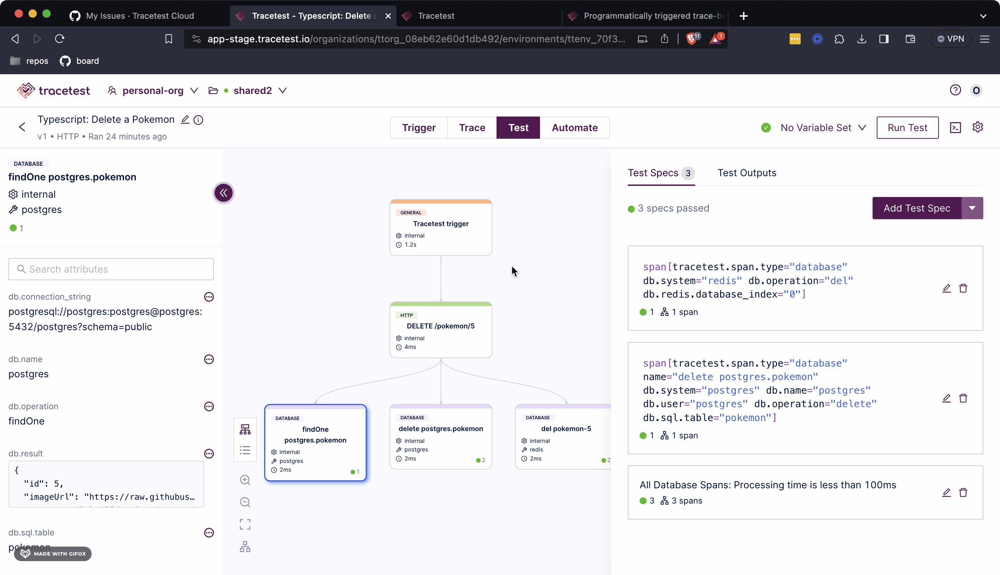

:::note
[Check out the source code on GitHub here.](https://github.com/kubeshop/tracetest/tree/main/examples/quick-start-typescript)
:::

[Tracetest](https://app.tracetest.io/) is a testing tool based on [OpenTelemetry](https://opentelemetry.io/) that allows you to test your distributed application. It allows you to use data from distributed traces generated by OpenTelemetry to validate and assert if your application has the desired behavior defined by your test definitions.

JavaScript/TypeScript is today the most popular language for web development, and it is also the most popular language for writing tests and automation scripts.

## Why is this important?

When working with testing tools, the most important thing is to be able to integrate them into your existing workflow and tooling. This is why we have created the `@tracetest/client` NPM package, which allows you to use the Tracetest platform to run trace-based tests from your existing JavaScript/TypeScript code.
Enabling you to run tests at any point in your code, and not only at the end of the test run, allows you to use trace-based testing as a tool to help you develop your application.

## The `@tracetest/client` NPM Package

With the [`@tracetest/client` NPM Package](https://www.npmjs.com/package/@tracetest/client), you will unlock the power of OpenTelemetry that allows you to run deeper testing based on the traces and spans generated by each of the checkpoints that you define within your services.

## How It Works

The following is a high-level sequence diagram of how the Typescript script, the `@tracetest/client` package, and Tracetest interact.



## Today You'll Learn How to integrate Trace-Based Tests with your Typescript Code

This is a simple quick-start guide on how to use the Tracetest `@tracetest/client` NPM package to enhance your Typescript toolkit with trace-based testing. The infrastructure will use the Pokeshop Demo as a testing ground, triggering requests against it and generating telemetry data.

## Requirements

**Tracetest Account**:

- Sign up to [`app.tracetest.io`](https://app.tracetest.io) or follow the [get started](/getting-started/installation) docs.
- Create an [environment](/concepts/environments).
- Create an [environment token](/concepts/environment-tokens).
- Have access to the environment's [agent API key](/configuration/agent).

**Docker**: Have [Docker](https://docs.docker.com/get-docker/) and [Docker Compose](https://docs.docker.com/compose/install/) installed on your machine.

## Run This Quckstart Example

The example below is provided as part of the Tracetest project. You can download and run the example by following these steps:

Clone the Tracetest project and go to the TypeScript Quickstart:

```bash
git clone https://github.com/kubeshop/tracetest
cd tracetest/examples/quick-start-typescript
```

Follow these instructions to run the included demo app and TypeScript example:

1. Copy the `.env.template` file to `.env`.
2. Log into the [Tracetest app](https://app.tracetest.io/).
3. This example is configured to use the OpenTelemetry Collector. Ensure the environment you will be utilizing to run this example is also configured to use the OpenTelemetry Tracing Backend by clicking on Settings, Tracing Backend, OpenTelemetry, Save.
4. Fill out the [token](https://docs.tracetest.io/concepts/environment-tokens) and [agent API key](https://docs.tracetest.io/concepts/agent) details by editing your .env file. You can find these values in the Settings area for your environment.
5. Run `docker compose up -d`.
6. Look for the `tracetest-client` service in Docker and click on it to view the logs. It will show the results from the trace-based tests that are triggered from the index.ts Typescript file.
7. Follow the links in the log to to view the test runs programmatically created by your TypeScript test script.

Follow along with the sections below for an in detail breakdown of what the example you just ran did and how it works.

## Project Structure

The quick start TypeScript project is built with Docker Compose.

The [Pokeshop Demo App](/live-examples/pokeshop/overview) is a complete example of a distributed application using different backend and front-end services. We will be launching it and running tests against it as part of this example.

The `docker-compose.yaml` file in the root directory of the quick start runs the Pokeshop Demo app, the OpenTelemetry Collector setup, and the [Tracetest Agent](/concepts/agent).

The Typescript Quickstart has two primary files: a Typescript file `definitions.ts` that defines two Tracetest tests, and a Typescript file 'index.ts' that imports these test definitions and uses the "@tracetest/client" NPM package to run them multiple times. 

We will show you how to install the NPM package and use these two Typescript programs to programatically run Tracetest tests.

## Installing the `@tracetest/client` NPM Package

The first step when using the Typescript NPM package is to install the `@tracetest/client` NPM Package. It is as easy as running the following command:

```bash
npm i @tracetest/client
```

Once you have installed the `@tracetest/client` package, you can import it and start making use of it as any other library to trigger trace-based tests and run checks against the resulting telemetry data.

## Tracetest Test Definitions

The `definitions.ts` file contains the JSON version of the test definitions that will be used to run the tests. It uses the HTTP trigger to execute requests against the Pokeshop Demo.

```typescript
import { TestResource } from "@tracetest/client/dist/modules/openapi-client";

export const importDefinition: TestResource = {
  type: "Test",
  spec: {
    id: "99TOHzpSR",
    name: "Typescript: Import a Pokemon",
    trigger: {
      type: "http",
      httpRequest: {
        method: "POST",
        url: "${var:BASE_URL}/import",
        body: '{"id": ${var:POKEMON_ID}}',
        headers: [
          {
            key: "Content-Type",
            value: "application/json",
          },
        ],
      },
    },
    specs: [
      {
        selector: 'span[tracetest.span.type="general" name = "validate request"] span[tracetest.span.type="http"]',
        name: "All HTTP Spans: Status  code is 200",
        assertions: ["attr:http.status_code = 200"],
      },
      {
        selector: 'span[tracetest.span.type="http" name="GET" http.method="GET"]',
        assertions: ['attr:http.route = "/api/v2/pokemon/${var:POKEMON_ID}"'],
      },
      {
        selector: 'span[tracetest.span.type="database"]',
        name: "All Database Spans: Processing time is less than 1s",
        assertions: ["attr:tracetest.span.duration < 1s"],
      },
    ],
    outputs: [
      {
        name: "DATABASE_POKEMON_ID",
        selector:
          'span[tracetest.span.type="database" name="create pokeshop.pokemon" db.system="postgres" db.name="pokeshop" db.user="ashketchum" db.operation="create" db.sql.table="pokemon"]',
        value: "attr:db.result | json_path '$.id'",
      },
    ],
  },
};

export const deleteDefinition: TestResource = {
  type: "Test",
  spec: {
    id: "C2gwdktIR",
    name: "Typescript: Delete a Pokemon",
    trigger: {
      type: "http",
      httpRequest: {
        method: "DELETE",
        url: "${var:BASE_URL}/${var:POKEMON_ID}",
        headers: [
          {
            key: "Content-Type",
            value: "application/json",
          },
        ],
      },
    },
    specs: [
      {
        selector:
          'span[tracetest.span.type="database" db.system="redis" db.operation="del" db.redis.database_index="0"]',
        assertions: ['attr:db.payload = \'{"key":"pokemon-${var:POKEMON_ID}"}\''],
      },
      {
        selector:
          'span[tracetest.span.type="database" name="delete pokeshop.pokemon" db.system="postgres" db.name="pokeshop" db.user="ashketchum" db.operation="delete" db.sql.table="pokemon"]',
        assertions: ["attr:db.result = 1"],
      },
      {
        selector: 'span[tracetest.span.type="database"]',
        name: "All Database Spans: Processing time is less than 100ms",
        assertions: ["attr:tracetest.span.duration < 100ms"],
      },
    ],
  },
};
```

## Creating the Typescript Script

The `index.ts` file contains the Typescript script that will be used to trigger requests against the Pokeshop Demo and run trace-based tests. The steps executed by this script are the following:

1. Import the `@tracetest/client` package.
2. Create a new `Tracetest` instance.
3. Get the last imported Pokemon number from the `GET /pokemon` endpoint using `fetch`.
4. Import the following 5 Pokemon after the last number by triggering a trace-based test to the `POST /import` endpoint.
5. From each test output, get the `DATABASE_POKEMON_ID` value and add it to a list.
6. Delete the imported Pokemon by triggering a trace-based test to the `DELETE /:id` endpoint.

```typescript
import Tracetest from "@tracetest/client";
import { config } from "dotenv";
import { PokemonList } from "./types";
import { deleteDefinition, importDefinition } from "./definitions";

config();

const { TRACETEST_API_TOKEN = "", POKESHOP_DEMO_URL = "http://api:8081" } = process.env;

const baseUrl = `${POKESHOP_DEMO_URL}/pokemon`;

const main = async () => {
  const tracetest = await Tracetest(TRACETEST_API_TOKEN);

  const getLastPokemonId = async (): Promise<number> => {
    const response = await fetch(baseUrl);
    const list = (await response.json()) as PokemonList;

    return list.items.length + 1;
  };

  // get the initial pokemon from the API
  const pokemonId = (await getLastPokemonId()) + 1;

  const getVariables = (id: string) => [
    { key: "POKEMON_ID", value: id },
    { key: "BASE_URL", value: baseUrl },
  ];

  const importedPokemonList: string[] = [];

  const importPokemons = async (startId: number) => {
    const test = await tracetest.newTest(importDefinition);
    // imports all pokemons
    await Promise.all(
      new Array(5).fill(0).map(async (_, index) => {
        console.log(`ℹ Importing pokemon ${startId + index + 1}`);
        const run = await tracetest.runTest(test, { variables: getVariables(`${startId + index + 1}`) });
        const updatedRun = await run.wait();
        const pokemonId = updatedRun.outputs?.find((output) => output.name === "DATABASE_POKEMON_ID")?.value || "";

        console.log(`ℹ Adding pokemon ${pokemonId} to the list, ${updatedRun}`);
        importedPokemonList.push(pokemonId);
      })
    );
  };

  const deletePokemons = async () => {
    const test = await tracetest.newTest(deleteDefinition);
    // deletes all pokemons
    await Promise.all(
      importedPokemonList.map(async (pokemonId) => {
        console.log(`ℹ Deleting pokemon ${pokemonId}`);
        return tracetest.runTest(test, { variables: getVariables(pokemonId) });
      })
    );
  };

  await importPokemons(pokemonId);
  console.log(await tracetest.getSummary());

  await deletePokemons();
  console.log(await tracetest.getSummary());
};

main();
```

## Running the Full Example

To start the full setup, run the following command:

```bash
docker compose up -d
```

## Finding the Results

The output from the Typescript script should be visible in the log for the `tracetest-client` service via Docker Desktop. This log will show links to Tracetest for each of the test runs invoked by index.ts. Click a link to launch Tracetest and view the test result.

```bash
2024-01-26 10:54:44 ℹ Importing pokemon 3
2024-01-26 10:54:44 ℹ Importing pokemon 4
2024-01-26 10:54:44 ℹ Importing pokemon 5
2024-01-26 10:54:44 ℹ Importing pokemon 6
2024-01-26 10:54:44 ℹ Importing pokemon 7
2024-01-26 10:54:56 ℹ Adding pokemon 1 to the list
2024-01-26 10:54:58 ℹ Adding pokemon 2 to the list
2024-01-26 10:54:59 ℹ Adding pokemon 3 to the list
2024-01-26 10:54:59 ℹ Adding pokemon 5 to the list
2024-01-26 10:54:59 ℹ Adding pokemon 4 to the list
2024-01-26 10:54:59 
2024-01-26 10:54:59 Successful: 5
2024-01-26 10:54:59 Failed: 0
2024-01-26 10:54:59 
2024-01-26 10:54:59 [✔️ Typescript: Import a Pokemon] #1 - https://app-stage.tracetest.io/organizations/ttorg_08eb62e60d1db492/environments/ttenv_70f346fe8ddba633/test/99TOHzpSR/run/1
2024-01-26 10:54:59 [✔️ Typescript: Import a Pokemon] #2 - https://app-stage.tracetest.io/organizations/ttorg_08eb62e60d1db492/environments/ttenv_70f346fe8ddba633/test/99TOHzpSR/run/2
2024-01-26 10:54:59 [✔️ Typescript: Import a Pokemon] #3 - https://app-stage.tracetest.io/organizations/ttorg_08eb62e60d1db492/environments/ttenv_70f346fe8ddba633/test/99TOHzpSR/run/3
2024-01-26 10:54:59 [✔️ Typescript: Import a Pokemon] #4 - https://app-stage.tracetest.io/organizations/ttorg_08eb62e60d1db492/environments/ttenv_70f346fe8ddba633/test/99TOHzpSR/run/4
2024-01-26 10:54:59 [✔️ Typescript: Import a Pokemon] #5 - https://app-stage.tracetest.io/organizations/ttorg_08eb62e60d1db492/environments/ttenv_70f346fe8ddba633/test/99TOHzpSR/run/5
2024-01-26 10:54:59 
2024-01-26 10:54:59 ℹ Deleting pokemon 1
2024-01-26 10:54:59 ℹ Deleting pokemon 2
2024-01-26 10:54:59 ℹ Deleting pokemon 3
2024-01-26 10:54:59 ℹ Deleting pokemon 5
2024-01-26 10:54:59 ℹ Deleting pokemon 4
2024-01-26 10:55:14 
2024-01-26 10:55:14 Successful: 10
2024-01-26 10:55:14 Failed: 0
2024-01-26 10:55:14 
2024-01-26 10:55:14 [✔️ Typescript: Import a Pokemon] #1 - https://app-stage.tracetest.io/organizations/ttorg_08eb62e60d1db492/environments/ttenv_70f346fe8ddba633/test/99TOHzpSR/run/1
2024-01-26 10:55:14 [✔️ Typescript: Import a Pokemon] #2 - https://app-stage.tracetest.io/organizations/ttorg_08eb62e60d1db492/environments/ttenv_70f346fe8ddba633/test/99TOHzpSR/run/2
2024-01-26 10:55:14 [✔️ Typescript: Import a Pokemon] #3 - https://app-stage.tracetest.io/organizations/ttorg_08eb62e60d1db492/environments/ttenv_70f346fe8ddba633/test/99TOHzpSR/run/3
2024-01-26 10:55:14 [✔️ Typescript: Import a Pokemon] #4 - https://app-stage.tracetest.io/organizations/ttorg_08eb62e60d1db492/environments/ttenv_70f346fe8ddba633/test/99TOHzpSR/run/4
2024-01-26 10:55:14 [✔️ Typescript: Import a Pokemon] #5 - https://app-stage.tracetest.io/organizations/ttorg_08eb62e60d1db492/environments/ttenv_70f346fe8ddba633/test/99TOHzpSR/run/5
2024-01-26 10:55:14 [✔️ Typescript: Delete a Pokemon] #1 - https://app-stage.tracetest.io/organizations/ttorg_08eb62e60d1db492/environments/ttenv_70f346fe8ddba633/test/C2gwdktIR/run/1
2024-01-26 10:55:14 [✔️ Typescript: Delete a Pokemon] #2 - https://app-stage.tracetest.io/organizations/ttorg_08eb62e60d1db492/environments/ttenv_70f346fe8ddba633/test/C2gwdktIR/run/2
2024-01-26 10:55:14 [✔️ Typescript: Delete a Pokemon] #4 - https://app-stage.tracetest.io/organizations/ttorg_08eb62e60d1db492/environments/ttenv_70f346fe8ddba633/test/C2gwdktIR/run/4
2024-01-26 10:55:14 [✔️ Typescript: Delete a Pokemon] #3 - https://app-stage.tracetest.io/organizations/ttorg_08eb62e60d1db492/environments/ttenv_70f346fe8ddba633/test/C2gwdktIR/run/3
2024-01-26 10:55:14 [✔️ Typescript: Delete a Pokemon] #5 - https://app-stage.tracetest.io/organizations/ttorg_08eb62e60d1db492/environments/ttenv_70f346fe8ddba633/test/C2gwdktIR/run/5
```

## What's Next?

After running the initial set of tests, you can click the run link for any of them, update the assertions, and run the scripts once more. This flow enables complete a trace-based TDD flow.



## Learn More

Please visit our [examples in GitHub](https://github.com/kubeshop/tracetest/tree/main/examples) and join our [Slack Community](https://dub.sh/tracetest-community) for more info!
