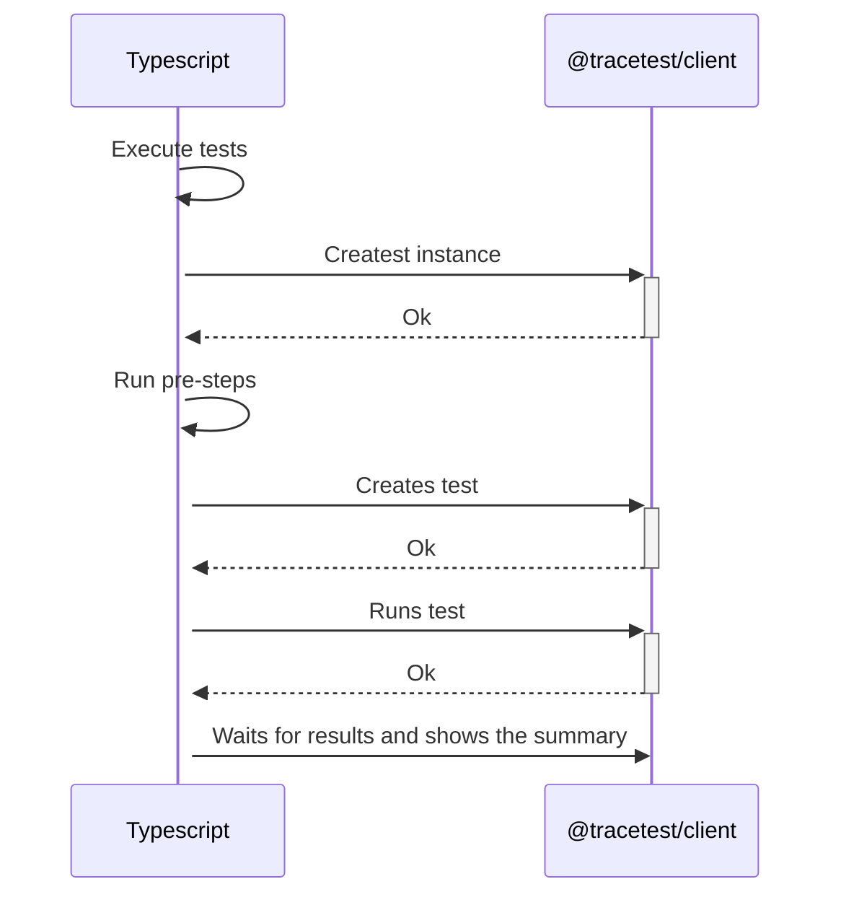
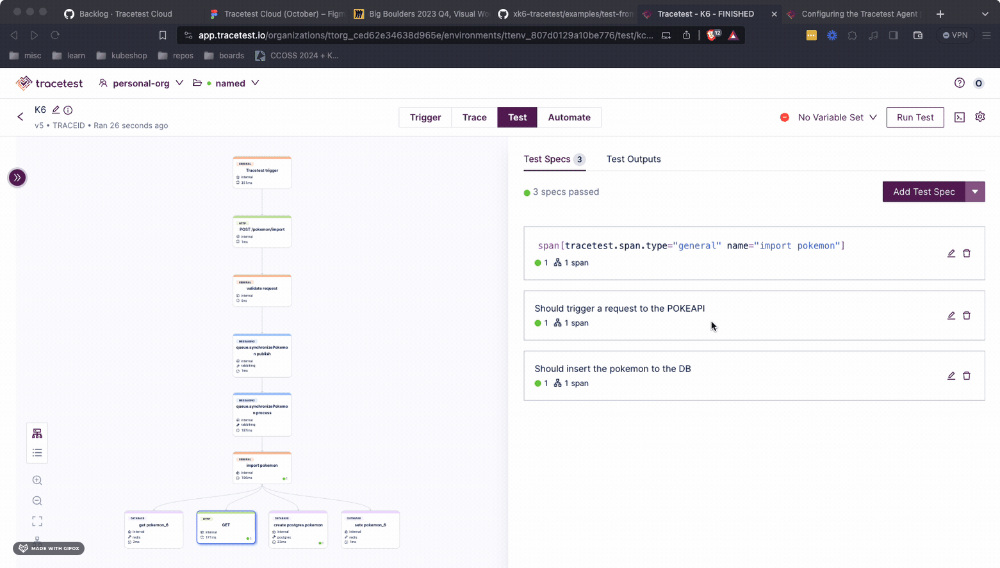

:::note
[Check out the source code on GitHub here.](https://github.com/kubeshop/tracetest/tree/main/examples/quick-start-typescript)
:::

[Tracetest](https://app.tracetest.io/) is a testing tool based on [OpenTelemetry](https://opentelemetry.io/) that allows you to test your distributed application. It allows you to use data from distributed traces generated by OpenTelemetry to validate and assert if your application has the desired behavior defined by your test definitions.

JavaScript/TypeScript is today the most popular language for web development, and it is also the most popular language for writing tests and automation scripts.

## Why is this important?

When working with testing tools, the most important thing is to be able to integrate them into your existing workflow and tooling. This is why we have created the `@tracetest/client` NPM package, which allows you to use the Tracetest platform to run trace-based tests from your existing JavaScript/TypeScript code.
Enabling you to run tests at any point in your code, and not only at the end of the test run, allows you to use trace-based testing as a tool to help you develop your application.

## The `@tracetest/client` NPM Package

With the [`@tracetest/client` NPM Package](https://www.npmjs.com/package/@tracetest/client), you will unlock the power of OpenTelemetry that allows you to run deeper testing based on the traces and spans generated by each of the checkpoints that you define within your services.

## How It Works

The following is a high-level sequence diagram of how k6 and Tracetest interact with the different pieces of the system.



## Today You'll Learn How to integrate Trace-Based Tests with your Typescript Code

This is a simple quick-start guide on how to use the Tracetest `@tracetest/client` NPM package to enhance your Typescript toolkit with trace-based testing. The infrastructure will use the Pokeshop Demo as a testing ground, triggering requests against it and generating telemetry data.

## Requirements

**Tracetest Account**:

- Sign up to [`app.tracetest.io`](https://app.tracetest.io) or follow the [get started](/getting-started/installation) docs.
- Create an [environment](/concepts/environments).
- Create an [environment token](/concepts/environment-tokens).
- Have access to the environment's [agent API key](/configuration/agent).

**Docker**: Have [Docker](https://docs.docker.com/get-docker/) and [Docker Compose](https://docs.docker.com/compose/install/) installed on your machine.

## Installing the `@tracetest/client` NPM Package

Installing the `@tracetest/client` NPM Package is as easy as running the following command:

```bash
npm i @tracetest/client
```

## Using the Tracetest Client Package

Once you have installed the `@tracetest/client` package, you can use import it and start making use of it as any other library to trigger trace-based tests and run checks against the resulting telemetry data.

## Project Structure

The project is built with Docker Compose.

### Pokeshop Demo App

The [Pokeshop Demo App](/live-examples/pokeshop/overview) is a complete example of a distributed application using different backend and front-end services, implementation code is written in Typescript.

The `docker-compose-yaml` file in the root directory is for the Pokeshop Demo app, the OpenTelemetry setup, and the [Tracetest Agent](/concepts/agent).

### Docker Compose Network

All `services` in the `docker-compose.yaml` are on the same network and will be reachable by hostname from within other services. For example, `jaeger:14250` in the `collector.config.yaml` file will map to the `jaeger` service, where port `14250` is the port where the Jaeger all-in-one instance accepts telemetry data.

## Tracetest Test Definitions

The `definitions.ts` file contains the JSON version of the test definitions that will be used to run the tests. It uses the HTTP trigger to execute requests against the Pokeshop Demo.

```typescript
import { TestResource } from "@tracetest/client/dist/modules/openapi-client";

export const importDefinition: TestResource = {
  type: "Test",
  spec: {
    id: "99TOHzpSR",
    name: "Typescript: Import a Pokemon",
    trigger: {
      type: "http",
      httpRequest: {
        method: "POST",
        url: "${var:BASE_URL}/import",
        body: '{"id": ${var:POKEMON_ID}}',
        headers: [
          {
            key: "Content-Type",
            value: "application/json",
          },
        ],
      },
    },
    specs: [
      {
        selector: 'span[tracetest.span.type="general" name = "validate request"] span[tracetest.span.type="http"]',
        name: "All HTTP Spans: Status  code is 200",
        assertions: ["attr:http.status_code = 200"],
      },
      {
        selector: 'span[tracetest.span.type="http" name="GET" http.method="GET"]',
        assertions: ['attr:http.route = "/api/v2/pokemon/${var:POKEMON_ID}"'],
      },
      {
        selector: 'span[tracetest.span.type="database"]',
        name: "All Database Spans: Processing time is less than 1s",
        assertions: ["attr:tracetest.span.duration < 1s"],
      },
    ],
    outputs: [
      {
        name: "DATABASE_POKEMON_ID",
        selector:
          'span[tracetest.span.type="database" name="create pokeshop.pokemon" db.system="postgres" db.name="pokeshop" db.user="ashketchum" db.operation="create" db.sql.table="pokemon"]',
        value: "attr:db.result | json_path '$.id'",
      },
    ],
  },
};

export const deleteDefinition: TestResource = {
  type: "Test",
  spec: {
    id: "C2gwdktIR",
    name: "Typescript: Delete a Pokemon",
    trigger: {
      type: "http",
      httpRequest: {
        method: "DELETE",
        url: "${var:BASE_URL}/${var:POKEMON_ID}",
        headers: [
          {
            key: "Content-Type",
            value: "application/json",
          },
        ],
      },
    },
    specs: [
      {
        selector:
          'span[tracetest.span.type="database" db.system="redis" db.operation="del" db.redis.database_index="0"]',
        assertions: ['attr:db.payload = \'{"key":"pokemon-${var:POKEMON_ID}"}\''],
      },
      {
        selector:
          'span[tracetest.span.type="database" name="delete pokeshop.pokemon" db.system="postgres" db.name="pokeshop" db.user="ashketchum" db.operation="delete" db.sql.table="pokemon"]',
        assertions: ["attr:db.result = 1"],
      },
      {
        selector: 'span[tracetest.span.type="database"]',
        name: "All Database Spans: Processing time is less than 100ms",
        assertions: ["attr:tracetest.span.duration < 100ms"],
      },
    ],
  },
};
```

## Creating the Typescript Script

The `index.ts` file contains the Typescript script that will be used to trigger requests against the Pokeshop Demo and run trace-based tests. The steps executed by this script are the following:

1. Import the `@tracetest/client` package.
2. Create a new `Tracetest` instance.
3. Get the last imported Pokemon number from the `GET /pokemon` endpoint using `fetch`.
4. Import the following 5 Pokemon after the last number by triggering a trace-based test to the `POST /import` endpoint.
5. From each test output, get the `DATABASE_POKEMON_ID` value and add it to a list.
6. Delete the imported Pokemon by triggering a trace-based test to the `DELETE /:id` endpoint.

```typescript
import Tracetest from "@tracetest/client";
import { config } from "dotenv";
import { PokemonList } from "./types";
import { deleteDefinition, importDefinition } from "./definitions";

config();

const { TRACETEST_API_TOKEN = "", POKESHOP_DEMO_URL = "http://api:8081" } = process.env;

const baseUrl = `${POKESHOP_DEMO_URL}/pokemon`;

const main = async () => {
  const tracetest = await Tracetest(TRACETEST_API_TOKEN);

  const getLastPokemonId = async (): Promise<number> => {
    const response = await fetch(baseUrl);
    const list = (await response.json()) as PokemonList;

    return list.items.length + 1;
  };

  // get the initial pokemon from the API
  const pokemonId = (await getLastPokemonId()) + 1;

  const getVariables = (id: string) => [
    { key: "POKEMON_ID", value: id },
    { key: "BASE_URL", value: baseUrl },
  ];

  const importedPokemonList: string[] = [];

  const importPokemons = async (startId: number) => {
    const test = await tracetest.newTest(importDefinition);
    // imports all pokemons
    await Promise.all(
      new Array(5).fill(0).map(async (_, index) => {
        console.log(`ℹ Importing pokemon ${startId + index + 1}`);
        const run = await tracetest.runTest(test, { variables: getVariables(`${startId + index + 1}`) });
        const updatedRun = await run.wait();
        const pokemonId = updatedRun.outputs?.find((output) => output.name === "DATABASE_POKEMON_ID")?.value || "";

        console.log(`ℹ Adding pokemon ${pokemonId} to the list, ${updatedRun}`);
        importedPokemonList.push(pokemonId);
      })
    );
  };

  const deletePokemons = async () => {
    const test = await tracetest.newTest(deleteDefinition);
    // deletes all pokemons
    await Promise.all(
      importedPokemonList.map(async (pokemonId) => {
        console.log(`ℹ Deleting pokemon ${pokemonId}`);
        return tracetest.runTest(test, { variables: getVariables(pokemonId) });
      })
    );
  };

  await importPokemons(pokemonId);
  console.log(await tracetest.getSummary());

  await deletePokemons();
  console.log(await tracetest.getSummary());
};

main();
```

## Tracetest Agent Connects to Tracetest

The `docker-compose.yaml` file includes the [Tracetest Agent](/concepts/agent) image, which is going to be listening for incoming traces from both the gRPC (4317) and HTTP (4318) OTLP ports.

```yaml
version: "3"

services:
  tracetest-agent:
    image: kubeshop/tracetest-agent:latest
    environment:
      TRACETEST_DEV: ${TRACETEST_DEV}
      TRACETEST_API_KEY: ${TRACETEST_API_KEY}
```

Do not forget to set the `TRACETEST_AGENT_API_KEY` environment variable in the `.env` file to your Tracetest Agent. The API key available on the `Settings > Agent` page of your environment as you can see [here](/configuration/agent).

From the `collector.config.yaml` file we can see how the telemetry data is routed to the `tracetest-agent` service.

```yaml title=tracetest-datastore.yaml
receivers:
  otlp:
    protocols:
      grpc:
      http:
        cors:
          allowed_origins:
            - "http://*"
            - "https://*"

processors:
  batch:

exporters:
  logging:
    loglevel: debug
  jaeger:
    endpoint: ${JAEGER_ENDPOINT}
    tls:
      insecure: true
  otlp/trace:
    endpoint: tracetest-agent:4317
    tls:
      insecure: true

service:
  pipelines:
    traces:
      receivers: [otlp]
      processors: []
      exporters: [logging, jaeger]
    traces/1:
      receivers: [otlp]
      processors: [batch]
      exporters: [otlp/trace]
```

## Running the Full Example

To start the full setup, run the following command:

```bash
docker-compose up
```

You can visit the Pokeshop Demo UI at `http://localhost:8081/`.

## Finding the Results

The output from the Typescript script should be visible in the terminal. Where you can find links to Tracetest to find details about trace-based test results.

```bash
2024-01-25 12:40:29 ℹ Importing pokemon 3
2024-01-25 12:40:29 ℹ Importing pokemon 4
2024-01-25 12:40:29 ℹ Importing pokemon 5
2024-01-25 12:40:29 ℹ Importing pokemon 6
2024-01-25 12:40:29 ℹ Importing pokemon 7
2024-01-25 12:40:42 ℹ Adding pokemon 1 to the list
2024-01-25 12:40:43 ℹ Adding pokemon 3 to the list
2024-01-25 12:40:44 ℹ Adding pokemon 2 to the list
2024-01-25 12:40:44 ℹ Adding pokemon 4 to the list
2024-01-25 12:40:44 ℹ Adding pokemon 5 to the list
2024-01-25 12:40:44 
2024-01-25 12:40:44 Successful: 5
2024-01-25 12:40:44 Failed: 0
2024-01-25 12:40:44 
2024-01-25 12:40:44 [✔️ Typescript: Import a Pokemon] #6 - https://app.tracetest.io/organizations/ttorg_ced62e34638d965e/environments/ttenv_b42fa137465c6e04/test/99TOHzpSR/run/6
2024-01-25 12:40:44 [✔️ Typescript: Import a Pokemon] #7 - https://app.tracetest.io/organizations/ttorg_ced62e34638d965e/environments/ttenv_b42fa137465c6e04/test/99TOHzpSR/run/7
2024-01-25 12:40:44 [✔️ Typescript: Import a Pokemon] #9 - https://app.tracetest.io/organizations/ttorg_ced62e34638d965e/environments/ttenv_b42fa137465c6e04/test/99TOHzpSR/run/9
2024-01-25 12:40:44 [✔️ Typescript: Import a Pokemon] #8 - https://app.tracetest.io/organizations/ttorg_ced62e34638d965e/environments/ttenv_b42fa137465c6e04/test/99TOHzpSR/run/8
2024-01-25 12:40:44 [✔️ Typescript: Import a Pokemon] #10 - https://app.tracetest.io/organizations/ttorg_ced62e34638d965e/environments/ttenv_b42fa137465c6e04/test/99TOHzpSR/run/10
2024-01-25 12:40:44 
2024-01-25 12:40:44 ℹ Deleting pokemon 1
2024-01-25 12:40:44 ℹ Deleting pokemon 3
2024-01-25 12:40:44 ℹ Deleting pokemon 2
2024-01-25 12:40:44 ℹ Deleting pokemon 4
2024-01-25 12:40:44 ℹ Deleting pokemon 5
2024-01-25 12:41:00 
2024-01-25 12:41:00 Successful: 10
2024-01-25 12:41:00 Failed: 0
2024-01-25 12:41:00 
2024-01-25 12:41:00 [✔️ Typescript: Import a Pokemon] #6 - https://app.tracetest.io/organizations/ttorg_ced62e34638d965e/environments/ttenv_b42fa137465c6e04/test/99TOHzpSR/run/6
2024-01-25 12:41:00 [✔️ Typescript: Import a Pokemon] #7 - https://app.tracetest.io/organizations/ttorg_ced62e34638d965e/environments/ttenv_b42fa137465c6e04/test/99TOHzpSR/run/7
2024-01-25 12:41:00 [✔️ Typescript: Import a Pokemon] #9 - https://app.tracetest.io/organizations/ttorg_ced62e34638d965e/environments/ttenv_b42fa137465c6e04/test/99TOHzpSR/run/9
2024-01-25 12:41:00 [✔️ Typescript: Import a Pokemon] #8 - https://app.tracetest.io/organizations/ttorg_ced62e34638d965e/environments/ttenv_b42fa137465c6e04/test/99TOHzpSR/run/8
2024-01-25 12:41:00 [✔️ Typescript: Import a Pokemon] #10 - https://app.tracetest.io/organizations/ttorg_ced62e34638d965e/environments/ttenv_b42fa137465c6e04/test/99TOHzpSR/run/10
2024-01-25 12:41:00 [✔️ Typescript: Delete a Pokemon] #4 - https://app.tracetest.io/organizations/ttorg_ced62e34638d965e/environments/ttenv_b42fa137465c6e04/test/C2gwdktIR/run/4
2024-01-25 12:41:00 [✔️ Typescript: Delete a Pokemon] #3 - https://app.tracetest.io/organizations/ttorg_ced62e34638d965e/environments/ttenv_b42fa137465c6e04/test/C2gwdktIR/run/3
2024-01-25 12:41:00 [✔️ Typescript: Delete a Pokemon] #5 - https://app.tracetest.io/organizations/ttorg_ced62e34638d965e/environments/ttenv_b42fa137465c6e04/test/C2gwdktIR/run/5
2024-01-25 12:41:00 [✔️ Typescript: Delete a Pokemon] #7 - https://app.tracetest.io/organizations/ttorg_ced62e34638d965e/environments/ttenv_b42fa137465c6e04/test/C2gwdktIR/run/7
2024-01-25 12:41:00 [✔️ Typescript: Delete a Pokemon] #6 - https://app.tracetest.io/organizations/ttorg_ced62e34638d965e/environments/ttenv_b42fa137465c6e04/test/C2gwdktIR/run/6
```

## What's Next?

After running the initial set of tests, you can click the run link for any of them, update the assertions and run the scripts once more. This flow enables complete a trace-based TDD flow.



## Learn More

Please visit our [examples in GitHub](https://github.com/kubeshop/tracetest/tree/main/examples) and join our [Slack Community](https://dub.sh/tracetest-community) for more info!
