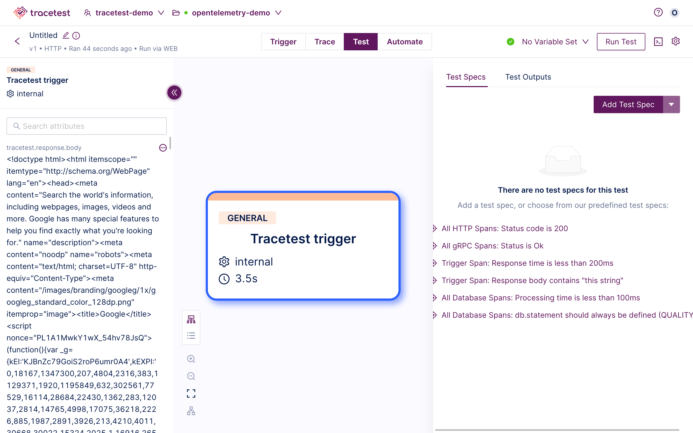

This page shows how to configure black box testing in the Tracetest Web UI.

👉 **Join our [shared Pokeshop API Demo environment](https://app.tracetest.io/organizations/ttorg_2179a9cd8ba8dfa5/invites/invite_760904a64b4b9dc9/accept) and try creating a Test yourself!**

Click the **Create** button:

The "Create New Test" dialog appears.
The option to choose the kind of trigger to initiate the trace is presented:

- HTTP Request - Create a basic HTTP request.
- GRPC Request - Test and debug your GRPC request.
- Kafka - Test consumers with Kafka messages.
- TraceID - Define your test via a TraceID (Not Available for Black-Box Testing).

Then, click one of the options to continue:

In this example, HTTP Request has been chosen.

Input the **Name** and **Trigger** details for a non-instrumented service.

We are using a generic **GET** request to **google.com** in this case:

Click **Run**:

The test will start:

After a few seconds, the skip **awaiting trace** popup will show up:

Click, the  **Skip awaiting trace** button:

The Run will complete, showing the **Tracetest trigger** root span:

Create a **Test Spec** from the **Tracetest Trigger** span:

To have test runs always skip the **awaiting trace** step, go to the settings tab under the trigger section:

And, enable the **Skip Trace collection** option:

Then click **Run** to save the changes:

Please visit the [Test Results](/web-ui/test-results) document for an explanation of viewing the results of a test.

👉 **Join our [shared Pokeshop API Demo environment](https://app.tracetest.io/organizations/ttorg_2179a9cd8ba8dfa5/invites/invite_760904a64b4b9dc9/accept) and try creating a Test yourself!**
