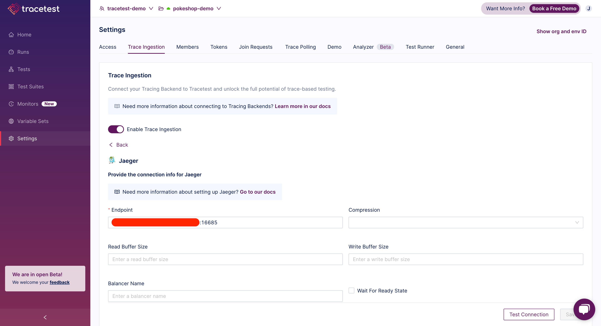
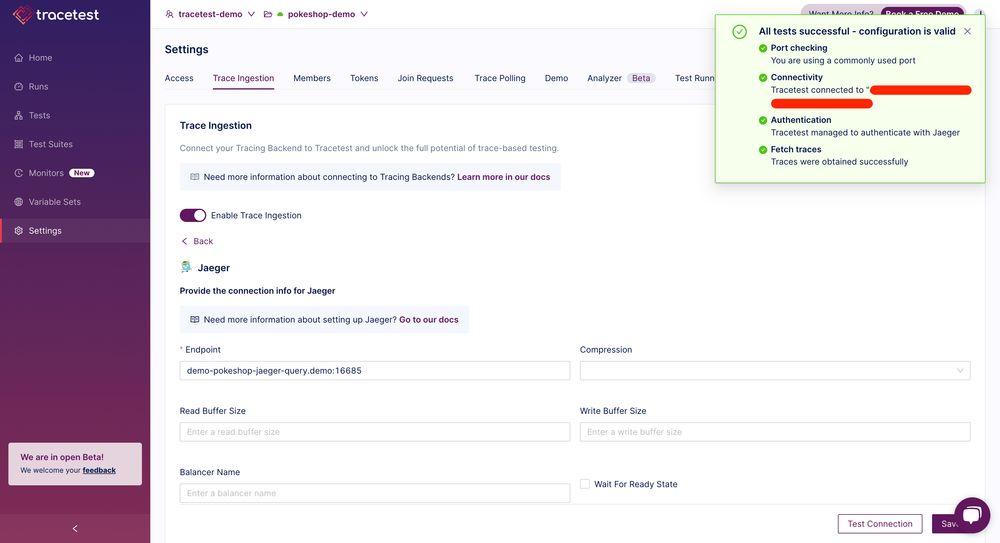

This page shows how to configure tracing backends in the Tracetest Web UI.

Open the **Settings** page and select the **Trace Ingestion** tab.

To help you configure the connection, you can use the **Test Connection** button to validate if the connection is successful and Tracetest can fetch traces from the tracing backend.

## Supported Tracing Backends

Select from the [list of available tracing backends](/configuration/overview) and configure the connection.
