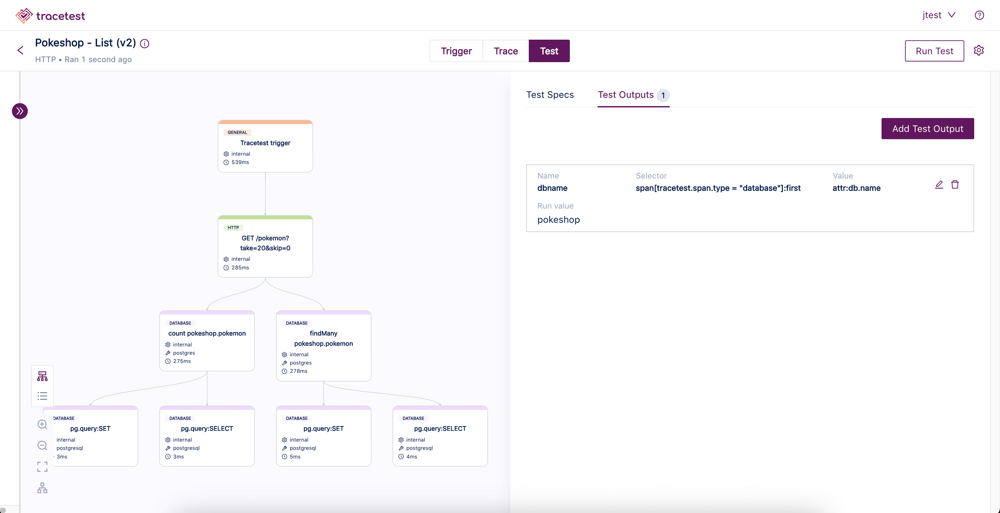
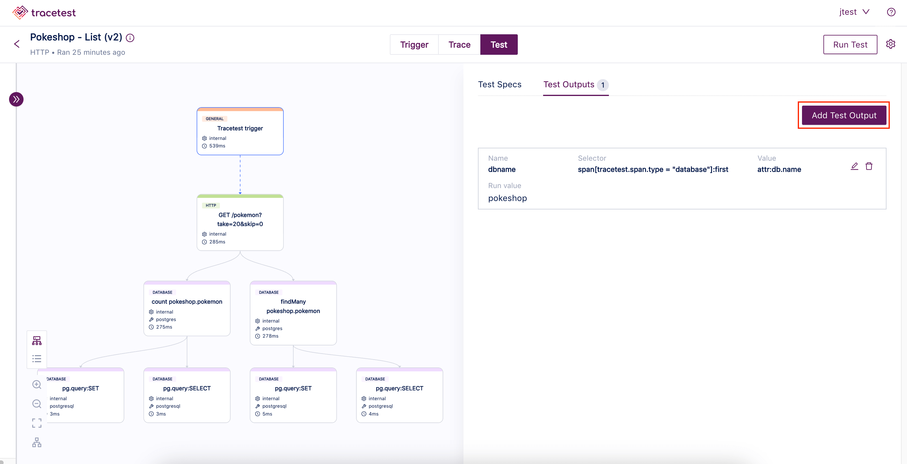
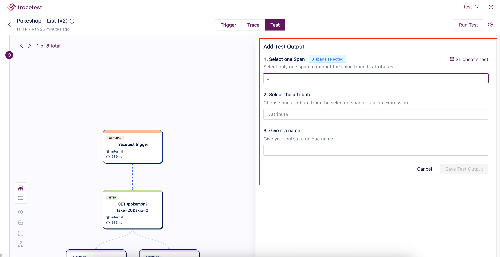
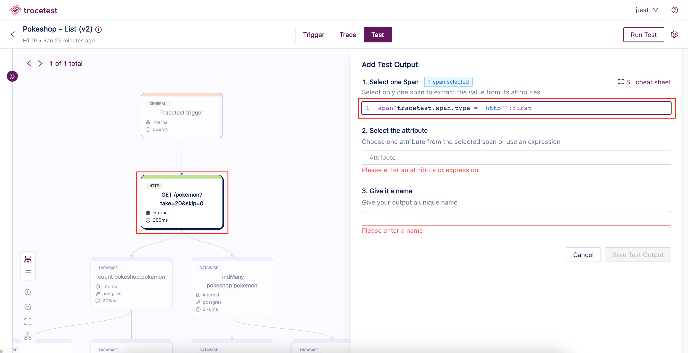
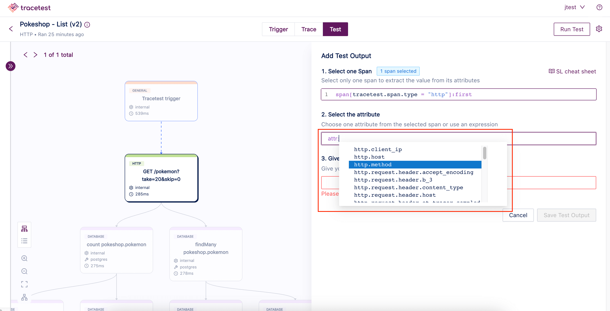
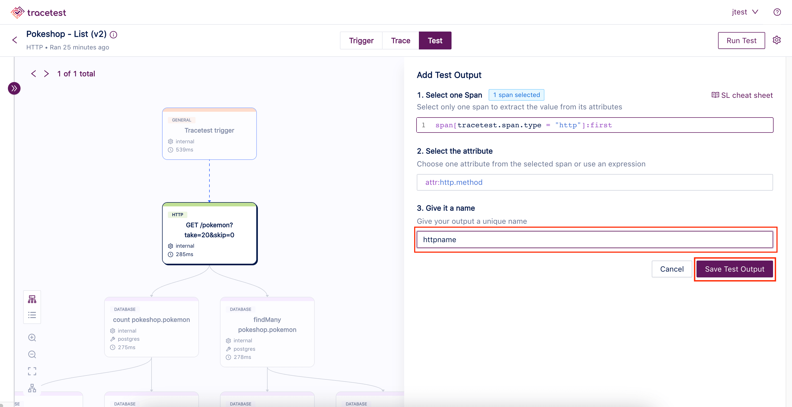
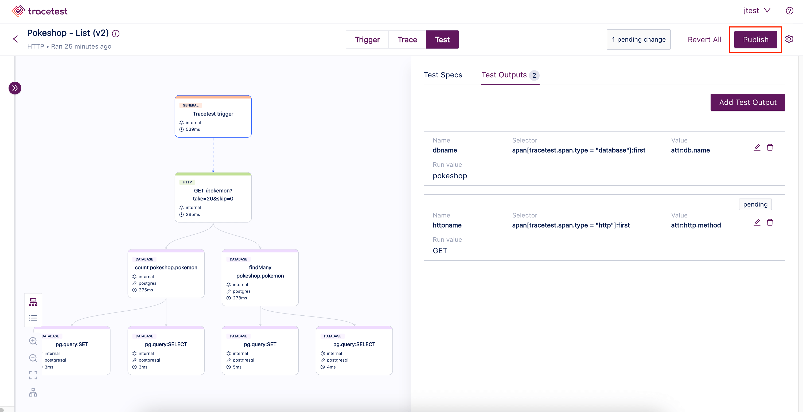

A Test Output allows you to define a variable based on the information contained in a particular span's attributes. This variable can be referenced in the same test or in later tests in a Test Suite. If test outputs have already been added to a test, they will be on the **Test** screen under the **Test Outputs** tab:

After you have created a test and your test run is complete, click the **Add Test Output** button at the right of the Test screen.

The **Add Test Output** screen opens.

To add a test output start by selecting one span using our [Selectors](../concepts/selectors.md). The selected span is highlighted in the graph view on the left:

Then choose one attribute from the selected span or use an [Expression](../concepts/expressions.md):

Finally, give your test output a name and click **Save Test Output**:

Don't forget to publish your changes by clicking the **Publish** button in the top right corner:

