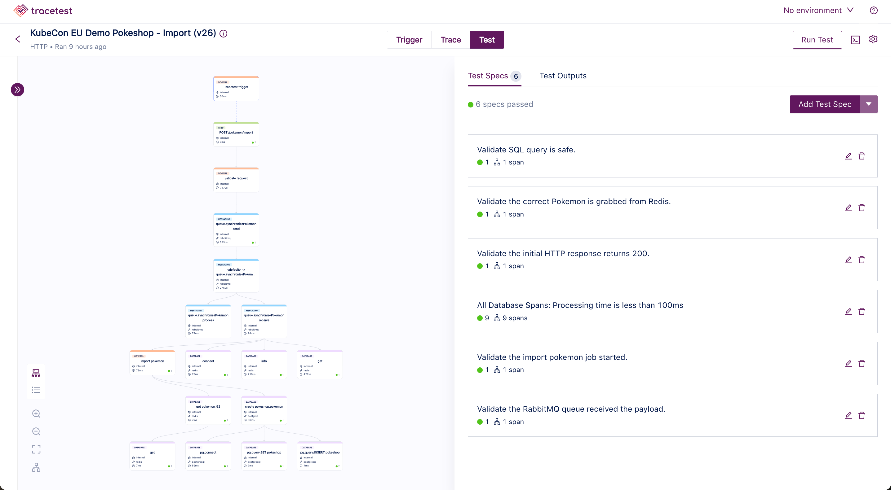
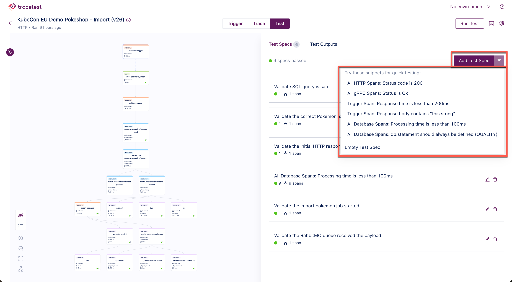
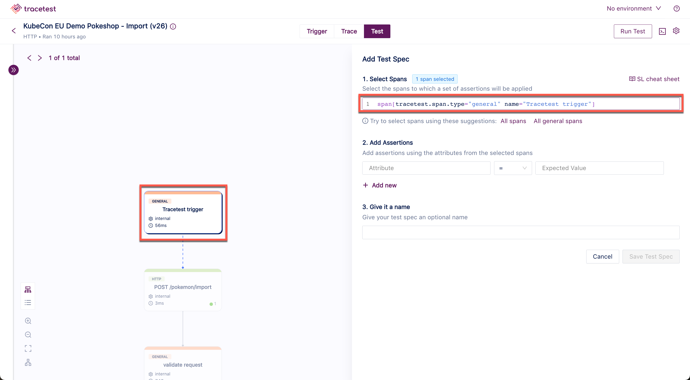
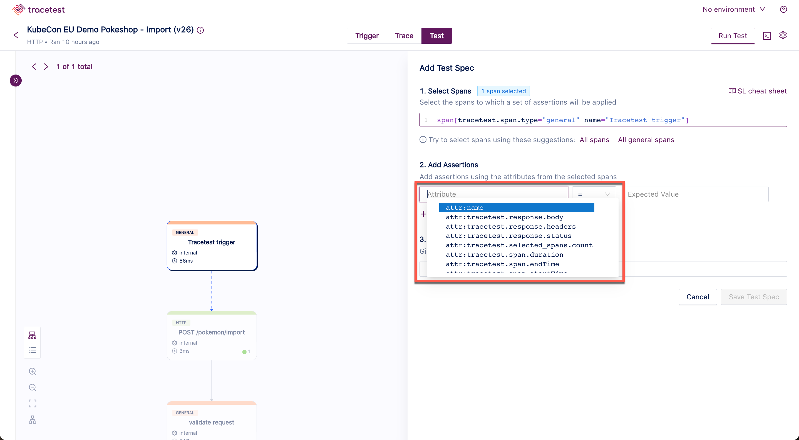
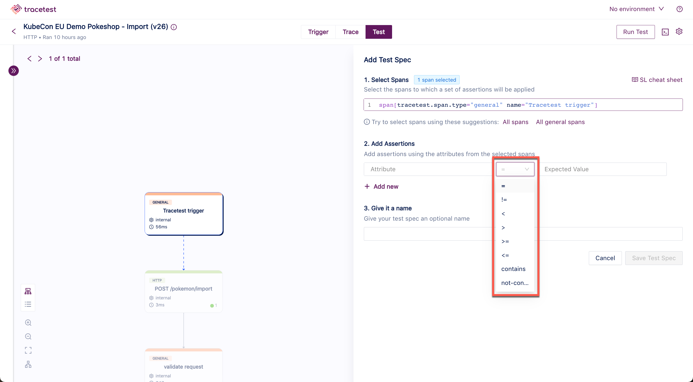
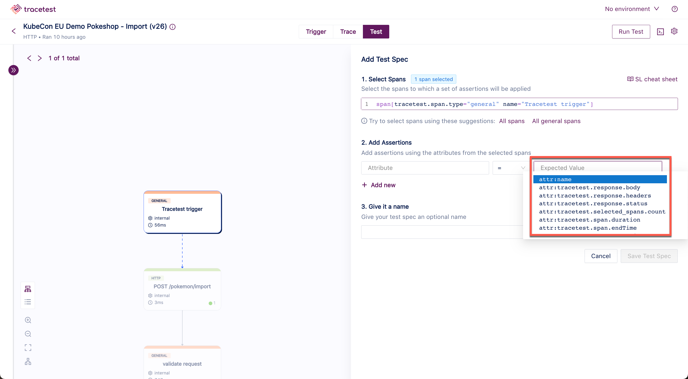
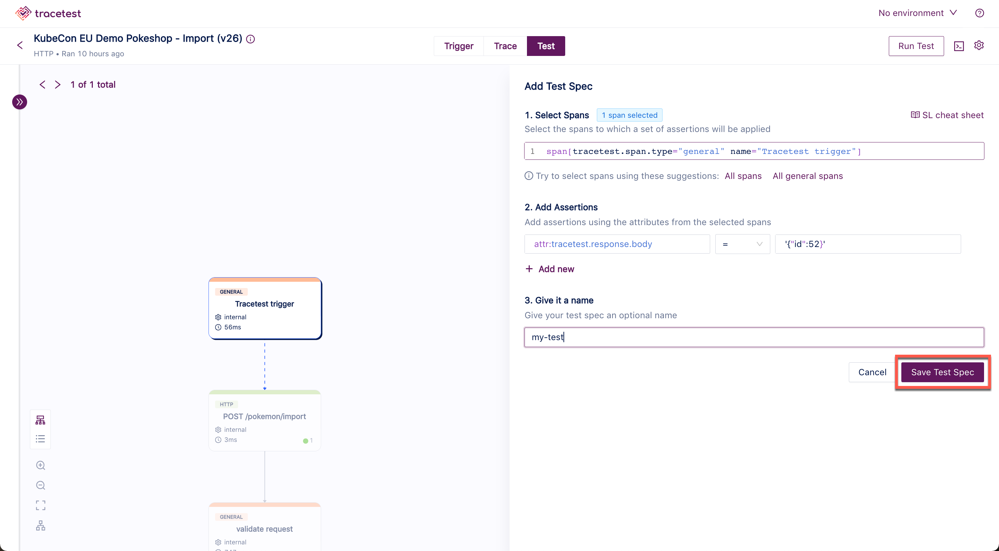
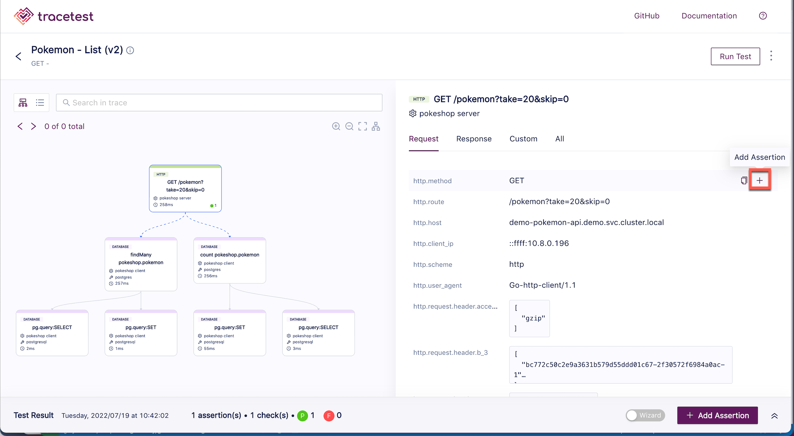

# Creating Test Specifications

Test Specifications may be added to a trace to set a value for a step in the trace to determine success or failure. If test specs have already been added to a test, they will be on the Test screen:

After you have created a test and your test run is complete, click the **Add Test Spec** button at the bottom right of the Test screen.

The **Add Test Spec** dialog opens. You can choose an example test spec from the drop down.

The span that the new test spec will apply to is highlighted in the graph view on the left:

To add an assertion to a span, click in the Attribute field to see the list of attributes that apply to the selected span:

Then select the operator for your assertion:

And add the value for comparison:

Finally, you can give your test spec an optional name and click **Save Test Spec**:

<!--- You can also create assertions by hovering over the **+** sign to the right of an attribute in the trace. 

This will populate the assertion with the correct information for that attribute.

The **Filter** field allows for limiting the spans affected by the assertion.

Use the **Advanced mode** toggle switch to use the wizard or the query language to create the span selector:

<!--- To see adding assertions in action, please watch <Add link to video> --->
