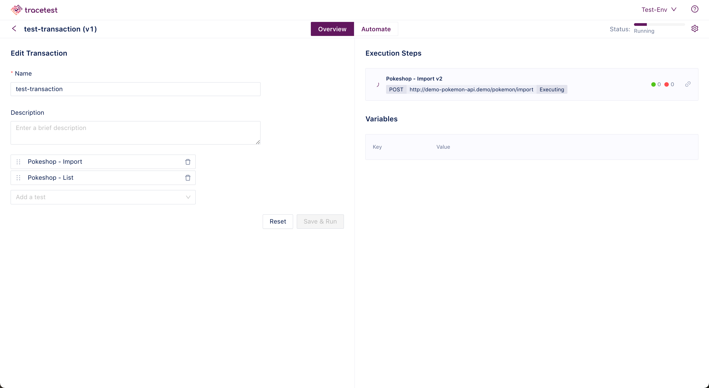

# Creating Test Suites

This page showcases how to create and edit Test Suites in the Web UI.

:::tip
[To read more about Test Suites check out Test Suites concepts.](../concepts/test-suites.md)
:::

Click the **Create** button and select **Create New Test Suite** in the drop down:

Give your Test Suite a name, and click **Next**:

Next, select which tests to run in the Test Suite and click **Create & Run**:

The Test Suite will start:

 On the automate tab, you find methods to automate the current Test Suite, including the YAML test file and the CLI command for Tracetest.

 

 With all of the toggles `Off`, each criteria is tested. Toggle individual criteria `On`, to select on certain checks for the selected test.

When the Test Suite is finished, you will get the following result:

You can now view individual [Test Results](test-results.md) executed by the Test Suite by clicking on any of the tests in the list.
