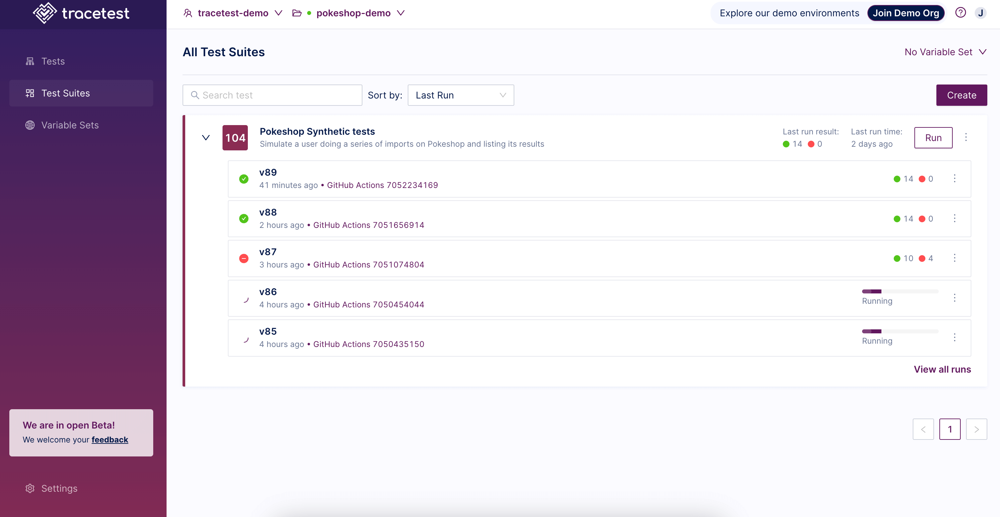
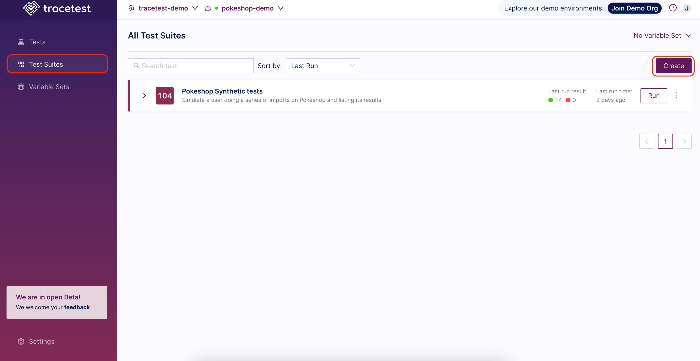
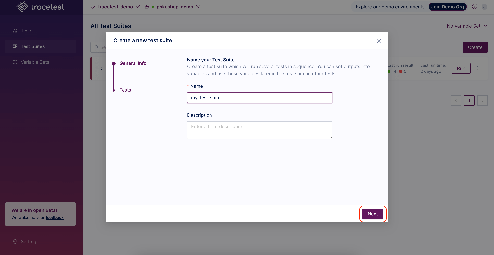
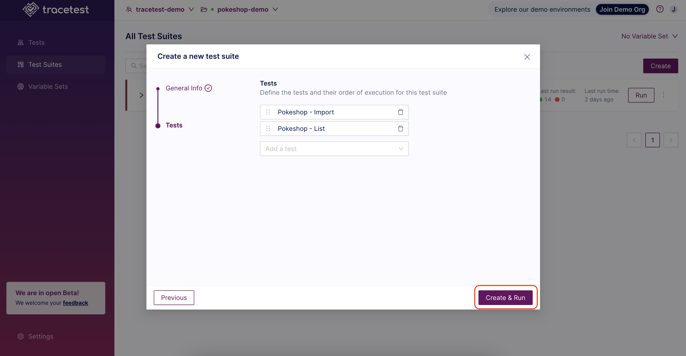
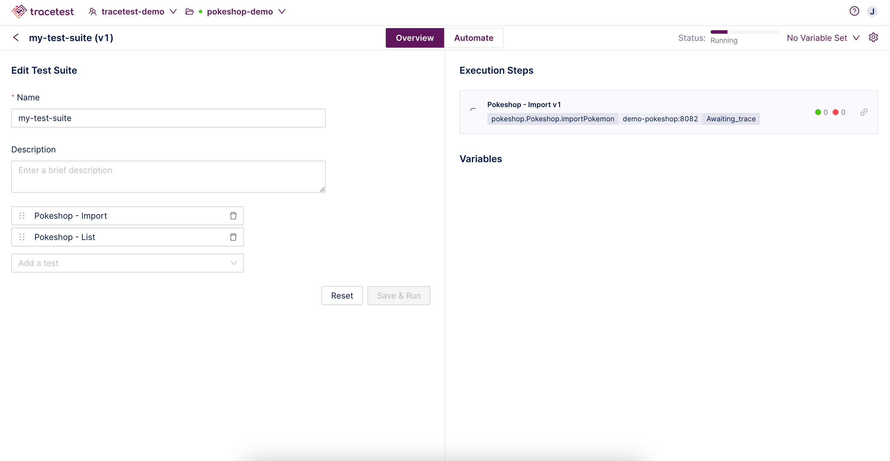
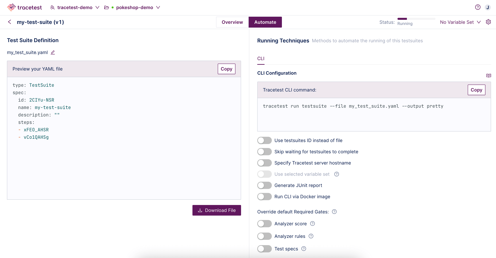
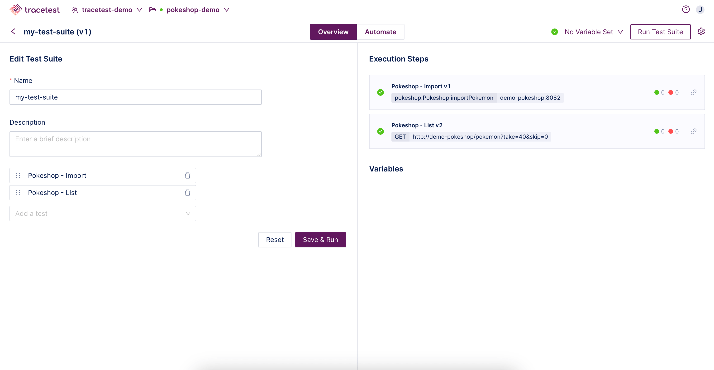

👉 **Join our [shared Pokeshop API Demo environment](https://app.tracetest.io/organizations/ttorg_2179a9cd8ba8dfa5/invites/invite_760904a64b4b9dc9/accept) and try creating a Test Suite yourself!**

This page showcases how to create and edit Test Suites in the Web UI.

:::tip
[To read more about Test Suites check out Test Suites concepts page.](/concepts/test-suites)
:::

Select **Test Suites** in the left menu and then click the **Create** button to create a new Test Suite:

Give your Test Suite a name, and click **Next**:

Next, select which tests to run in the Test Suite and click **Create & Run**:

The Test Suite will start:

 On the automate tab, you find methods to automate the current Test Suite, including the YAML test file and the CLI command for Tracetest.

 

 With all of the toggles `Off`, each criteria is tested. Toggle individual criteria `On`, to select on certain checks for the selected test.

When the Test Suite is finished, you will get the following result:

You can now view individual [Test Results](/web-ui/test-results) executed by the Test Suite by clicking on any of the tests in the list.

👉 **Join our [shared Pokeshop API Demo environment](https://app.tracetest.io/organizations/ttorg_2179a9cd8ba8dfa5/invites/invite_760904a64b4b9dc9/accept) and try creating a Test Suite yourself!**