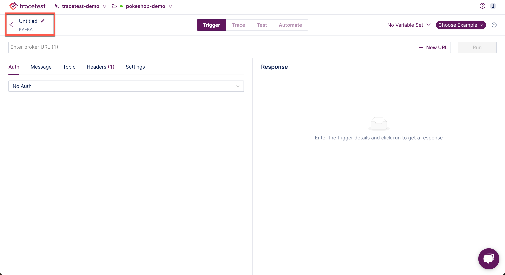
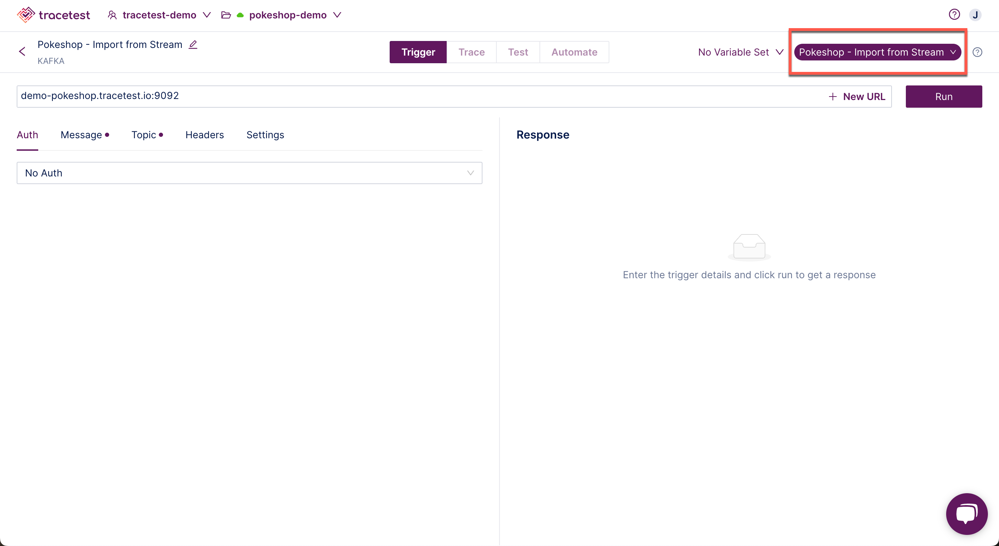
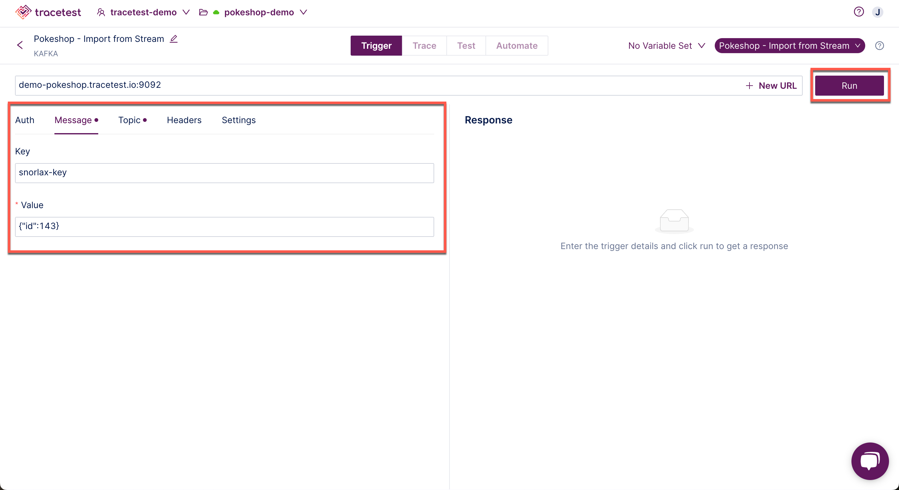
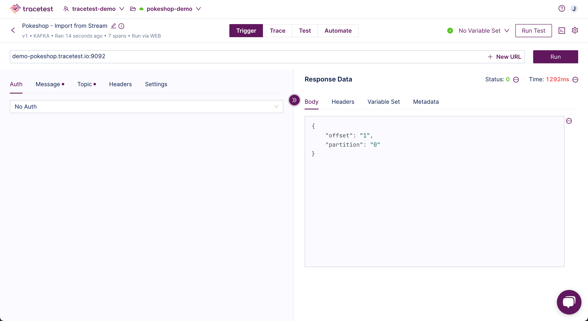

[Kafka](https://kafka.apache.org/) is a distributed streaming platform designed to handle large volumes of real-time data. It provides durability, fault tolerance, and horizontal scalability, making it a popular option for building event-driven architectures.

👉 **Join our [shared Pokeshop API Demo environment](https://app.tracetest.io/organizations/ttorg_2179a9cd8ba8dfa5/invites/invite_760904a64b4b9dc9/accept) and try creating a Test yourself!**

Click the Kafka option to continue:

In this example, a Kafka Request has been chosen.

Input the **Name** and **Trigger** details or select one of the example provided in the drop down:

The **Pokeshop - Import from Stream** example has been chosen.

Add any additional information and click **Run**:

When the test is finished, you will get the following results:

Please visit the [Test Results](../web-ui/test-results.mdx) document for an explanation of viewing the results of a test.

👉 **Join our [shared Pokeshop API Demo environment](https://app.tracetest.io/organizations/ttorg_2179a9cd8ba8dfa5/invites/invite_760904a64b4b9dc9/accept) and try creating a Test yourself!**

