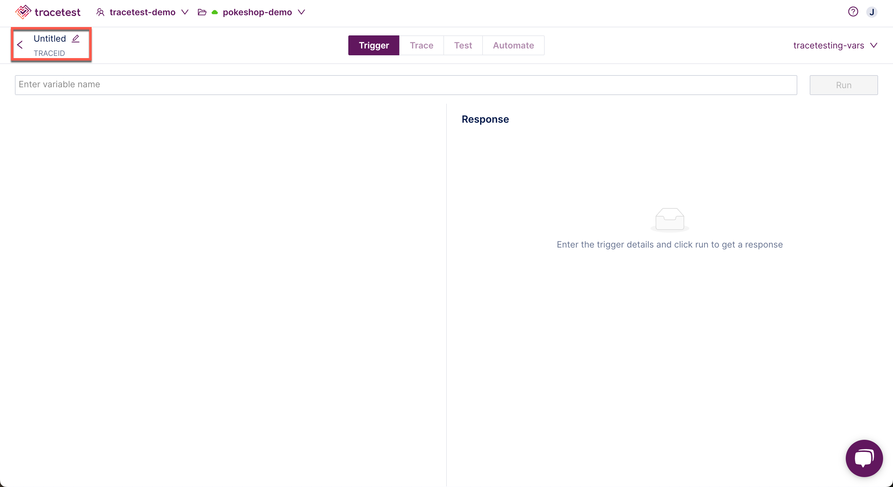
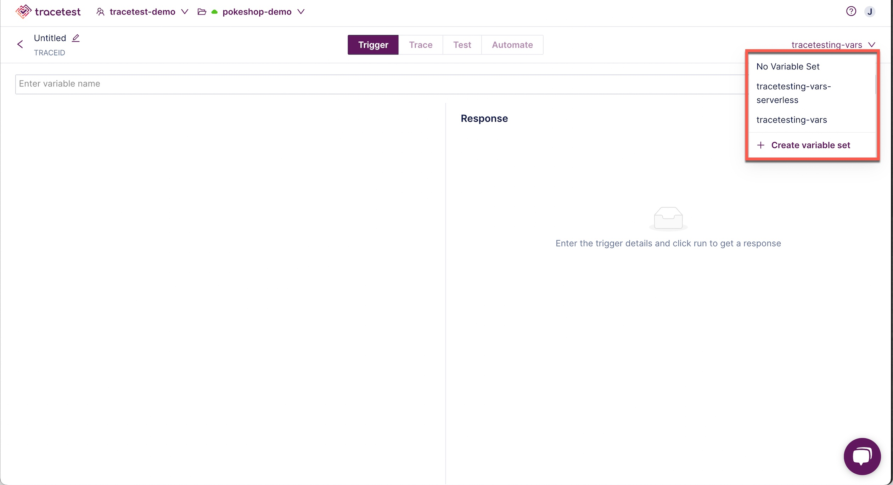
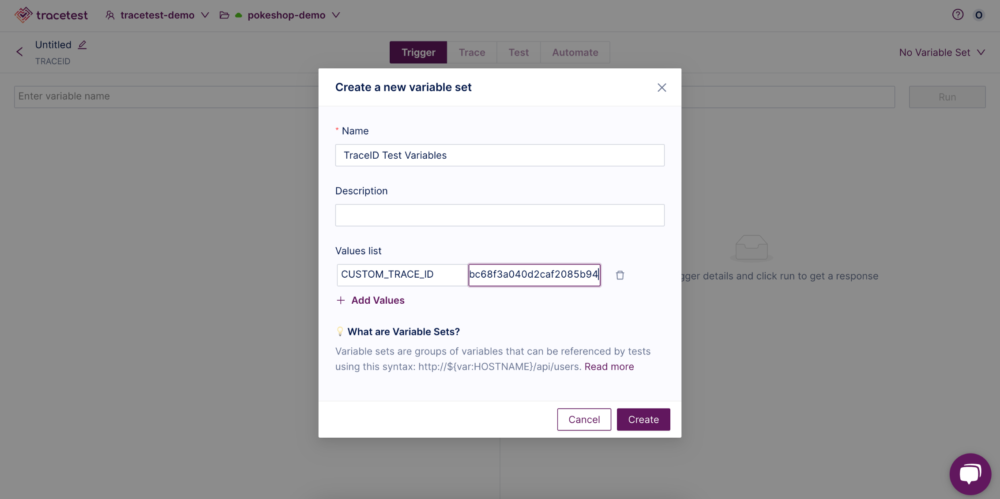
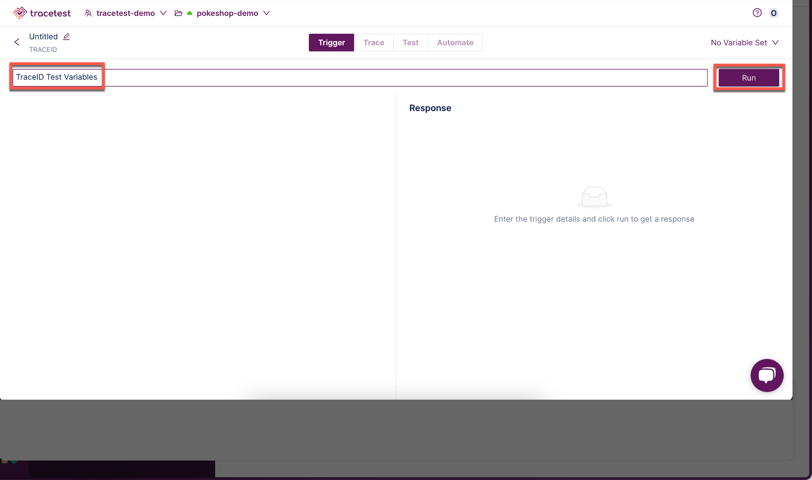
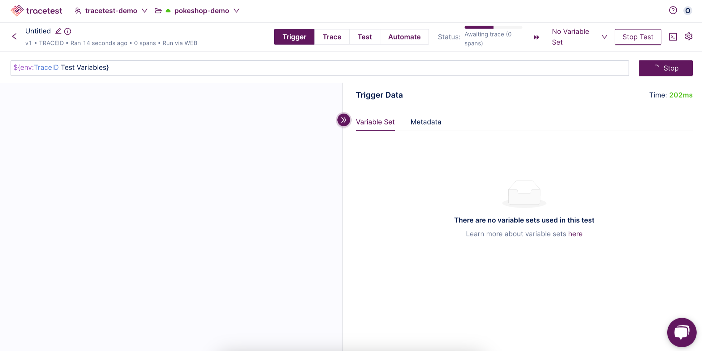

Would you like to run a test on a captured trace already run in your test, staging, or production environment?

The TraceID trigger allows you to pass a parent `trace_id` to Tracetest and have a predefined test run against it. 

Examples for using the TraceID trigger:
- You want to manually run a transaction via a custom trigger currently not supported by Tracetest, determine the parent trace id, and run a trace-based test against the captured trace.
- You want to have a process that identifies particular traces stored in your tracing backend and runs trace-based tests on them. An example would be querying Grafana Tempo for traces that match a particular signature, such as a POST against a particular endpoint, and then run a Tracetest against each of the traces that matches that signature.
- You want to run an adhoc test in production against a particular trace you noted in a tracing backend and verify it passes a Tracetest. This Tracetest could use the [Tracing Analyzer](../analyzer/concepts.mdx) to verify the trace properly uses the semantic conventions, or it could check to see that all database queries execute faster than a particular threshold.

:::warning
Since TraceID based triggers are given a parent `trace_id` for a trace that has already been captured, you must be using a tracing backend that supports **direct** connections. These include Jaeger, Grafana Tempo, AWS XRay, Azure App Insights, Elastic APM, OpenSearch and Sumo Logic. Tracing backends that send data to Tracetest via a separate pipeline in the OTel Collector will not support TraceID based triggers.
:::

👉 **Join our [shared Pokeshop API Demo environment](https://app.tracetest.io/organizations/ttorg_2179a9cd8ba8dfa5/invites/invite_760904a64b4b9dc9/accept) and try creating a Test yourself!**

Click the TraceID option to continue:

In this example, a TraceID Request has been chosen.

Select an existing variable set or create a new one in the drop down:

Enter the variable name and click **Run**:

The test will start:

Please visit the [Test Results](../web-ui/test-results.mdx) document for an explanation of viewing the results of a test.

👉 **Join our [shared Pokeshop API Demo environment](https://app.tracetest.io/organizations/ttorg_2179a9cd8ba8dfa5/invites/invite_760904a64b4b9dc9/accept) and try creating a Test yourself!**

