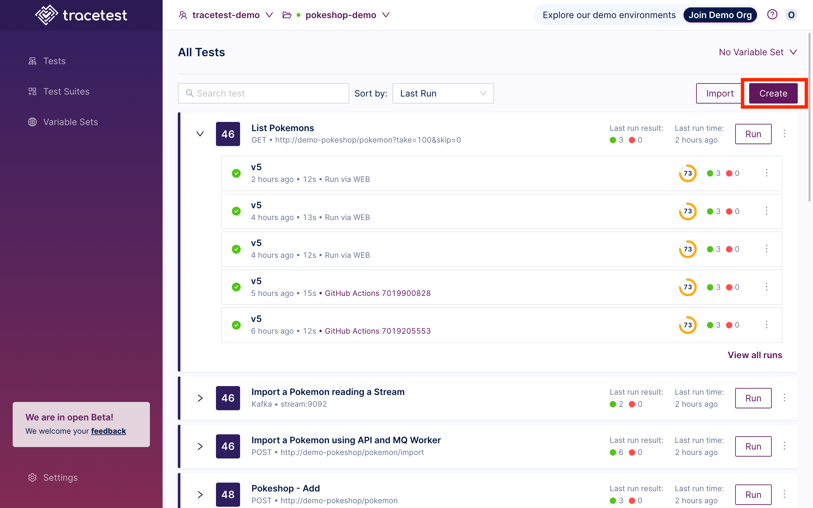
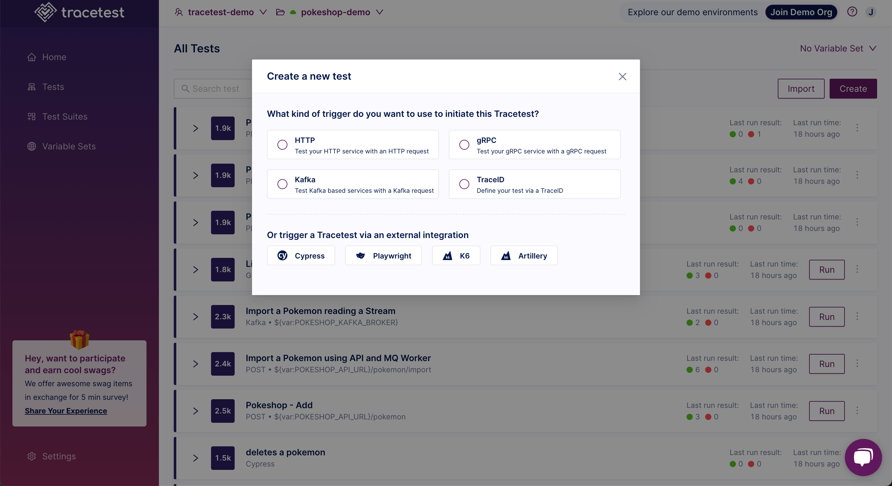
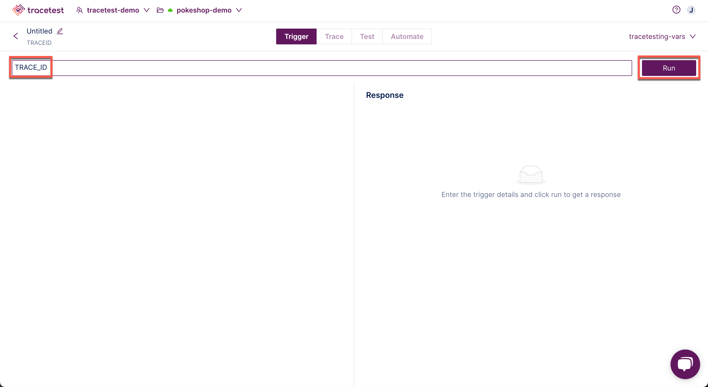

👉 **Join our [shared Pokeshop API Demo environment](https://app.tracetest.io/organizations/ttorg_2179a9cd8ba8dfa5/invites/invite_760904a64b4b9dc9/accept) and try creating a Test yourself!**

Click the **Create** button:

The "Create New Test" dialog appears.
Choose the kind of trigger to initiate the trace:

- HTTP Request - Create a basic HTTP request.
- gRPC Request - Test and debug your GRPC request.
- Kafka - Test consumers with Kafka messages.
- TraceID - Define your test via a TraceID.

Or, choose to use an external integration to trigger Tracetest:

- Cypress
- Playwright
- k6
- Artillary

Then, click one of the options to continue:

In this example, a TraceID Request has been chosen.

Select an existing variable set or create a new one in the drop down:

Enter the variable name and click **Run**:

The test will start:

Please visit the [Test Results](../web-ui/test-results.mdx) document for an explanation of viewing the results of a test.

👉 **Join our [shared Pokeshop API Demo environment](https://app.tracetest.io/organizations/ttorg_2179a9cd8ba8dfa5/invites/invite_760904a64b4b9dc9/accept) and try creating a Test yourself!**

