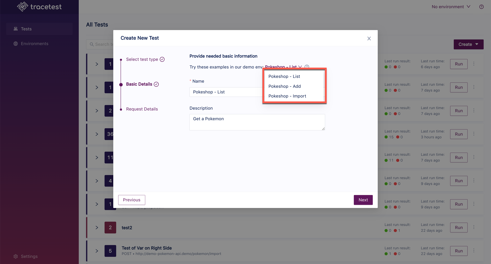

# Creating Tests

Click the **Create** button and select **Create New Test** in the drop down:

The "Create New Test" dialog appears:

The option to choose the kind of trigger to initiate the trace is presented:

- HTTP Request - Create a basic HTTP request.
- GRPC Request - Test and debug your GRPC request.
- cURL Command - Define your HTTP test via a cURL command.
- Postman Collection - Define your HTTP request via a Postman collection.
- TraceID - Define your test via a TraceID.
- Kafka - Test consumers with Kafka messages

Choose the trigger and click **Next**:

In this example, HTTP Request has been chosen.

Input the **Name** of the test and the **Description** or select one of the example provided in the drop down:

The **Pokemon - Import** example has been chosen. Then click **Next**.

Add any additional information and click **Create & Run**:

The test will start:

When the test is finished, you will get the following results:

Please visit the [Test Results](test-results.md) document for an explanation of viewing the results of a test.
