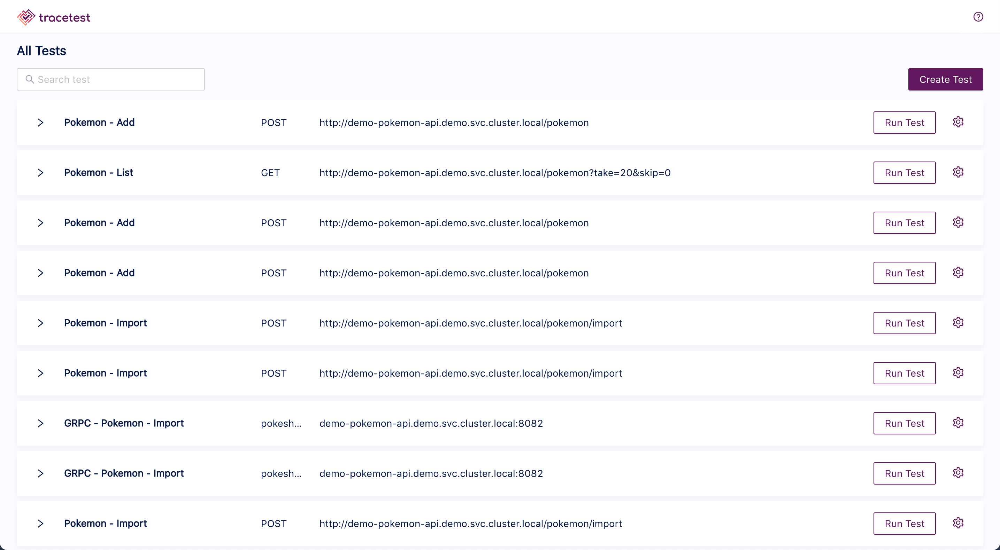
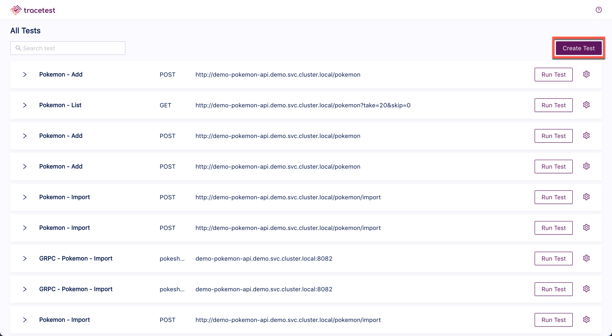
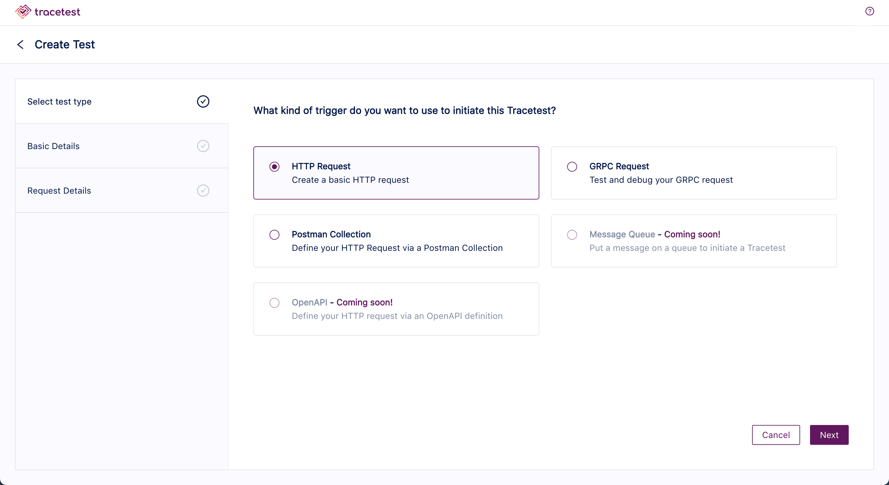
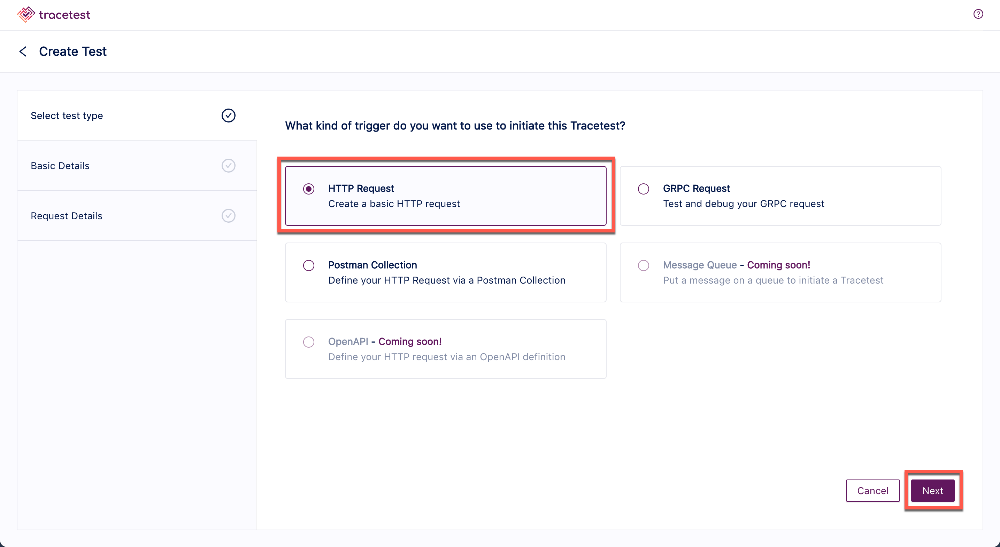
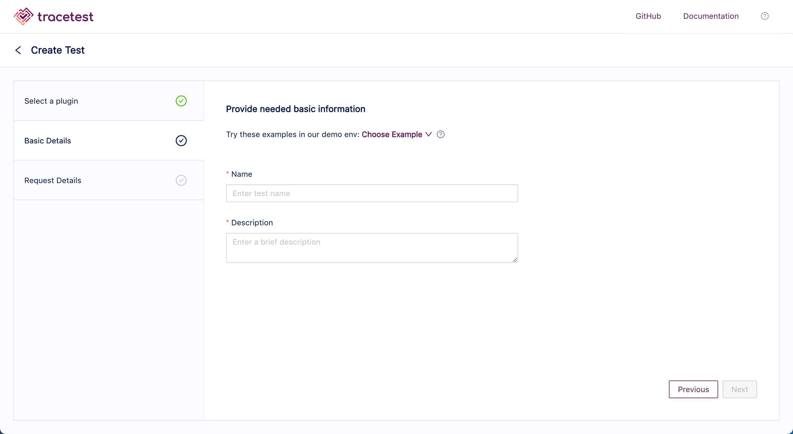
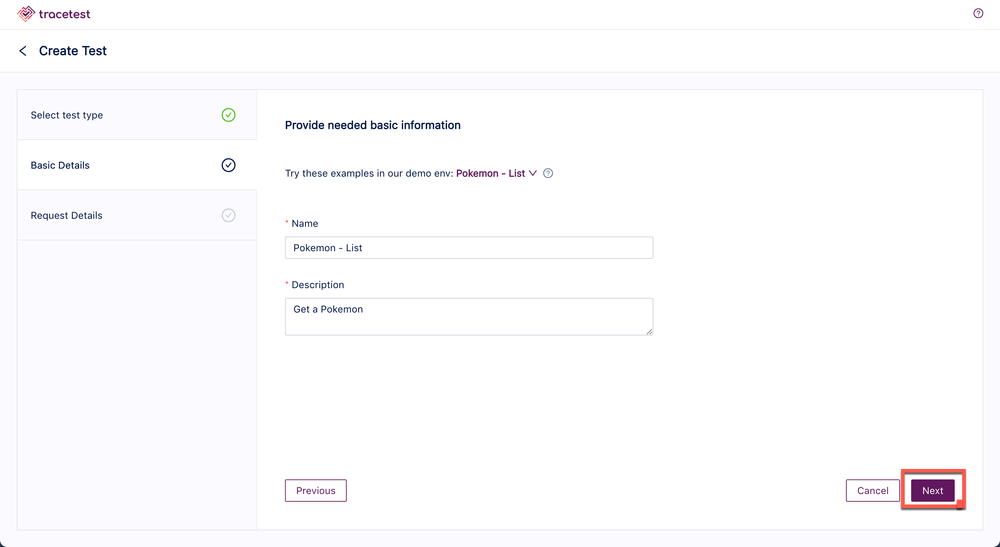
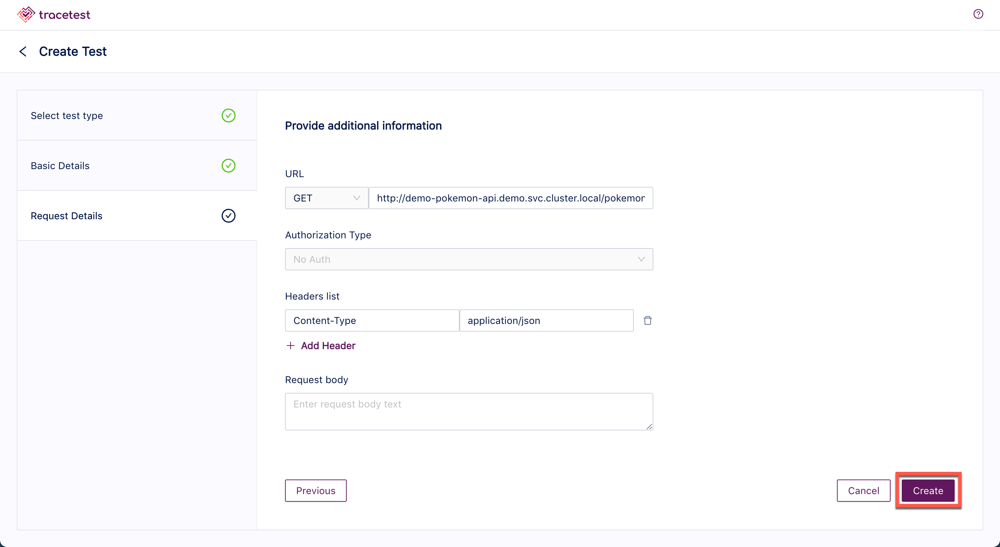
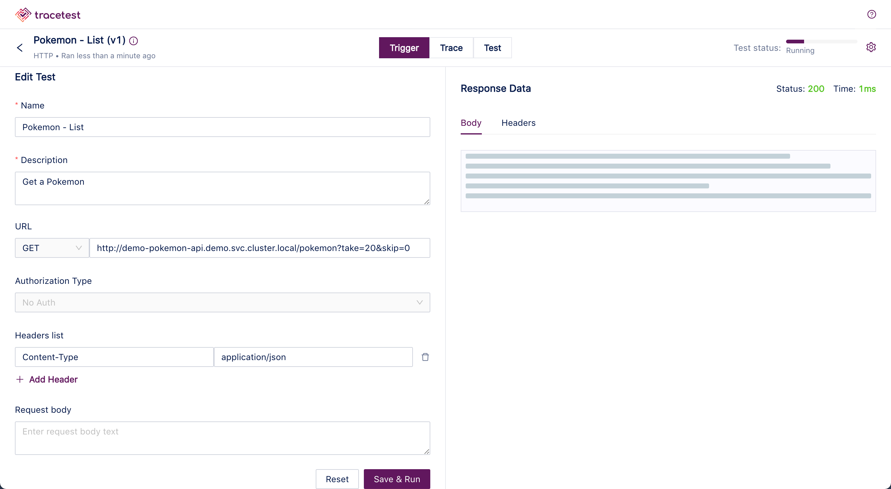

# Create a Test

Access the [Tracetest application](../getting-started/accessing-dashboard.md).

Click the **Create Test** button and the **Create New Test** dialog appears:

The option to choose the kind of trigger to initiate the trace is presented:

- HTTP Request - Create a basic HTTP request.
- RPC Request - Test and debug your RPC request.
- Postman Collection - Define your HTTP request via a Postman collection.

Choose the trigger and click **Next**:

In this example, HTTP Request has been chosen.

Input the **Name** of the test and the **Description** or select one of the example provided in the drop down:

The **Pokemon - List** example has been chosen. Then click **Next**.

Add any additional information and click **Create**:

The test will start:

When the test is finished, you will get the following results:

Please visit the [Test Results](test-results.md) document for an explanation of viewing the results of a test..
