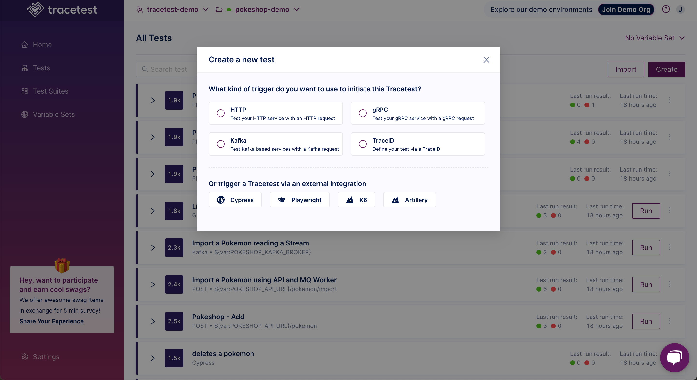

👉 **Join our [shared Pokeshop API Demo environment](https://app.tracetest.io/organizations/ttorg_2179a9cd8ba8dfa5/invites/invite_760904a64b4b9dc9/accept) and try creating a Test yourself!**

Click the **Create** button:

The "Create New Test" dialog appears.
Choose the kind of trigger to initiate the trace:

- [HTTP Request - Create a basic HTTP request.](/web-ui/creating-tests-http)
- [GRPC Request - Test and debug your GRPC request.](/web-ui/creating-tests-gRPC)
- [Kafka - Test consumers with Kafka messages.](/web-ui/creating-tests-kafka)
- [TraceID - Define your test via a TraceID.](/web-ui/creating-tests-traceid)

Or, choose to use an external integration to trigger Tracetest:

- [Cypress](/web-ui/creating-tests-cypress)
- [Playwright](/web-ui/creating-tests-playwright)
- [k6](/web-ui/creating-tests-k6)
- [Artillery](/web-ui/creating-tests-artillery)

