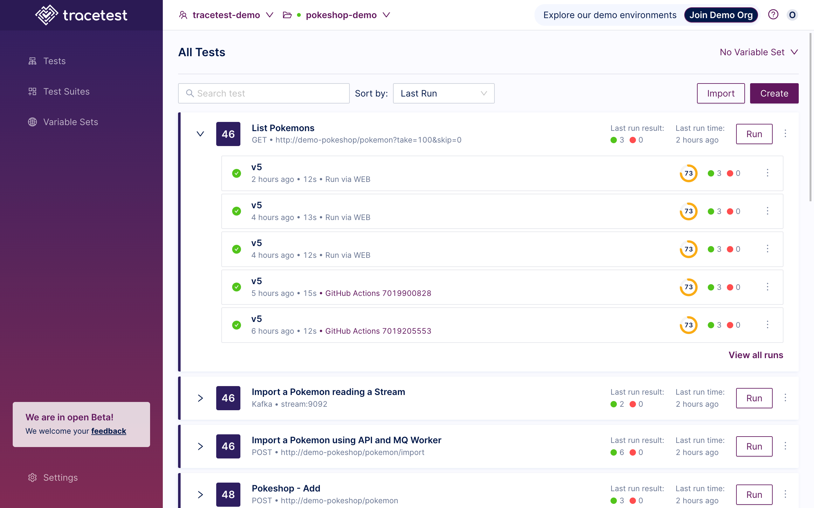
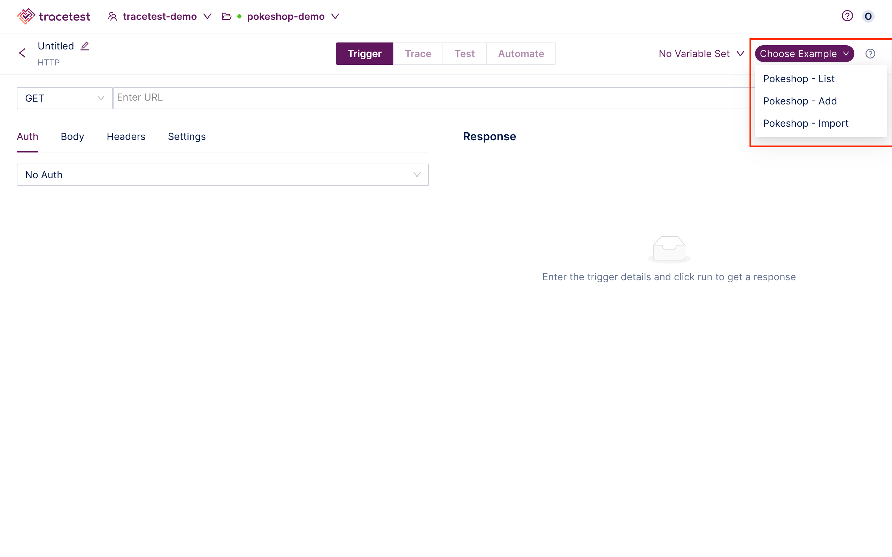
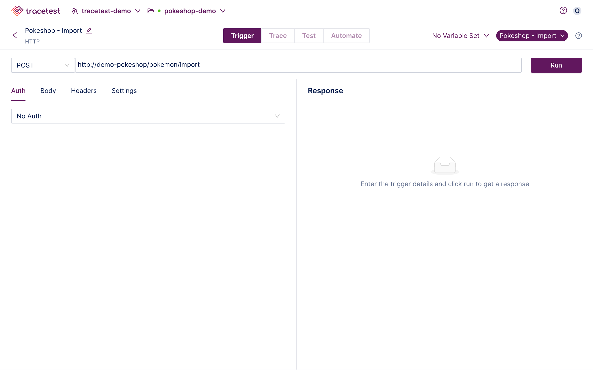
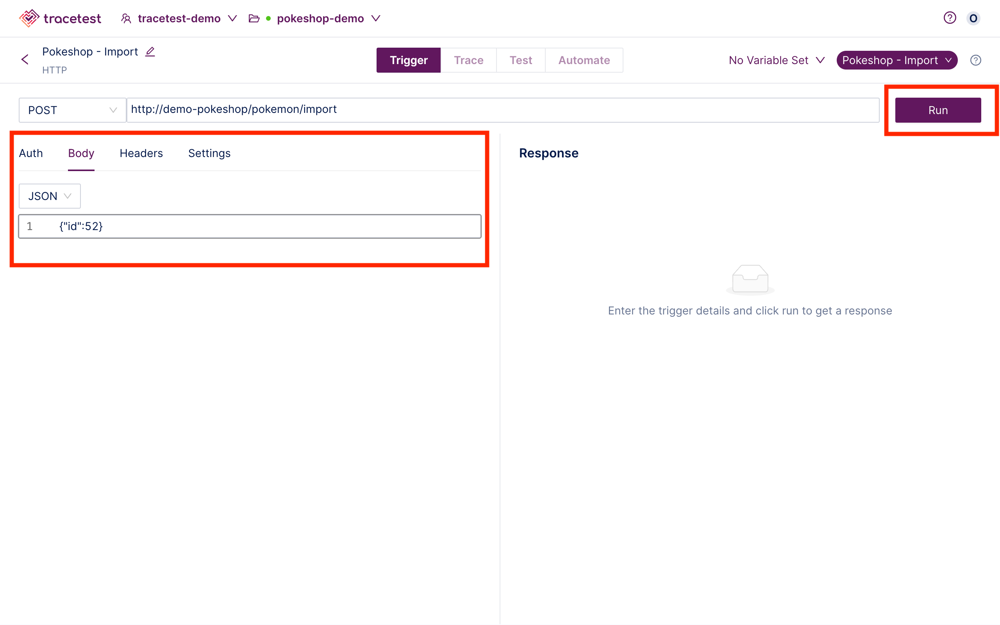
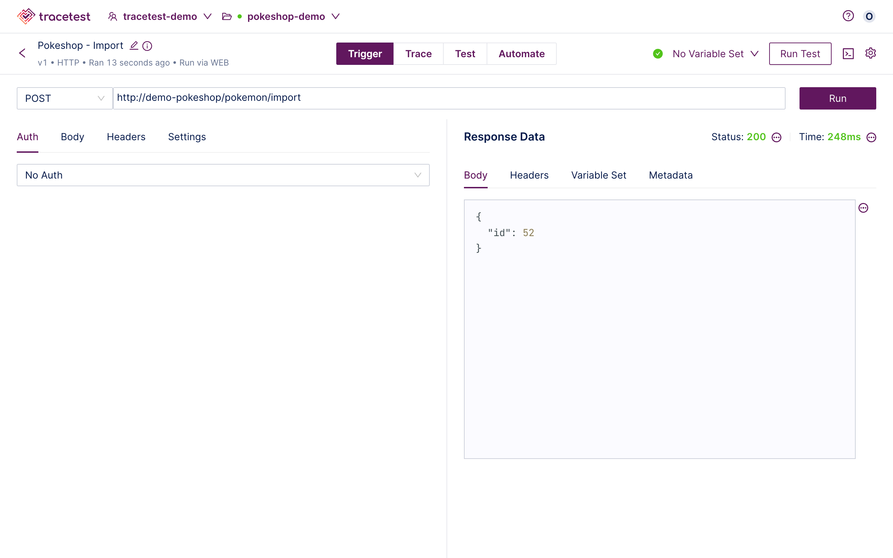

👉 **Join our [shared Pokeshop API Demo environment](https://app.tracetest.io/organizations/ttorg_2179a9cd8ba8dfa5/invites/invite_760904a64b4b9dc9/accept) and try creating a Test yourself!**

Click the **Create** button:

The "Create New Test" dialog appears.
The option to choose the kind of trigger to initiate the trace is presented:

- HTTP Request - Create a basic HTTP request.
- GRPC Request - Test and debug your GRPC request.
- Kafka - Test consumers with Kafka messages.
- TraceID - Define your test via a TraceID.

Then, click one of the options to continue:

In this example, HTTP Request has been chosen.

Input the **Name** and **Trigger** details or select one of the example provided in the drop down:

The **Pokemon - Import** example has been chosen.

Add any additional information and click **Run**:

The test will start:

When the test is finished, you will get the following results:

Please visit the [Test Results](/web-ui/test-results) document for an explanation of viewing the results of a test.

👉 **Join our [shared Pokeshop API Demo environment](https://app.tracetest.io/organizations/ttorg_2179a9cd8ba8dfa5/invites/invite_760904a64b4b9dc9/accept) and try creating a Test yourself!**

