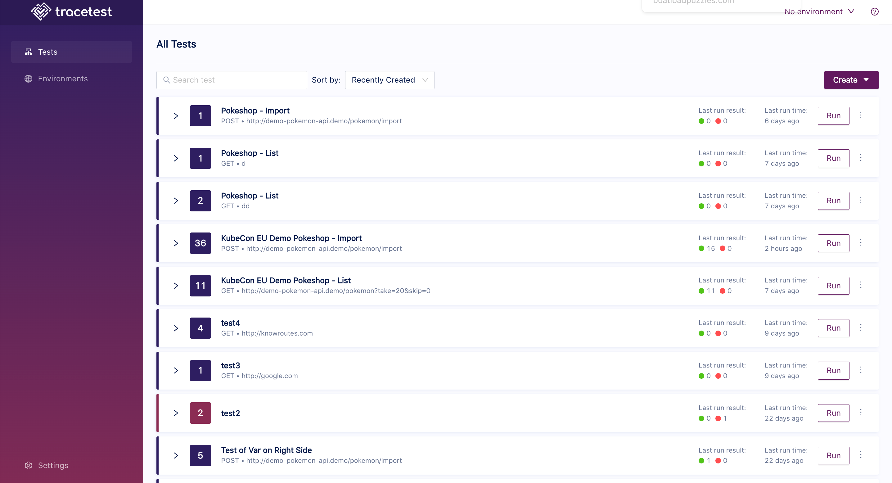

# Creating Transactions

This page showcases how to create and edit Transactions in the Web UI.

:::tip
[To read more about transactions check out transactions concepts.](../concepts/transactions.md)
:::

Click the **Create** button and select **Create New Transaction** in the drop down:

Give your transaction a name, and click **Next**:

Next, select which tests to run in the transaction and click **Create & Run**:

The transaction will start:

 On the automate tab, you find methods to automate the current transaction, including the YAML test file and the CLI command for Tracetest.

 

 With all of the toggles `Off`, each criteria is tested. Toggle individual criteria `On`, to select on certain checks for the selected test.

When the transaction is finished, you will get the following result:

You can now view individual [Test Results](test-results.md) executed by the transaction by clicking on any of the tests in the list.
