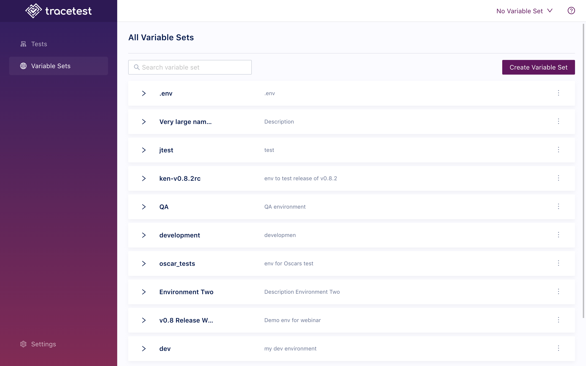
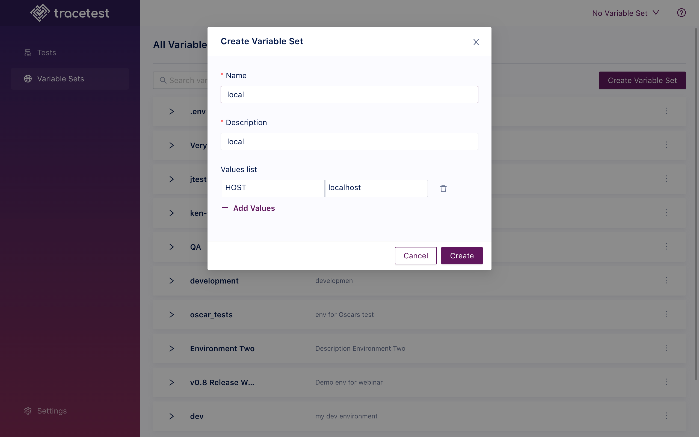
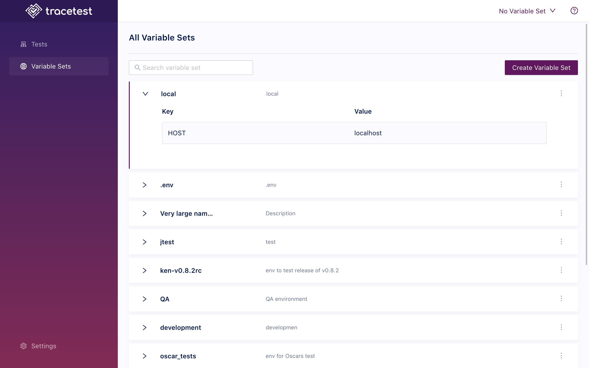
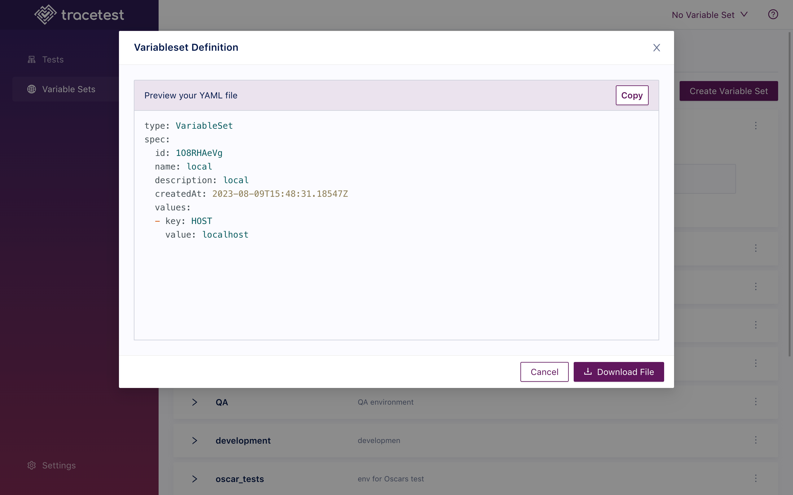

# Creating Variable Sets

This page showcases how to create and edit variable sets in the Web UI.

:::tip
[To read more about variable sets check out the variable sets concepts guide.](../concepts/variable-sets.md)
:::

On the variable sets page, click **Create Variable Set**.

To create a variable set, click **Create**.

You can also edit a variable set by clicking on the three dots and clicking **Edit**.

To export a YAML definition of a variable set, click **Variable Set Definition**:

