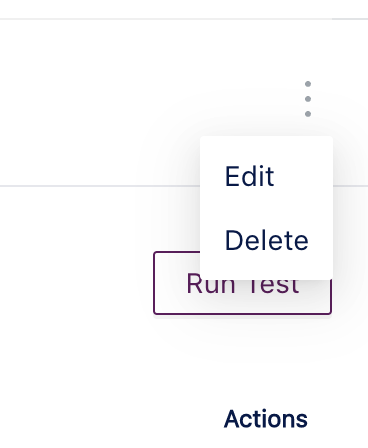
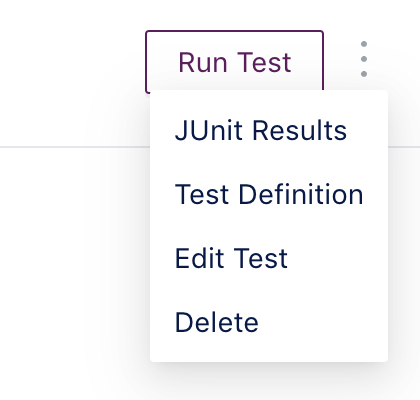
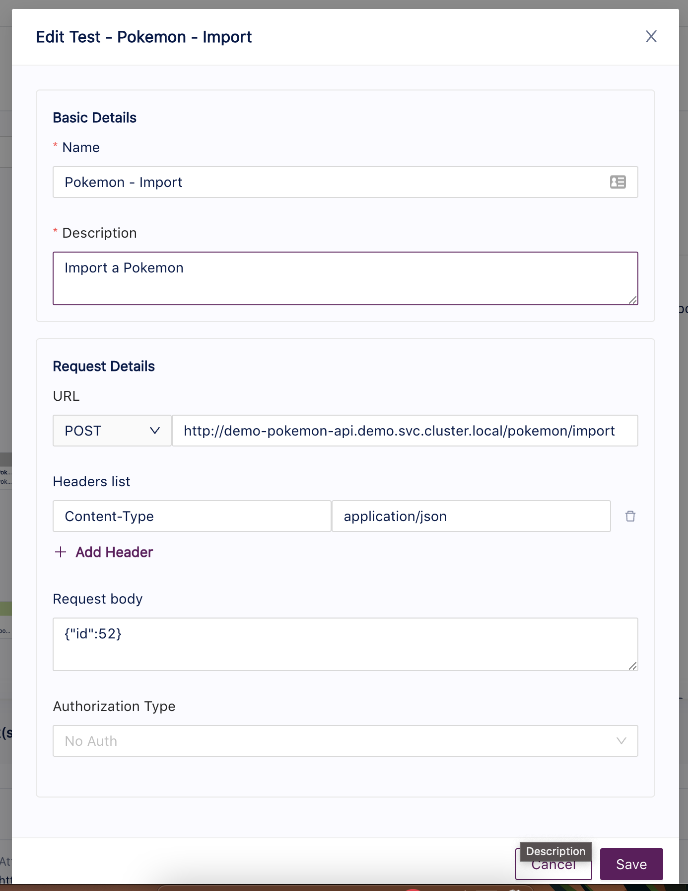
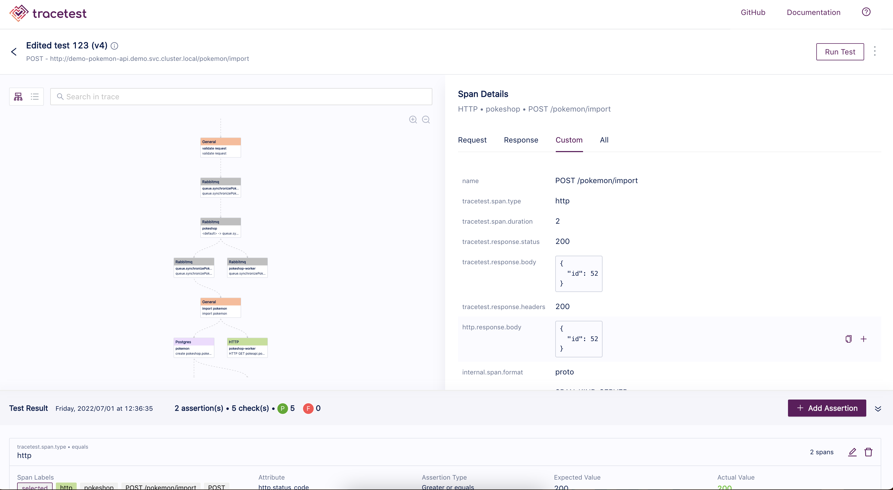

# Editing Tests

Tracetest enables the update of test details at anytime, if you have to update any of the details regarding the triggering method or the basic details such as **name** and/or **description**.

This process is really simple and can be achieved from three different places within the app:
1. The home page.
2. The test details page.
3. The Result/Trace page.

In any of these pages you'll find a dropdown menu that indicates there are more actions that can be executed for the viewed element.

## The Edit Form

The edit form is composed by the basic details and the request details sections.

The basic details section includes the information regarding the test metadata like **name, description, Test Suite (future)**.
Request details is a changing section depending on which triggering method was used to create the request. For example, if the test was created using the RPC triggering method instead of HTTP, the request details will show different inputs like **method, message and metadata**.

After updating the different information displayed in the form, simply click **Save**.

Every time the test is updated, a new run will be executed with the latest information and the version of the test will increase by one.
Then you will be redirected to the run/trace page where you can determine if any of the previous assertions has failed, the trace was changed or other updates from the trace.

