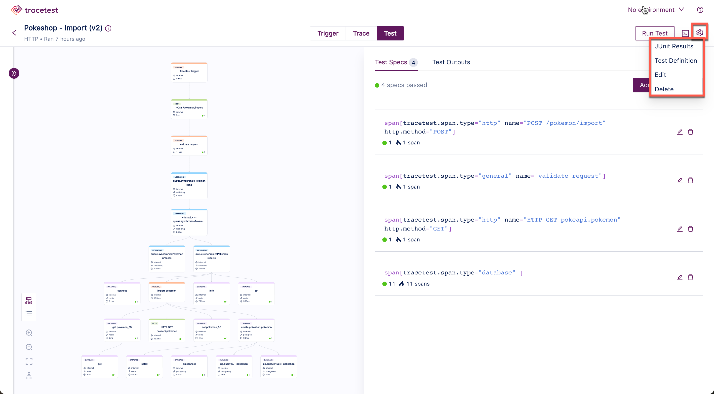
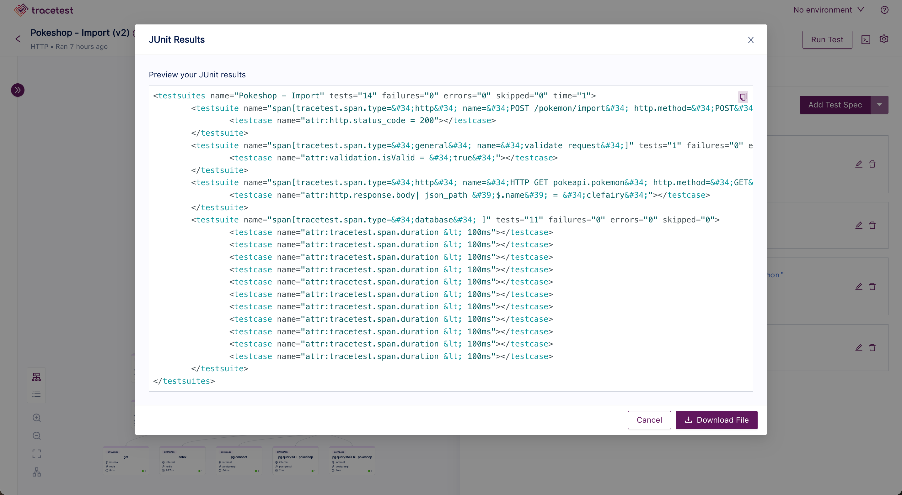
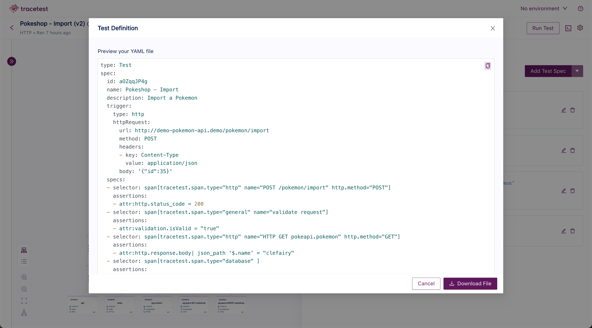

# Exporting Tests

Tracetest allows you to export the different set of information displayed for assertions and checks to use it as input for other tools and create text-based tests to use on your CI/CD pipelines using the CLI and more options.

The current supported exports are:
1. JUnit results XML.
2. Test Definition YAML.

To access any of the available exports, go to the run/trace page details for any test and, at the top right next to "Run Test", you'll find a settings icon which will display the options.

## JUnit Results XML
To access the JUnit XML file, select the "JUnit Results" option from the dropdown and you'll find the file viewer modal with the location to download the file.
The JUnit report contains the results from each of the assertions added to the test and their statuses. Depending on how many assertions the test has, this file will grow.

## Test Definition YAML
The Tracetest CLI allows you to execute text-based tests. This means you can store all of your tests in a repo, keep track of the different versions and use them for your CI/CD process.
An easy way to start is to export the test definition directly from the UI by selecting the "Test Definition" option from the dropdown.
The file viewer modal will pop up and you can copy paste or download the file.

